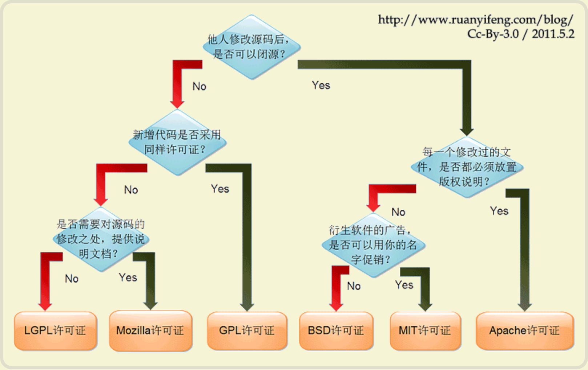

tags:: [[Open Source License]]
---

- ## 选择教程
	- 参考: [如何选择开源许可证？](https://www.ruanyifeng.com/blog/2011/05/how_to_choose_free_software_licenses.html)
		- 
	- 参考: [开源协议这么多，我们应如何选择？](https://www.bilibili.com/video/BV1ngzrYREyS)
- ## 选择工具
	- [Choose an open source license](https://choosealicense.com/)
	  logseq.order-list-type:: number
	- [License Selector](https://ufal.github.io/public-license-selector/)
	  logseq.order-list-type:: number
	-