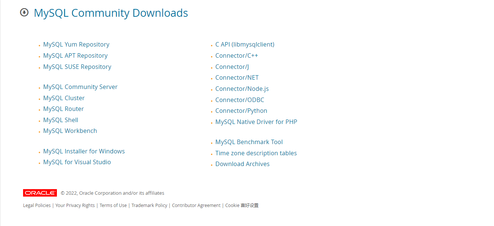
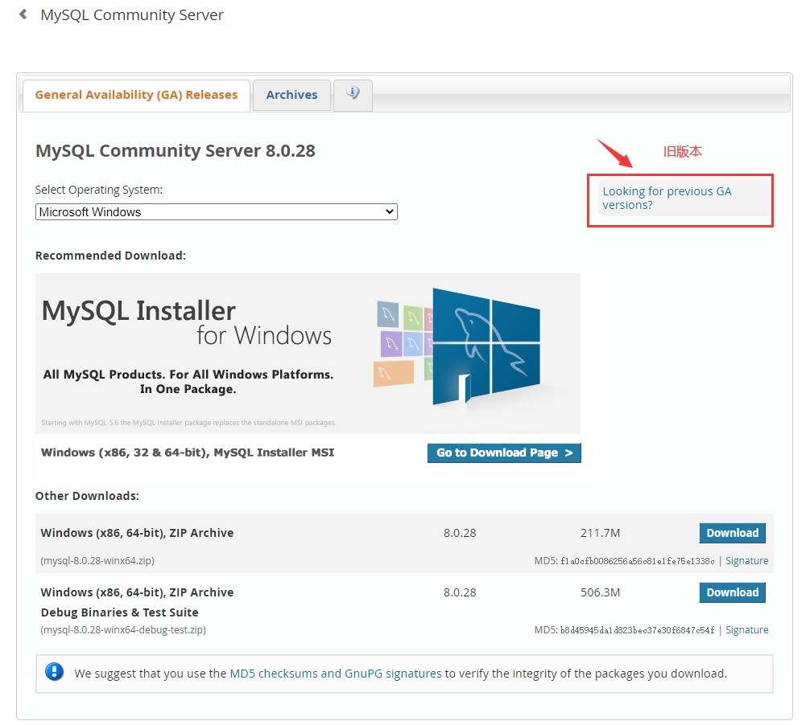
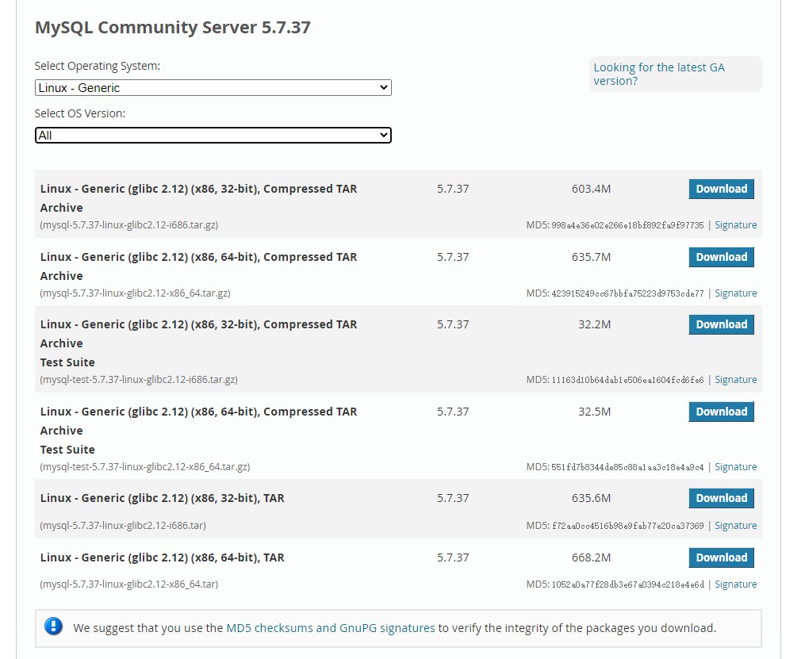
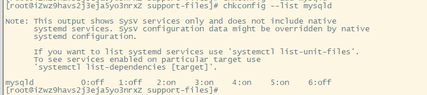

tags:: [[MySQL]]
---

- ## 访问官网下载 MySQL
	- ### 下载地址
		- [官方下载地址](https://dev.mysql.com/downloads/)
		- 
	- ### 如何下载旧版本
		- 下拉菜单选择自己想要下载的版本，图中标识部分是旧版本的下载链接。
		- 
	- ### 选择系统对应的版本
		- 在 Linux 系统中执行 `uname -r` 可以得到类似 `5.10.60-9.al8.x86_64` 的系统信息。
		- 执行 `ldd --version` 可以得到类似 `ldd (GNU libc) 2.17` 的 glibc 版本信息。
		- 所以这里我们选择 `Linux - Generic (glibc 2.17) (x86, 64-bit), Compressed TAR Archive` 。
		- 
- ## 使用 wget 命令下载 MySQL
	- ```sh
	  # 文件下载到了命令执行时的目录
	  wget https://dev.mysql.com/get/Downloads/MySQL-5.7/mysql-5.7.37-linux-glibc2.12-x86_64.tar.gz
	  ```
- ## 在 Linux 中安装 MySQL
	- ### 参考
		- ```crystal
		  https://www.cnblogs.com/linglei/p/14519416.html
		  
		  # 程序羊 https://github.com/hansonwang99
		  https://mp.weixin.qq.com/s/YNOZSQ5smo1uGE5ZttUZ_w
		  ```
	- ### 检查是否已安装过mysql
		- ```sh
		  # 检查是否已安装过mysql
		  rpm -qa | grep mysql
		  
		  # 如果已存在，则执行删除命令 后边为Mysql目录
		  rpm -e --nodeps mysql-xxxx
		  ```
	- ### 创建 MySQL 用户组和用户
		- 检查是否存在 **MySQL 用户组和用户** ，如果没有，则创建
		- ```sh
		  # 查看 group 文件中是否含有 mysql 字符串
		  cat /etc/group | grep mysql
		  # 查看 passwd 文件中是否含有 mysql 字符串
		  cat /etc/passwd | grep mysql
		  # 创建用户组 mysql
		  groupadd mysql
		  # 创建 mysql 用户组下的用户 mysql
		  useradd -g mysql mysql
		  ```
	- ### 解压
		- 将安装文件上传至 `/usr/local/` 目录下；
		- 执行 `tar -xzvf mysql-5.7.37-linux-glibc2.12-x86_64.tar.gz` 命令，解压；
		- 执行 `mv mysql-5.7.37-linux-glibc2.12-x86_64 /usr/local/mysql` 命令，对文件重命名为 `mysql` 。
	- ### 创建data目录
		- ```sh
		  # 在 mysql-5.7.37 目录下创建data目录
		  mkdir /usr/local/mysql/data
		  ```
	- ### 修改 MySQL ⽬录的归属⽤户
		- ```sh
		  chown -R mysql:mysql ./
		  ```
	- ### 准备 MySQL 的配置⽂件
		- 在 `/etc` ⽬录下新建 `my.cnf` ⽂件 : `touch /etc/my.conf` 。
		- ```properties
		  [mysql]
		  # 设置mysql客户端默认字符集
		  default-character-set=utf8
		  socket=/var/lib/mysql/mysql.sock
		  
		  [mysqld]
		  skip-name-resolve
		  #设置3306端口
		  port=3306
		  socket=/var/lib/mysql/mysql.sock
		  # 设置mysql的安装目录
		  basedir=/usr/local/mysql
		  # 设置mysql数据库的数据的存放目录
		  datadir=/usr/local/mysql/data
		  # 允许最大连接数
		  max_connections=200
		  # 服务端使用的字符集默认为8比特编码的latin1字符集
		  character-set-server=utf8
		  # 创建新表时将使用的默认存储引擎
		  default-storage-engine=INNODB
		  lower_case_table_names=1
		  max_allowed_packet=16M
		  ```
		- 同时使⽤如下命令创建 /var/lib/mysql ⽬录，并修改权限：
		- ```sh
		  mkdir /var/lib/mysql
		  chmod 777 /var/lib/mysql
		  ```
	- ### 正式开始安装 MySQL
		- 执⾏如下命令正式开始安装：
		- ```sh
		  cd /usr/local/mysql/bin
		  ./mysqld --initialize --user=mysql --basedir=/usr/local/mysql --datadir=/usr/local/mysql/data
		  ```
		- 执行时发生如下错误：
		- ```sh
		  ./mysqld: error while loading shared libraries: libaio.so.1: cannot open shared object file: No such file or directory
		  ```
		- 原因可能是：该链接库文件有没有安装。使用如下命令，发现确实没有安装：
		- ```sh
		  rpm -qa|grep libaio
		  ```
		- 执行如下命令进行安装：
		- ```sh
		  yum install libaio-devel.x86_64
		  ```
		- 再次执行数据库安装命令时，提示成功：
		- ```sh
		  [root@iZwz9havs2j3eja5yo3nrxZ bin]# ./mysqld --initialize --user=mysql --basedir=/usr/local/mysql --datadir=/usr/local/mysql/data
		  2022-03-02T14:43:44.132999Z 0 [Warning] TIMESTAMP with implicit DEFAULT value is deprecated. Please use --explicit_defaults_for_timestamp server option (see documentation for more details).
		  2022-03-02T14:43:45.030794Z 0 [Warning] InnoDB: New log files created, LSN=45790
		  2022-03-02T14:43:45.225252Z 0 [Warning] InnoDB: Creating foreign key constraint system tables.
		  2022-03-02T14:43:45.291775Z 0 [Warning] No existing UUID has been found, so we assume that this is the first time that this server has been started. Generating a new UUID: 29916b99-9a37-11ec-b775-00163e029537.
		  2022-03-02T14:43:45.294436Z 0 [Warning] Gtid table is not ready to be used. Table 'mysql.gtid_executed' cannot be opened.
		  2022-03-02T14:43:46.270766Z 0 [Warning] A deprecated TLS version TLSv1 is enabled. Please use TLSv1.2 or higher.
		  2022-03-02T14:43:46.270790Z 0 [Warning] A deprecated TLS version TLSv1.1 is enabled. Please use TLSv1.2 or higher.
		  2022-03-02T14:43:46.271292Z 0 [Warning] CA certificate ca.pem is self signed.
		  2022-03-02T14:43:46.333971Z 1 [Note] A temporary password is generated for root@localhost: !)o4pq2T>duh
		  ```
		- 记住最后一行的 `root` 账号的密码： `!)o4pq2T>duh` 。
	- ### 复制启动脚本到资源⽬录
		- 执⾏如下命令复制：
		- ```sh
		  cp /usr/local/mysql/support-files/mysql.server /etc/init.d/mysqld
		  ```
		- 并修改 `/etc/init.d/mysqld` ，修改其 `basedir` 和 `datadir` 为实际对应⽬录：
		- ```sh
		  vim /etc/init.d/mysqld
		  - basedir=/usr/local/mysql
		  datadir=/usr/local/mysql/data
		  ```
	- ### 设置 MySQL 系统服务并开启⾃启
		- ⾸先增加 `mysqld` 服务控制脚本执⾏权限：
		- ```sh
		  chmod +x /etc/init.d/mysqld
		  ```
		- 同时将 `mysqld` 服务加⼊到系统服务：
		- ```sh
		  chkconfig --add mysqld
		  ```
		- 最后检查 mysqld 服务是否已经⽣效即可：
		- ```sh
		  chkconfig --list mysqld
		  ```
		- 这样就表明 mysqld 服务已经⽣效了，在 2、3、4、5 运⾏级别随系统启动⽽⾃动启动，以后可以直接使⽤ `service` 命令控制 `mysql` 的启停。
		- 
	- ### 启动 MySQLD
		- ```sh
		  service mysqld start
		  ```
	- ### 将  MySQL 的 BIN ⽬录加⼊ PATH 环境变量
		- 编辑 `~/.bash_profile` ⽂件，在⽂件末尾处追加如下信息:
		- ```sh
		  export PATH=$PATH:/usr/local/mysql/bin
		  ```
		- 如下是修改后的文件:
		- ```sh
		  # .bash_profile
		  
		  # Get the aliases and functions
		  if [ -f ~/.bashrc ]; then
		        . ~/.bashrc
		  fi
		  
		  # User specific environment and startup programs
		  
		  PATH=$PATH:$HOME/bin
		  
		  export PATH
		  
		  export PATH=$PATH:/usr/local/mysql/bin
		  ```
		- 执⾏如下命令使环境变量⽣效:
		- ```sh
		  source ~/.bash_profile
		  ```
	- ### ⾸次登陆 MySQL
		- 以 `root` 账户登录 `mysql` ，执行如下命令：
		- ```sh
		  mysql -u root -p
		  ```
		- 得到如下的输入提示，输入密码即可登录（输入的密码是不可见的，可以使用复制粘贴）：
		- ```sh
		  [root@iZwz9havs2j3eja5yo3nrxZ bin]# mysql -u root -p
		  Enter password:
		  ```
	- ### 修改 `Root` 用户密码
		- ```sh
		  # user() 表示当前用户，即修改当前用户的密码
		  mysql>alter user user() identified by "xxxxx";
		  mysql>flush privileges;
		  ```
	- ### 设置远程主机登录
		- ```sh
		  mysql> use mysql;
		  # 表示所有ip都可以使用root用户登录
		  mysql> update user set user.Host='%' where user.User='root';
		  mysql> flush privileges;
		  ```
		- 现在就可以使用 `navicat` 等工具来连接 `mysql` 。
		- 若出现：**2003 - Can‘t connect to MySQL server on '192.168.X.X'(10060 "Unknown error")** ，则表明数据库端口被防火墙拦截，可以执行以下语句解决：
		- ```sh
		  # 开放3306端口
		  firewall-cmd --zone=public --add-port=3306/tcp --permanent
		  # 重启防火墙
		  firewall-cmd --reload
		  # 查看已开放的端口
		  firewall-cmd --list-ports
		  ```
		- 如果开放了端口还不能登录的话，如果你用的是云服务器的话，那很有可能是安全策略中没有让3306通过，加上即可。
		- 
- ## 在 Windows 中安装 MySQL
	- ### 使用压缩包
		- 参考：
			- ```wiki
			  1. https://www.cnblogs.com/heaven21cn/p/15924238.html
			  2. https://blog.csdn.net/weixin_32612253/article/details/113713953
			  3. https://zhuanlan.zhihu.com/p/73402380
			  ```
		- [下载地址](https://dev.mysql.com/downloads/mysql/)
		- 解压压缩包 `mysql-8.0.28-winx64.zip` 。
		  logseq.order-list-type:: number
		- 在mysql解压的根目录，新建 `my.ini` 文件，文件中写入如下内容：
		  logseq.order-list-type:: number
			- ```sh
			   [mysqld]
			   
			   # 设置端口
			   port = 3306
			   
			   # 设置mysql的安装目录
			   basedir = E:\devtools\db\mysql-8.0.28
			   
			   # 设置mysql 数据库的数据的存放目录(为了保证数据的安全，我放在C盘)
			   datadir = C:\dbdata\mysql-8.0.28
			   
			   # 允许最大连接数
			   max_connections = 200
			   
			   # 允许连接失败的次数
			   max_connect_errors = 10
			   
			   # 服务端使用的默认字符集
			   # MySQL 的 utf8 实际上不是真正的 UTF-8, utf8只 支持每个字符最多三个字节，而真正的UTF-8是每个字符最多四个字节。
			   # MySQL 一直没有修复这个bug，他们在2010年发布了一个叫作 utf8mb4 的字符集，绕过了这个问题。
			   character-set-server = utf8mb4
			   
			   # 创建新表时将使用的默认引擎
			   default-storage-engine = INNODB
			   
			   # 默认的认证插件
			   authentication_policy = mysql_native_password
			   
			   # 
			   explicit_defaults_for_timestamp = 1
			   
			   
			   
			   [mysql]
			   
			   # 客户端默认字符集
			   default-character-set = utf8mb4
			   
			   
			   
			   [client]
			   
			   # 客户端连接服务端时默认使用的端口
			   port = 3306
			   
			   default-character-set = utf8mb4
			   ```
		- 使用管理模式进入执行 cmd ，进入 `bin` 目录执行 `mysqld --initialize-insecure --user=mysql` 。等待一会儿后，执行完成，命令行中没有提示。
		  logseq.order-list-type:: number
		- 执行 `mysqld install` 提示 `Service successfully installed.` 。
		  logseq.order-list-type:: number
		- 执行 `net start mysql` 启动服务。
		  logseq.order-list-type:: number
		- 执行 `mysql -uroot -p` 登录 MySQL ，提示输入密码时，可以直接回车。
		  logseq.order-list-type:: number
		- 先执行 `exit` 退出 MySQL 客户端，执行 `mysqladmin -u root -p password` 修改密码，第一次让你输入现在的密码，可以直接回车；第二、第三次才是让你输入新密码。
		  logseq.order-list-type:: number
			- ```sh
			   E:\devtools\db\mysql-8.0.28\bin>mysqladmin -u root -p password
			   Enter password:
			   New password: ****
			   Confirm new password: ****
			   Warning: Since password will be sent to server in plain text, use ssl connection to ensure password safety.
			   ```
		- 关闭 MySQL 开机自启动：命令行中执行 `services.msc` ，搜索 `MYSQL` ，将 **启动类型** 设置为 **手动** 。
		  logseq.order-list-type:: number
	- ### 使用 msi (Microsoft Installer)
		- [MSI 下载地址](https://dev.mysql.com/downloads/windows/installer/8.0.html)
- ## 在 Windows 中完全卸载 MySQL
	- 参考：[mysql完全卸载教程（图文详细）](https://blog.csdn.net/qq_41140741/article/details/81489531)
	- 关闭 `MySQL 服务`。
	  logseq.order-list-type:: number
	- 以管理员方式进入 `MySQL` 的 `bin` 目录，执行 `mysqld remove` 。
	  logseq.order-list-type:: number
	- 快捷键 `win+r` 输入 `regedit` 进入注册表。
	  logseq.order-list-type:: number
	- 删除 `HKEY_LOCAL_MACHINE\SYSTEM\ControlSet001\Services\Eventlog\Application\MySQL` 文件夹。
	  logseq.order-list-type:: number
	- 删除 `HKEY_LOCAL_MACHINE\SYSTEM\ControlSet002\Services\Eventlog\Application\MySQL` 文件夹 和 `HKEY_LOCAL_MACHINE\SYSTEM\CurrentControlSet\Services\Eventlog\Application\MySQL` 文件夹（若这两个都不存在，则不用删除）。
	  logseq.order-list-type:: number
	- 删除 `MySQL 的 安装目录` 。
	  logseq.order-list-type:: number
	- 删除 `C:\Program Files (x86)\MySQL` 目录。
	  logseq.order-list-type:: number
	- 删除 `C:\ProgramData\MySQL` 目录。
	  logseq.order-list-type:: number
-
-