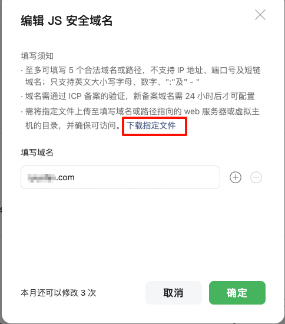
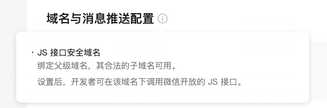

tags:: [[微信网页开发]]
---

- ## 配置 JS 接口安全域名作用
	- 配置 **公众号/服务号** 的 **JS 接口安全域名** 的作用:
		- 保证: 在 **微信客户端** 内, 打开 **配置的 JS 接口安全域名** 及其 **子域名** 下的网页, 能够调用该 **公众号/服务号** 所支持的 **微信网页开发** 相关能力.
- ## 配置 JS 接口安全域名
	- 进入编辑页面 (两种方式)
	  logseq.order-list-type:: number
		- 进入 [微信开发者平台](https://developers.weixin.qq.com/console/index?tab1=business&tab2=dev) -> 公众号/服务号 -> 选择指定公众号/服务号 -> 域名与消息推送配置 -> JS 接口安全域名 -> 点击 "编辑"
		  logseq.order-list-type:: number
		- 进入 [微信公众平台](https://mp.weixin.qq.com/) -> 登录指定公众号/服务号 -> 公众号/服务号设置 -> 功能设置 -> JS 接口安全域名
		  logseq.order-list-type:: number
	- 出现类似如下界面, 点击 "下载指定文件" .
	  logseq.order-list-type:: number
		- {:height 364, :width 287}
	- 将下载的文件, 保存到要配置的域名下, 然后填写域名.
	  logseq.order-list-type:: number
		- 注意: 要先保存文件, 才能配置成功.
- ## 安全域名注意事项
	- 不支持 IP 地址, 端口号及短链域名.
	  logseq.order-list-type:: number
	- 配置了 **父域名** , 其 **合法的子域名** 都可用.
	  logseq.order-list-type:: number
		- 即所有 **子域名** 下的网页都可调用相关能力.
		- {:height 173, :width 490}
	- 域名需通过 ICP 备案的验证, 新备案域名需 24 小时后才可配置.
	  logseq.order-list-type:: number
	-
- ## 参考
	- [微信内网页跳转APP功能](https://developers.weixin.qq.com/doc/oplatform/Mobile_App/WeChat_H5_Launch_APP.html)
	  logseq.order-list-type:: number
	- [JS-SDK 使用说明](https://developers.weixin.qq.com/doc/service/guide/h5/jssdk.html)
	  logseq.order-list-type:: number
-