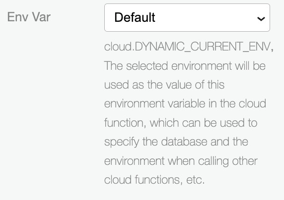
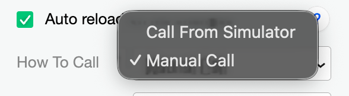
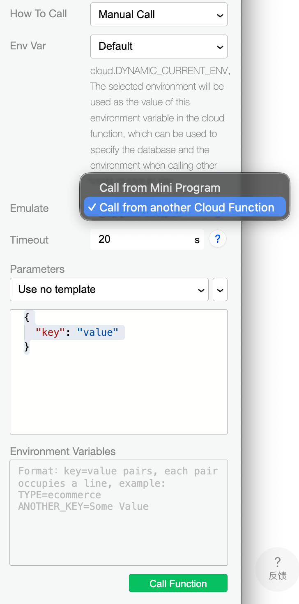
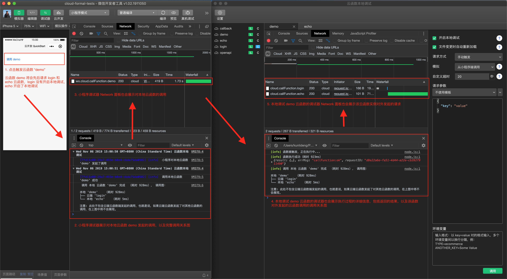

tags:: [[微信云开发]]
---

- ## 本地调试的好处
	- **本地调试** 有如下好处:
		- 单步调试 / 断点调试 .
		  logseq.order-list-type:: number
		- 在本地查看控制台 .
		  logseq.order-list-type:: number
		- 无需上传云函数 .
		  logseq.order-list-type:: number
			- 使用 **云函数本地调试** 时, 无需上传修改后的云函数, 即可执行最新代码.
- ## 开启云函数本地调试
	- 右击 **云函数** , 点击 **云函数本地调试** .
- ## 本地调试运行环境
	- 本地运行 **云函数** 的 `Node.js` 版本:
	  logseq.order-list-type:: number
		- 默认使用 **开发者工具** 自带的 `Node.js` , 可以点击左上角 **设置** 进行修改.
	- 云函数实例:
	  logseq.order-list-type:: number
		- 本地调试下, 一个云函数只有一个 **实例**  , 请求会被 **串行执行** .
		- ==注意: 此时云函数无法 **递归调用** 自身==
	- npm 依赖:
	  logseq.order-list-type:: number
		- 若 **云函数** 有使用到 `npm 模块` , 则需在 **云函数本地目录** 安装相应依赖, 才可使用本地调试功能.
		- 一般打开云函数的 **本地调试** 会自动安装.
- ## 选择云环境
	- **云函数本地调试**  控制台可以选择 **云环境** .
		- 若选择 **Default** , 则 `getWXContext().ENV` 的值默认是 `local` .
	- {:height 246, :width 317}
- ## 如何进行本地调试
	- ### 如何触发本地调用
		- 可以在 **本地调试界面** 选择:
			- **小程序模拟器** 触发
			  logseq.order-list-type:: number
			- **本地调试界面** 手动触发
			  logseq.order-list-type:: number
			- {:height 133, :width 333}
		- 如果一个 **云函数** 开启了 **本地调试** :
			- 则如果以上两种方式触发了 **该云函数** , 则会请求到 **本地云函数实例** , 而非 **云端云函数实例** .
	- ### 本地调试界面手动触发
		- 可以选择:
			- **从小程序端调用** .
			  logseq.order-list-type:: number
				- 调用时, 云函数内, 可通过 `cloud.getWXContext()` 获取调用的 **微信上下文** .
			- **从其他云函数调用** .
			  logseq.order-list-type:: number
				- 调用时, 云函数内, 无法获取 **微信上下文** .
		- {:height 783, :width 294}
- ## 本地调试特殊功能
	- ### 调用关系图展示
		- ==什么是调用关系:==
			- 即: 调用了哪个 **本地云函数** , 随后 **该本地云函数** 又调用了哪些 **本地或云端的云函数** .
		- 使用 **小程序模拟器** 进行 **本地调试** 时, 则:
			- 在 **本地调试面板** 的 **各个云函数实例的调试器** , 会展示 **该云函数** 的 **调用关系图** .
			  logseq.order-list-type:: number
			- 在 **小程序调试器** 也会展示 **该云函数** 的 **调用关系图** .
			  logseq.order-list-type:: number
		- 
	- ### Network 面板
		- 即便 **云函数** 运行在 `Node.js` 环境中, **本地调试** 也为其提供了 `Network 面板` .
	- ### 热重载
		- **云函数** 代码修改时, 自动重新加载 **云函数实例** .
	- ### 请求参数模板
		- 可以保存用于 **本地调试界面手动触发** 的 **请求参数模板** .
		- **请求参数模板** 会被保存在 **小程序根目录** 的 `cloudfunctionTemplate` 目录下.
- ## 本地云函数调用本地云函数
	- ==发现有个问题：==
		- 我有一个按钮，点击会调用 **云函数 foo**，而 **云函数 foo** 又会调用 **云函数 bar** 。
		- 现在，我想在本地调试 **云函数 foo** 对 **云函数 bar **的调用。
		- 于是，我有如下发现：
			- 当 **本地云函数 foo** 依赖的 `wx-server-sdk` 版本等于 `3.0.1` 时，可以正常调用 **本地云函数 bar **。
			- 而当 **本地云函数 foo** 依赖的 `wx-server-sdk` 版本大于 `3.0.1` 时，调用 **本地云函数 bar** 会报错：
				- ```
				  [error] 函数执行失败（耗时 273ms） Error: callFunction:fail callFunction:fail the reource is not found
				  ```
	- ==问题复现: ==
		- [复现的代码片段](https://developers.weixin.qq.com/s/G0Obxdmw8EbO)
	- ==我提交的 Issue:==
		- [微信开放社区提问](https://developers.weixin.qq.com/community/develop/doc/00026c58dacf10149b8527f4d6ac00)
		  logseq.order-list-type:: number
		- [wx-server-sdk GitHub Issue](https://github.com/wechat-miniprogram/wx-server-sdk/issues/1)
		  logseq.order-list-type:: number
		- [cloudbase community CNB Issue](https://cnb.cool/tencent/cloud/cloudbase/community/-/issues/1212)
		  logseq.order-list-type:: number
- ## 本地调试的限制
	- 本地调试的限制:
		- 由于 **共享环境** 的 **云函数** 在 **资源方** 而不在 **调用方** , 所以 **调用方** 显然无法在本地调试 **资源方** 提供的 **云函数** .
		  logseq.order-list-type:: number
			- 可以需要: **资源方** 进行 **本地调试** 后 **上传** , 再由 **调用方** 调用线上的 **云函数** .
		- 获取不到 `getWXContext().UNIONID` 的值.
		  logseq.order-list-type:: number
		- 本地调试不提供 **临时存储空间** .
		  logseq.order-list-type:: number
			- 参见: [[CloudBase 云函数: 临时存储空间]]
- ## 官方建议
	- 任何云函数, 使用 **本地调试** 测试通过后, 再上线部署.
- ## 参考
	- [云开发 - 核心能力 - 云函数 - 本地调试](https://developers.weixin.qq.com/miniprogram/dev/wxcloudservice/wxcloud/guide/functions/local-debug.html)
	  logseq.order-list-type:: number