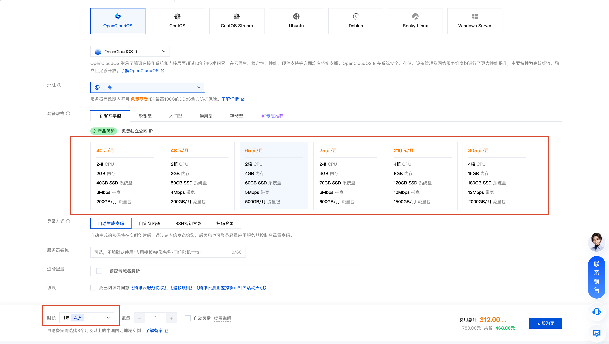

tags:: [[微信云开发]], [[微信云托管]], [[腾讯云 CloudBase]]
---

- ## 微信云开发
	- 参考: [微信云开发 - 介绍](https://developers.weixin.qq.com/miniprogram/dev/wxcloudservice/wxcloud/basis/getting-started.html)
	- ### 什么是微信云开发
		- [[微信云开发]] 是 **微信团队** 联合 **腾讯云** 推出的专业的 **小程序/小游戏/公众号网页** 开发服务.
		- 开发者 **无需搭建服务器** , 可 **免鉴权** 直接使用平台提供的 API 进行业务开发.
			- **小程序/小游戏/公众号网页** 直接通过 **腾讯云内网** 访问相关服务, 所以 **免鉴权** .
	- ### 微信云开发相关网站
		- [微信云开发官网 (好像没啥用, 只是展示作用)](https://cloud.weixin.qq.com/cloudbase)
		  logseq.order-list-type:: number
		- [微信云开发官方文档](https://developers.weixin.qq.com/miniprogram/dev/wxcloudservice/wxcloud/basis/getting-started.html)
		  logseq.order-list-type:: number
- ## 腾讯云 CloudBase
	- 参考:
		- [小程序 - 微信云开发 - 快速开始](https://developers.weixin.qq.com/miniprogram/dev/wxcloudservice/wxcloud/quick-start/)
		  logseq.order-list-type:: number
	- ### 什么是腾讯云 CloudBase
		- **腾讯云 CloudBase** , 英文为 **Tencent CloudBase** (简称为 `TCB` ), 也称为 **云开发 CloudBase** , 或 **CloudBase** .
		- [[腾讯云 CloudBase]] 是 **腾讯云** 提供的支撑 [[微信云开发]] 的云服务.
		- **腾讯云 CloudBase** 不止能用于构建 **微信生态应用** , 也可以构建 **Web 网站 / 移动 App** 等应用.
	- ### 腾讯云 CloudBase 相关网站
		- [CloudBase 控制台](https://tcb.cloud.tencent.com/dev)
		  logseq.order-list-type:: number
		- 文档:
		  logseq.order-list-type:: number
			- [CloudBase 开发文档](https://docs.cloudbase.net/)
			  logseq.order-list-type:: number
			- [腾讯云文档中心 - 云开发 CloudBase](https://cloud.tencent.com/document/product/876)
			  logseq.order-list-type:: number
		- [CloudBase 官网 (无需关注)](https://tcb.cloud.tencent.com/)
		  logseq.order-list-type:: number
		- [腾讯云 CloudBase 产品主页 (无需关注)](https://cloud.tencent.com/product/tcb)
		  logseq.order-list-type:: number
	- ### 腾讯云 CloudBase 提供的服务
		- CloudBase 提供如下服务: (创建 CloudBase 环境后, 到此处查看: [CloudBase 控制台](https://tcb.cloud.tencent.com/dev))
			- 后端组件 :
			  logseq.order-list-type:: number
				- SQL 型数据库 (MySQL)
				  logseq.order-list-type:: number
				- 文档型数据库 (MongoDB)
				  logseq.order-list-type:: number
				- 云存储 (对象存储)
				  logseq.order-list-type:: number
			- 后端 API :
			  logseq.order-list-type:: number
				- 云函数
				  logseq.order-list-type:: number
				- 云托管 (可托管我们自建的后端服务)
				  logseq.order-list-type:: number
				- 身份认证 (邮箱/短信/账号密码登录等)
				  logseq.order-list-type:: number
			- 各服务可观测性:
			  logseq.order-list-type:: number
				- 日志监控
				  logseq.order-list-type:: number
			- 静态网站托管:
			  logseq.order-list-type:: number
				- 静态网站托管
				  logseq.order-list-type:: number
			- AI 能力
			  logseq.order-list-type:: number
			- ...
		- {:height 340, :width 632}
	- ### 腾讯云 CloudBase 支持 AI 原生开发
		- 腾讯云 CloudBase 提供了 MCP 和 Skills , 以搭配 AI Agent 进行开发 .
	- ### 腾讯云 CloudBase 云模板
		- **云模板** 提供 营销活动、基础能力模板、管理后台 等常用业务模板, 只需简单调整, 即可将它们集成到 **小程序包** 或 **云开发服务** 中.
		- 在 [云模板中心](https://tcb.cloud.tencent.com/cloud-template) 查找适合自己的模板.
		- 在 [CloudBase 控制台](https://tcb.cloud.tencent.com/dev) 的 **集成与模板** 也可以找到.
	- ### 腾讯云 CloudBase 计费
		- 参见: [腾讯云 CloudBase 购买指南](https://cloud.tencent.com/document/product/876/127357)
- ## 腾讯云 CloudBase Run
	- 参考:
		- [腾讯云文档中心 - 云托管 CloudBase Run](https://cloud.tencent.com/document/product/1243)
		  logseq.order-list-type:: number
	- ### 什么是腾讯云 CloudBase Run
		- **腾讯云 CloudBase Run** , 英文为 **Tencent CloudBase Run** , 也称为 **云托管 CloudBase Run** , 或 **CloudBase Run** .
		- [[腾讯云 CloudBase Run]]  是 [[腾讯云 CloudBase]] 提供的 **云原生应用引擎 (App Engine 2.0)** , 可以 **容器化部署** 任意语言的应用.
			- 也即, 上述 **腾讯云 CloudBase** 提供的 **云托管** 服务的底层能力.
	- ### 腾讯云 CloudBase Run 相关网站
		- [腾讯云文档中心 - 云托管 CloudBase Run](https://cloud.tencent.com/document/product/1243)
- ## 微信云托管
	- 参考:
		- [微信云托管 - 产品简介](https://developers.weixin.qq.com/miniprogram/dev/wxcloudservice/wxcloudrun/src/basic/intro.html)
		  logseq.order-list-type:: number
	- ### 什么是微信云托管
		- **微信云托管** 英文为 **WeChat CloudRun** .
		- [[微信云托管]] 是 **微信团队** 提供的快速部署 **小程序/小游戏/公众号网页** 服务端 的 **云原生** 解决方案.
		- 它整合了: (参考: [云托管 CloudBase Run（腾讯云托管）和微信云托管的关系是什么？](https://cloud.tencent.com/document/product/1243/59521))
			- 多种腾讯云的底层资源.
			  logseq.order-list-type:: number
				- 如: 腾讯云 CloudBase Run, 腾讯云 TDSQL- C (数据库), 腾讯云 COS (对象存储)
				- ==微信云托管的容器化部署能力, 来自 [[腾讯云 CloudBase Run]]==
			- 微信生态的能力.
			  logseq.order-list-type:: number
				- 因此, 后端服务调用 [[微信服务端 API]] 可以 **免鉴权** .
		- 对于 **部署后端服务**  , 官方建议:
			- 若后端服务与微信生态有关, 使用 [[微信云托管]] .
			- 若后端服务与微信生态无关, 则使用 [[腾讯云 CloudBase Run]]
	- ### 微信云托管相关网站
		- [微信云托管 - 控制台](https://cloud.weixin.qq.com/cloudrun/console)
		  logseq.order-list-type:: number
		- [微信云托管 - 文档](https://developers.weixin.qq.com/miniprogram/dev/wxcloudservice/wxcloudrun/src/)
		  logseq.order-list-type:: number
		- [微信云托管 - 官网 (无需关注)](https://cloud.weixin.qq.com/cloudrun)
		  logseq.order-list-type:: number
	- ### 微信云托管提供的服务
		- 微信云托管 提供如下服务:
			- 后端组件 :
			  logseq.order-list-type:: number
				- MySQL
				  logseq.order-list-type:: number
				- 对象存储
				  logseq.order-list-type:: number
			- 后端 API:
			  logseq.order-list-type:: number
				- 服务容器化部署
				  logseq.order-list-type:: number
				- 运行日志
				  logseq.order-list-type:: number
			- 静态资源存储 (静态网站托管)
			  logseq.order-list-type:: number
			- 安全服务:
			  logseq.order-list-type:: number
				- DDos 防护
				  logseq.order-list-type:: number
		- {:height 513, :width 806}
	- ### 微信云托管计费
		- 参见: [微信云托管说明](https://cloud.tencent.com/document/product/876/113602)
- ## 云服务器
	- 以腾讯云 [轻量应用服务器](https://buy.cloud.tencent.com/lighthouse) 为例.
		- {:height 348, :width 669}
		- 首年有 4 折优惠
	- 可以自己部署或单独订阅各种服务.
		- 特别是在 存储备份, 日志管理 和 DDos 防护 等安全方面, 需要花心思解决或花钱解决.
- ## 参考
	- logseq.order-list-type:: number
-