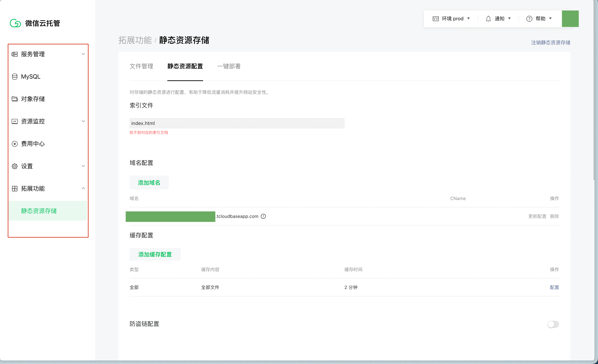

tags:: [[微信云托管]]
---

- ## 什么是微信云托管
	- **微信云托管** 英文为 **WeChat CloudRun** .
	- [[微信云托管]] 是 **微信团队** 提供的快速部署 **小程序/小游戏/公众号网页** 服务端 的 **云原生** 解决方案.
	- 它整合了: (参考: [云托管 CloudBase Run（腾讯云托管）和微信云托管的关系是什么？](https://cloud.tencent.com/document/product/1243/59521))
		- 多种腾讯云的底层资源.
		  logseq.order-list-type:: number
			- 如: 腾讯云 CloudBase Run, 腾讯云 TDSQL- C (数据库), 腾讯云 COS (对象存储)
			- ==微信云托管的容器化部署能力, 来自 [[CloudBase 云托管]]==
		- 微信生态的能力.
		  logseq.order-list-type:: number
			- 因此, 后端服务调用 [[微信服务端 API]] 可以 **免鉴权** .
	- 对于 **部署后端服务**  , 官方建议:
		- 若后端服务与微信生态有关, 使用 [[微信云托管]] .
		- 若后端服务与微信生态无关, 则使用 [[CloudBase 云托管]]
- ## 微信云托管提供的服务
	- 微信云托管 提供如下服务:
		- 后端组件 :
		  logseq.order-list-type:: number
			- MySQL
			  logseq.order-list-type:: number
			- 对象存储
			  logseq.order-list-type:: number
		- 后端 API:
		  logseq.order-list-type:: number
			- 服务容器化部署
			  logseq.order-list-type:: number
			- 运行日志
			  logseq.order-list-type:: number
		- 静态资源存储 (静态网站托管)
		  logseq.order-list-type:: number
		- 安全服务:
		  logseq.order-list-type:: number
			- DDos 防护
			  logseq.order-list-type:: number
	- {:height 513, :width 806}
- ## 微信云托管计费
	- 参见: [微信云托管说明](https://cloud.tencent.com/document/product/876/113602)
- ## 微信云托管相关网站
	- [微信云托管 - 控制台](https://cloud.weixin.qq.com/cloudrun/console)
	  logseq.order-list-type:: number
	- [微信云托管 - 文档](https://developers.weixin.qq.com/miniprogram/dev/wxcloudservice/wxcloudrun/src/)
	  logseq.order-list-type:: number
	- [微信云托管 - 官网 (无需关注)](https://cloud.weixin.qq.com/cloudrun)
	  logseq.order-list-type:: number
- ## 参考
	- [微信云托管 - 产品简介](https://developers.weixin.qq.com/miniprogram/dev/wxcloudservice/wxcloudrun/src/basic/intro.html)
	  logseq.order-list-type:: number