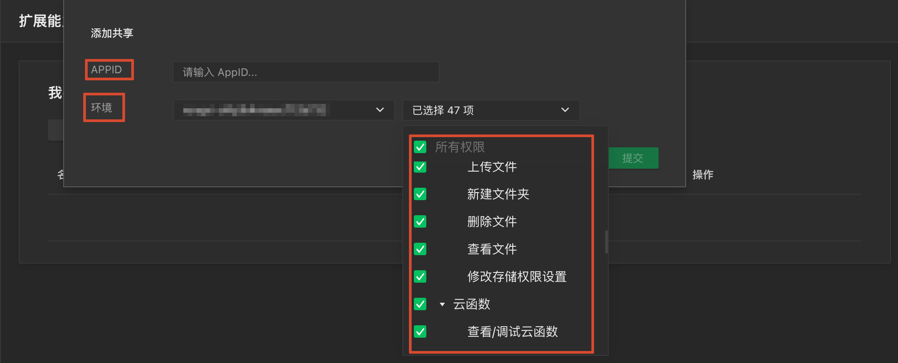

tags:: [[微信云环境共享]]
---

- ## 什么是环境共享
	- 即, 将 一个 **微信公众平台应用 (小程序/小游戏/公众号/服务号)** 的 **云环境** , 授权共享给 **同主体下** 的多个其他的 **微信公众平台应用 (小程序/小游戏/公众号/服务号)** 使用 .
		- ==一个环境, 最多共享给 10 个 **微信公众平台应用**==
- ## 单层级授权
	- 假设 C 将资源授权给 B , 而 B 将资源授权给 A (此时, B 无法将 C 的资源授权给 A) :
		- 如果 C 没有主动将资源授权给 A , 则 A 不能调用 C 的资源.
- ## 添加环境共享
	- **微信开发者工具** 打开 **云开发控制台** :
		- 点击 `扩展能力 -> 环境共享 -> 开通` .
		  logseq.order-list-type:: number
		- 点击 `添加共享` , 填写 `接收环境的 AppID` , 选择 `环境` 及其 `权限` .
		  logseq.order-list-type:: number
			- {:height 280, :width 660}
- ## 参考
	- [微信云开发 - 开发指引 - 微信生态 - 小程序环境共享 - 介绍](https://developers.weixin.qq.com/miniprogram/dev/wxcloudservice/wxcloud/guide/resource-sharing/introduce.html)
	  logseq.order-list-type:: number
	- [微信云开发 - 基础概念 - 跨账号环境共享](https://developers.weixin.qq.com/miniprogram/dev/wxcloudservice/wxcloud/basis/resource-sharing.html)
	  logseq.order-list-type:: number