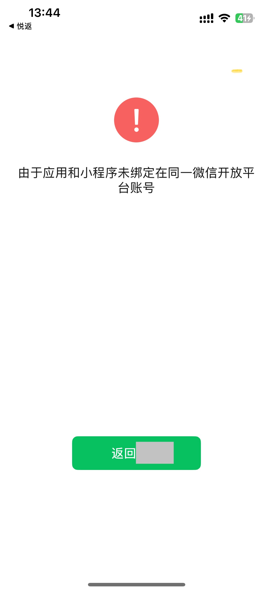

tags:: [[WeChat Dev]] 
---

- ## 分享小程序卡片
	- 参考:
		- [分享小程序卡片到微信: wx.miniapp.shareMiniProgramMessage](https://developers.weixin.qq.com/miniprogram/dev/platform-capabilities/miniapp/api/miniapp/shareMiniProgramMessage.html)
		  logseq.order-list-type:: number
		- [APP调用【分享小程序卡片至微信】API，必须要与小程序主体一致吗？](https://developers.weixin.qq.com/community/develop/doc/00068af77287605c4c347176061c00)
		  logseq.order-list-type:: number
	- 如果 移动 APP 与 目标小程序 没有绑定在同一 微信开放平台 账号, 则无法分享.
		- 也即, 你开发的 移动 APP 无法直接 分享别的开发者开发的 小程序 .
		- {:height 737, :width 337}