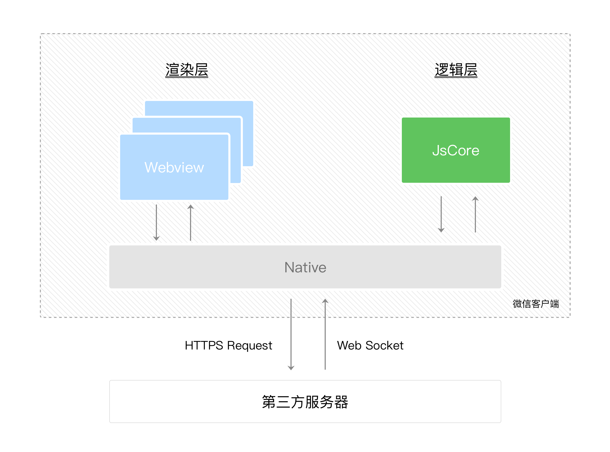

tags:: [[微信小程序]]
---

- ## 分层
	- 小程序的运行环境分成 **渲染层** (App Service) 和 **逻辑层** (View) .
		- `WXML` 和 `WXSS` 工作在 **渲染层** ;
			- 使用 `WXML` 描述界面.
			- 使用 `WXSS` 描述样式.
		- `JavaScript` 脚本工作在 **逻辑层** .
- ## 线程
	- **渲染层** 的界面使用了 `WebView` 进行渲染.
		- 一个小程序可能有多个界面, 所以 **渲染层** 可能存在多个 `WebView` 线程.
	- **逻辑层** 采用 `JsCore` 线程运行 JS 脚本.
		- **逻辑层** 只有一个线程.
- ## 层间通信
	- 小程序在 `逻辑层` 与 `视图层` 之间提供了 `数据传输` 和 `事件系统` .
	- **渲染层** 与 **逻辑层** 之间的通信, 会经由 微信客户端 (或称为 `Native` ) 中转.
	- **逻辑层** 发送网络请求也经由 `Native` 转发.
	- {:height 576, :width 651}
- ## 参考
	- [小程序宿主环境](https://developers.weixin.qq.com/miniprogram/dev/framework/quickstart/framework.html#%E6%B8%B2%E6%9F%93%E5%B1%82%E5%92%8C%E9%80%BB%E8%BE%91%E5%B1%82)
	  logseq.order-list-type:: number