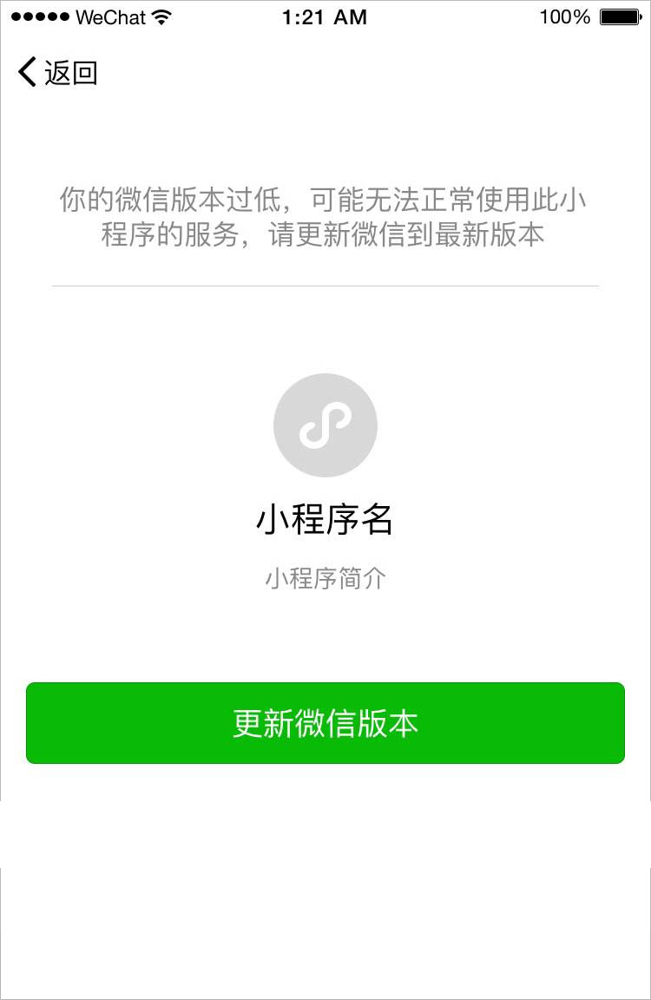

tags:: [[微信小程序]]
---

- ## 低版本兼容
	- 即, 通过 **判断版本号** 或者 **判断是否能使用某 API** 来避免: 在低版本基础库环境下, 调用高版本基础库的能力 (也可以提示用户更新客户端).
- ## 版本号比较
	- ### 获取版本号
		- 小于等于 2.20.1 , 可以使用如下方法获取基础库版本号:
			- [wx.getSystemInfo](https://developers.weixin.qq.com/miniprogram/dev/api/base/system/wx.getSystemInfo.html)
			  logseq.order-list-type:: number
			- [wx.getSystemInfoSync](https://developers.weixin.qq.com/miniprogram/dev/api/base/system/wx.getSystemInfoSync.html) 
			  logseq.order-list-type:: number
		- 大于 2.20.1 , 上述接口仍能调用, 但已不再维护, 建议使用如下方法获取基础库版本号:
			- [wx.getAppBaseInfo](https://developers.weixin.qq.com/miniprogram/dev/api/base/system/wx.getAppBaseInfo.html)
			  logseq.order-list-type:: number
	- ### 版本号比较
		- ``` js
		  function compareVersion(v1, v2) {
		    v1 = v1.split('.')
		    v2 = v2.split('.')
		    const len = Math.max(v1.length, v2.length)
		  
		    while (v1.length < len) {
		      v1.push('0')
		    }
		    while (v2.length < len) {
		      v2.push('0')
		    }
		  
		    for (let i = 0; i < len; i++) {
		      const num1 = parseInt(v1[i])
		      const num2 = parseInt(v2[i])
		  
		      if (num1 > num2) {
		        return 1
		      } else if (num1 < num2) {
		        return -1
		      }
		    }
		  
		    return 0
		  }
		  
		  compareVersion('1.11.0', '1.9.9') // 1
		  ```
		- 示例:
			- ``` js
			  const version = wx.getAppBaseInfo().SDKVersion
			  
			  if (compareVersion(version, '1.1.0') >= 0) {
			    wx.openBluetoothAdapter()
			  } else {
			    // 如果希望用户在最新版本的客户端上体验您的小程序，可以这样子提示
			    wx.showModal({
			      title: '提示',
			      content: '当前微信版本过低，无法使用该功能，请升级到最新微信版本后重试。'
			    })
			  }
			  ```
- ## 判断指定 API 是否存在
	- ``` js
	  if (wx.openBluetoothAdapter) {
	    wx.openBluetoothAdapter()
	  } else {
	    // 如果希望用户在最新版本的客户端上体验您的小程序，可以这样子提示
	    wx.showModal({
	      title: '提示',
	      content: '当前微信版本过低，无法使用该功能，请升级到最新微信版本后重试。'
	    })
	  }
	  ```
- ## wx.canIUse
	- ### 判断 API 的参数或返回值的指定成员是否存在
		- ``` js
		  wx.showModal({
		    success: function(res) {
		      if (wx.canIUse('showModal.success.cancel')) {
		        console.log(res.cancel)
		      }
		    }
		  })
		  ```
	- ### 判断指定组件或组件属性是否存在
		- ``` js
		  Page({
		    data: {
		      canIUse: wx.canIUse('cover-view')
		    }
		  })
		  ```
		- ``` wxml
		  <video controls="{{!canIUse}}">
		    <cover-view wx:if="{{canIUse}}">play</cover-view>
		  </video>
		  ```
	- ### 注意
		- `wx.canIUse` 的数据文件随基础库进行更新.
		- 但新版本中的新功能可能出现遗漏的情况, 建议开发者在使用时提前测试.
- ## 设置最低基础库版本
	- 在 [小程序管理页](https://mp.weixin.qq.com/)  的【设置】-【基本设置】-【基础库最低版本设置】进行设置
	- 如果用户基础库版本低于设置的值, 则无法正常打开小程序, 并有如下提示:
		- {:height 579, :width 280}
- ## 参考
	- [基础库 - 低版本兼容](https://developers.weixin.qq.com/miniprogram/dev/framework/compatibility.html)
	  logseq.order-list-type:: number