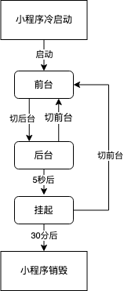

tags:: [[微信小程序 - 逻辑层]]
---

- ## 小程序生命周期图
	- 
- ## 冷启动与热启动
	- ### 什么是冷启动
		- 如下情况启动被称为冷启动:
			- 用户首次打开小程序.
			  logseq.order-list-type:: number
			- 小程序被 **销毁** 后, 用户再次打开.
			  logseq.order-list-type:: number
		- 此时, 小程序需要被重新加载.
	- ### 什么是热启动
		- 如下情况启动被称为热启动:
			- 用户已经打开过小程序, 然后在一定时间内再次打开该小程序.
		- 此时, 小程序并未被 **销毁** , 只是 **从后台状态进入前台状态** .
	- ### 注意
		- 一般讲的 **启动** 专指 **冷启动** .
		- **热启动** 一般被称为 **后台切前台** .
- ## 前台, 后台与挂起状态
	- ### 什么是前台状态
		- **前台状态**: 小程序启动后 (不管是冷启动还是热启动), 界面被展示给用户时.
	- ### 什么是后台状态
		- 如下情况, 小程序会进入 **后台** 状态 ( ==不仅限于如下几种== ):
			- 点击 **右上角胶囊按钮** 离开小程序
			  logseq.order-list-type:: number
			- iOS **从屏幕左侧右滑** 离开小程序
			  logseq.order-list-type:: number
			- Android 点击 **返回键** 离开小程序
			  logseq.order-list-type:: number
			- 小程序前台运行时, 直接 **把微信切后台** (手势 或 Home 键)
			  logseq.order-list-type:: number
			- 小程序前台运行时, 直接 **锁屏**
			  logseq.order-list-type:: number
		- 小程序进入 **后台** 状态后, 还会 **短暂运行一小段时间** .
			- 但是部分 API 的使用会受到限制.
	- ### 什么是挂起状态
		- 进入 **挂起** 状态:
			- 小程序进入 **后台** 状态一段时间后 (目前是 5 秒) , 微信会停止小程序 **JS 线程** 的执行, 小程序进入 **挂起** 状态.
		- 进入 **挂起** 状态时:
			- 小程序的 **内存状态会被保留** , 但 开发者代码 执行会停止
			- **事件和接口回调** , 会在小程序再次进入 **前台** 时触发
		- 开发者使用了如下能力时, 小程序可以在 **后台** 持续运行, 不会进入到 **挂起** 状态:
			- [后台音乐播放](https://developers.weixin.qq.com/miniprogram/dev/api/media/background-audio/wx.getBackgroundAudioManager.html)
			  logseq.order-list-type:: number
			- [后台地理位置](https://developers.weixin.qq.com/miniprogram/dev/api/location/wx.startLocationUpdateBackground.html)
			  logseq.order-list-type:: number
			- ....
			  logseq.order-list-type:: number
- ## 小程序销毁
	- **销毁** 状态, 即 小程序 **完全终止运行** .
	- 小程序被 **销毁** 的情况:
		- 用户很久没有使用小程序:
		  logseq.order-list-type:: number
			- 小程序进入 **后台** 并被 **挂起** 后, 很长时间 (目前是 30 分钟) 都未再次进入 **前台** .
		- 小程序占用 **系统资源** 过高 (**被 系统 销毁** 或 **被 微信客户端 主动回收** ):
		  logseq.order-list-type:: number
			- 在 iOS 上:
				- 在一定时间间隔内, **微信客户端** 连续收到 **系统内存告警** 时;
				- **微信客户端** 会根据一定的策略, 主动销毁小程序, 并提示用户 `运行内存不足，请重新打开该小程序` .
					- ==**具体策略** 会持续进行 **调整优化** .==
			- 在 Android 和其他平台上:
				- 销毁机制差异较大, 但是肯定会出现 **销毁** 的情况.
			- 建议:
				- 在必要时, 使用 [wx.onMemoryWarning](https://developers.weixin.qq.com/miniprogram/dev/api/device/memory/wx.onMemoryWarning.html) 监听 **内存告警事件** , 进行必要的 **内存清理** .
		- ~~基础库版本属于 [1.1.0, 1.4.0) , 且同时满足如下条件时:~~ ==无需在意, 因为基础库版本属于这个区间的用户几乎绝迹==
		  logseq.order-list-type:: number
			- 用户从如下任一场景进入小程序:
			  logseq.order-list-type:: number
				- **扫一扫** : 1011, 1025
				  logseq.order-list-type:: number
				- **转发** : 1007, 1008
				  logseq.order-list-type:: number
			- 在没有置顶小程序的情况下, 退出小程序.
			  logseq.order-list-type:: number
- ## App(): 注册小程序
	- 每个小程序都需要在 `app.js` 中调用 `App` 方法注册小程序实例. ( 参见: [App(Object object)](https://developers.weixin.qq.com/miniprogram/dev/reference/api/App.html) )
		- ``` js 
		  // app.js
		  App({
		    onLaunch (options) {
		      // Do something initial when launch.
		    },
		    onShow (options) {
		      // Do something when show.
		    },
		    onHide () {
		      // Do something when hide.
		    },
		    onError (msg) {
		      console.log(msg)
		    },
		    globalData: 'I am global data'
		  })
		  ```
	- 每个小程序只能有一个 `APP` 实例, 否则可能会出问题.
- ## getApp(): 获取小程序实例
	- 可以通过 `getApp` 方法获取到全局唯一的 `App` 实例, 并访问其数据和函数. ( 参见: [AppObject getApp(Object object)](https://developers.weixin.qq.com/miniprogram/dev/reference/api/getApp.html) )
		- ``` js
		  // xxx.js
		  const appInstance = getApp()
		  console.log(appInstance.globalData) // I am global data
		  ```
- ## 小程序冷启动流程
	- 参考: [小程序宿主环境](https://developers.weixin.qq.com/miniprogram/dev/framework/quickstart/framework.html)
	- 在打开小程序之前, 微信客户端会把整个小程序的代码包 **下载** 到本地。
	  logseq.order-list-type:: number
	- 通过 `app.json` 的 `pages` 字段, 微信客户端可以知道小程序的所有页面路径, 第一个即为首页.
	  logseq.order-list-type:: number
		- ``` json
		  {
		    "pages":[
		      "pages/index/index",
		      "pages/logs/logs"
		    ]
		  }
		  ```
	- 微信客户端把首页的代码装载进来, 并进行渲染.
	  logseq.order-list-type:: number
	- 小程序启动之后, `app.js` 中定义的 App 实例的 `onLaunch` 回调方法会被执行.
	  logseq.order-list-type:: number
		- ``` js
		  App({
		    onLaunch: function () {
		      // 小程序启动之后 触发
		    }
		  })
		  ```
		- 整个小程序, 只有一个 App 实例, 所有页面共享.
- ## 参考
	- [小程序运行时 - 运行机制](https://developers.weixin.qq.com/miniprogram/dev/framework/runtime/operating-mechanism.html)
	  logseq.order-list-type:: number
	- [注册小程序](https://developers.weixin.qq.com/miniprogram/dev/framework/app-service/app.html)
	  logseq.order-list-type:: number
-