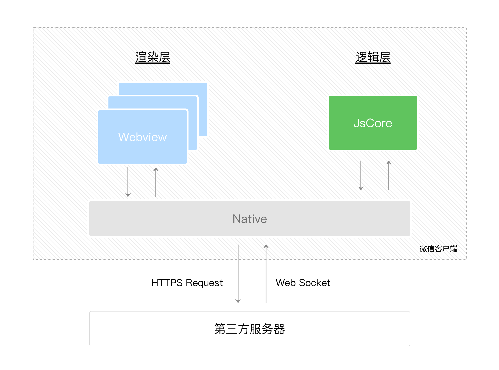

tags:: [[微信小程序]]
---

- ## 渲染层和逻辑层
	- ### 分层
		- 小程序的运行环境分成 **渲染层** 和 **逻辑层** .
			- `WXML` 模板和 `WXSS` 样式工作在 **渲染层** ;
			- `JS` 脚本工作在 **逻辑层** .
	- ### 线程
		- **渲染层** 的界面使用了 `WebView` 进行渲染.
			- 一个小程序可能有多个界面, 所以 **渲染层** 可能存在多个 `WebView` 线程.
		- **逻辑层** 采用 `JsCore` 线程运行 JS 脚本.
			- **逻辑层** 只有一个线程.
	- ### 层间通信
		- **渲染层** 与 **逻辑层** 之间的通信, 会经由 微信客户端 (或称为 `Native` ) 中转.
		- **逻辑层** 发送网络请求也经由 `Native` 转发.
		- {:height 576, :width 651}
- ## 小程序启动流程
	- 在打开小程序之前, 微信客户端会把整个小程序的代码包 **下载** 到本地。
	  logseq.order-list-type:: number
	- 通过 `app.json` 的 `pages` 字段, 微信客户端可以知道小程序的所有页面路径, 第一个即为首页.
	  logseq.order-list-type:: number
		- ``` json
		  {
		    "pages":[
		      "pages/index/index",
		      "pages/logs/logs"
		    ]
		  }
		  ```
	- 微信客户端把首页的代码装载进来, 并进行渲染.
	  logseq.order-list-type:: number
	- 小程序启动之后, `app.js` 中定义的 App 实例的 `onLaunch` 回调方法会被执行.
	  logseq.order-list-type:: number
		- ``` js
		  App({
		    onLaunch: function () {
		      // 小程序启动之后 触发
		    }
		  })
		  ```
		- 整个小程序, 只有一个 App 实例, 所有页面共享.
- ## 页面渲染流程
	- 先根据 `page.json` 的配置生成一个界面.
	  logseq.order-list-type:: number
	- 然后, 装载这个页面的 `WXML` 结构和 `WXSS` 样式 .
	  logseq.order-list-type:: number
	- 最后, 装载 `page.js` .
	  logseq.order-list-type:: number
		- ``` js
		  Page({
		    data: { // 参与页面渲染的数据
		      logs: []
		    },
		    onLoad: function () {
		      // 页面渲染后 执行
		    }
		  })
		  ```
	- 根据 `data` 数据,  `WXML` 结构和 `WXSS` 样式, 渲染出最终页面.
	  logseq.order-list-type:: number
	- 在渲染完界面之后, 页面实例就会收到一个 `onLoad` 回调.
	  logseq.order-list-type:: number
-
- ## 参考
	- [小程序宿主环境](https://developers.weixin.qq.com/miniprogram/dev/framework/quickstart/framework.html#%E6%B8%B2%E6%9F%93%E5%B1%82%E5%92%8C%E9%80%BB%E8%BE%91%E5%B1%82)
	  logseq.order-list-type:: number
	- logseq.order-list-type:: number