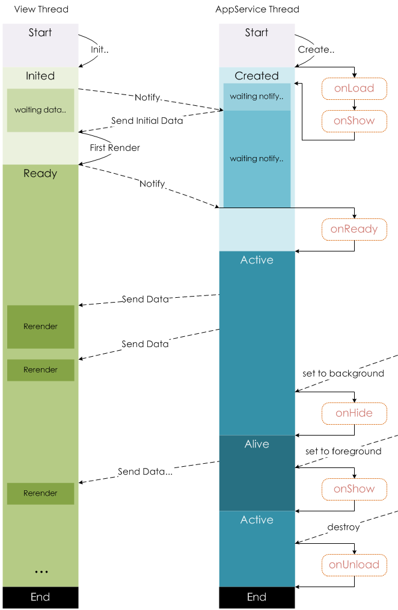

tags:: [[微信小程序]]
---

- ## 逻辑层介绍
	- 逻辑层使用 `JavaScript` 引擎为小程序提供 `JavaScript` 运行环境 和 微信小程序特有功能.
	  logseq.order-list-type:: number
	- 逻辑层将数据进行处理后发送给视图层, 同时接受视图层的事件反馈.
	  logseq.order-list-type:: number
	- 开发者写的所有代码最终将会打包成一份 `JavaScript` 文件, 并在小程序启动的时候运行, 直到小程序销毁.
	  logseq.order-list-type:: number
		- 这一行为类似 `ServiceWorker`, 所以逻辑层也称之为 App Service .
	- 在 `JavaScript` 的基础上, 新增了一些小程序开发需要的功能.
	  logseq.order-list-type:: number
	- ==注意：小程序框架的逻辑层并非运行在浏览器中, 因此 JavaScript 在 Web 中一些能力无法使用, 如 window，document 等. ==
- ## 注册小程序
	- 每个小程序都需要在 `app.js` 中调用 `App` 方法注册小程序实例. ( 参见: [App(Object object)](https://developers.weixin.qq.com/miniprogram/dev/reference/api/App.html) )
		- ``` js 
		  // app.js
		  App({
		    onLaunch (options) {
		      // Do something initial when launch.
		    },
		    onShow (options) {
		      // Do something when show.
		    },
		    onHide () {
		      // Do something when hide.
		    },
		    onError (msg) {
		      console.log(msg)
		    },
		    globalData: 'I am global data'
		  })
		  ```
	- 每个小程序只能有一个 `APP` 实例, 否则可能会出问题.
	- 可以通过 `getApp` 方法获取到全局唯一的 `App` 实例, 并访问其数据和函数. ( 参见: [AppObject getApp(Object object)](https://developers.weixin.qq.com/miniprogram/dev/reference/api/getApp.html) )
		- ``` js
		  // xxx.js
		  const appInstance = getApp()
		  console.log(appInstance.globalData) // I am global data
		  ```
- ## 注册页面
	- 小程序中的每个页面, 都需要在页面对应的 `js` 文件中进行注册. ( 参见: [Page(Object object)](https://developers.weixin.qq.com/miniprogram/dev/reference/api/Page.html) )
		- ``` js
		  //index.js
		  Page({
		    data: {
		      text: "This is page data."
		    },
		    onLoad: function(options) {
		      // 页面创建时执行
		    },
		    onShow: function() {
		      // 页面出现在前台时执行
		    },
		    onReady: function() {
		      // 页面首次渲染完毕时执行
		    },
		    onHide: function() {
		      // 页面从前台变为后台时执行
		    },
		    onUnload: function() {
		      // 页面销毁时执行
		    },
		    onPullDownRefresh: function() {
		      // 触发下拉刷新时执行
		    },
		    onReachBottom: function() {
		      // 页面触底时执行
		    },
		    onShareAppMessage: function () {
		      // 页面被用户分享时执行
		    },
		    onPageScroll: function() {
		      // 页面滚动时执行
		    },
		    onResize: function() {
		      // 页面尺寸变化时执行
		    },
		    onTabItemTap(item) {
		      // tab 点击时执行
		      console.log(item.index)
		      console.log(item.pagePath)
		      console.log(item.text)
		    },
		    // 事件响应函数
		    viewTap: function() {
		      this.setData({
		        text: 'Set some data for updating view.'
		      }, function() {
		        // this is setData callback
		      })
		    },
		    // 自由数据
		    customData: {
		      hi: 'MINA'
		    }
		  })
		  ```
- ## 页面生命周期
	- 
- ## 页面路由
	- ### 什么是页面路由
		- 页面路由用于 **表达和控制** 所有页面的创建、销毁及状态转换.
	- ### 路由的时机
		- 路由会以 `事件` 形式表示, 路由事件发起方式:
			- 用户操作 (如按下返回按钮).
			  logseq.order-list-type:: number
				- 路由事件直接由 `客户端` 下发到 `基础库` .
			- 开发者通过 API（如 `wx.navigateTo` ） 或 组件（如 `<navigator>` ）发起.
			  logseq.order-list-type:: number
				- `基础库` 首先向 `客户端` 发起路由请求, `客户端` 确认路由可以被执行后, 再将路由事件下发到 `基础库` .
				- 如果路由被确定执行, API 的 `success` 回调函数或组件的 `success` 事件将被触发, 否则将触发 `fail` .
					- 如果路由被确定执行, 没有任何操作可以取消这一次路由.
		- 当多次路由被连续发起时, 所有路由事件需要排队依次执行.
	- ### 页面栈
		-
- ## 参考
	- [逻辑层 App Service](https://developers.weixin.qq.com/miniprogram/dev/framework/app-service/)
	  logseq.order-list-type:: number
-