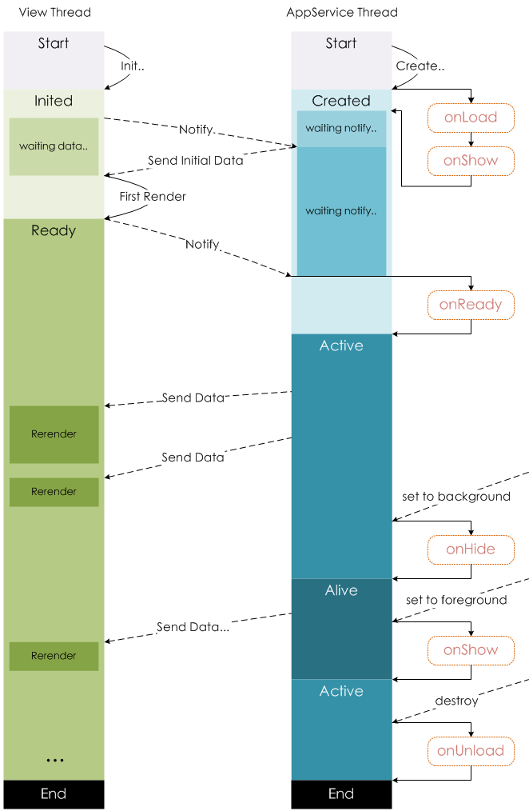

tags:: [[微信小程序]]
---

- ## 页面生命周期
	- {:height 709, :width 400}
	- [图源](https://developers.weixin.qq.com/miniprogram/dev/framework/app-service/page-life-cycle.html)
- ## Page(): 注册页面
	- 小程序中的每个页面, 都需要在页面对应的 `js` 文件中进行注册. ( 参见: [Page(Object object)](https://developers.weixin.qq.com/miniprogram/dev/reference/api/Page.html) )
		- ``` js
		  //index.js
		  Page({
		    data: {
		      text: "This is page data."
		    },
		    onLoad: function(options) {
		      // 页面创建时执行
		    },
		    onShow: function() {
		      // 页面出现在前台时执行
		    },
		    onReady: function() {
		      // 页面首次渲染完毕时执行
		    },
		    onHide: function() {
		      // 页面从前台变为后台时执行
		    },
		    onUnload: function() {
		      // 页面销毁时执行
		    },
		    onPullDownRefresh: function() {
		      // 触发下拉刷新时执行
		    },
		    onReachBottom: function() {
		      // 页面触底时执行
		    },
		    onShareAppMessage: function () {
		      // 页面被用户分享时执行
		    },
		    onPageScroll: function() {
		      // 页面滚动时执行
		    },
		    onResize: function() {
		      // 页面尺寸变化时执行
		    },
		    onTabItemTap(item) {
		      // tab 点击时执行
		      console.log(item.index)
		      console.log(item.pagePath)
		      console.log(item.text)
		    },
		    // 事件响应函数
		    viewTap: function() {
		      this.setData({
		        text: 'Set some data for updating view.'
		      }, function() {
		        // this is setData callback
		      })
		    },
		    // 自由数据
		    customData: {
		      hi: 'MINA'
		    }
		  })
		  ```
	- ### 其他构造页面方式
		- [[微信小程序 - Component]]
		  logseq.order-list-type:: number
		- [[微信小程序 - Behavior]]
		  logseq.order-list-type:: number
- ## 页面渲染流程
	- 参考: [小程序宿主环境](https://developers.weixin.qq.com/miniprogram/dev/framework/quickstart/framework.html)
	- ==页面渲染流程:==
		- 先根据 `page.json` 的配置生成一个界面.
		  logseq.order-list-type:: number
		- 然后, 装载这个页面的 `WXML` 结构和 `WXSS` 样式 .
		  logseq.order-list-type:: number
		- 最后, 装载 `page.js` .
		  logseq.order-list-type:: number
			- ``` js
			  Page({
			    data: { // 参与页面渲染的数据
			      logs: []
			    },
			    onLoad: function () {
			      // 页面创建时执行
			    },
			    onShow: function() {
			      // 页面出现在前台时执行
			    },
			    onReady: function() {
			      // 页面首次渲染完毕时执行
			    }
			  })
			  ```
		- 根据 `data` 数据,  `WXML` 结构和 `WXSS` 样式, 渲染出最终页面.
		  logseq.order-list-type:: number
	- ==几个生命周期回调执行顺序如下:==
		- ``` zsh
		  页面创建
		    ↓
		  onLoad
		    ↓
		  onShow
		    ↓
		  首次渲染
		    ↓
		  onReady
		  ```
- ## 参考
	- [注册页面](https://developers.weixin.qq.com/miniprogram/dev/framework/app-service/page.html)
	  logseq.order-list-type:: number
	- [页面生命周期](https://developers.weixin.qq.com/miniprogram/dev/framework/app-service/page-life-cycle.html)
	  logseq.order-list-type:: number
-