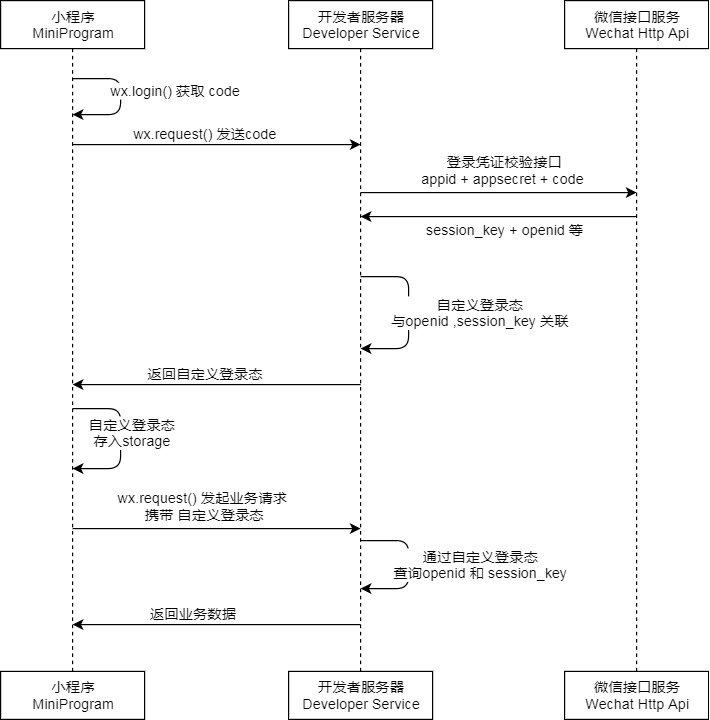

tags:: [[微信小程序登录]]
---

- ## 获取唯一标识登录流程
	- {:height 613, :width 547}
	-
	- **小程序端** 调用 `wx.login()` 获取 `临时登录凭证 code` .
	  logseq.order-list-type:: number
		- `code` 只能使用一次, 使用完就失效
	- **小程序端** 将 `code` 发给 **开发者服务器** (一般就是 **登录接口** 啦) , **开发者服务器** 做如下事情:
	  logseq.order-list-type:: number
		- 调用 `code2Session` 服务端 API , 从 **微信接口服务** 换取如下参数:
		  logseq.order-list-type:: number
			- `OpenID` : 微信用户在当前 **微信生态应用** 下的唯一标识.
			  logseq.order-list-type:: number
				- 参见: [[微信开发: OpenID & UnionID]]
			- `UnionID` : 微信用户在当前 **微信开放平台账号** 下的唯一标识.
			  logseq.order-list-type:: number
				- 参见: [[微信开发: OpenID & UnionID]]
			- `session_key` : 会话密钥 , 用于 **开发者服务器** 调用 **微信接口服务** 时的 **解密和签名** .
			  logseq.order-list-type:: number
			- ==以上参数, 都不应下发给 **小程序端** .==
		- 生成系统用户 **会话标识 (如 Token/JWT 等)** , 并返回给 **小程序端** .
		  logseq.order-list-type:: number
			- 如果系统中已存在关联此 **微信用户** 的 **系统用户** , 则直接生成 **会话标识** .
			  logseq.order-list-type:: number
			- 如果系统中不存在关联此 **微信用户** 的 **系统用户** , 则创建新的关联此 **微信用户** 的 **系统用户** , 再生成 **会话标识** .
			  logseq.order-list-type:: number
	- **小程序端** 可以保存此 **会话标识** , 在后续向 **开发者服务器** 发起业务请求时带上, 以用于识别 **系统用户** .
	  logseq.order-list-type:: number
		- 为了保证 **会话标识** 的安全, 可以给 **会话标识** 设计 **过期失效** 逻辑.
		- 为了保证 **会话标识** 持续有效, 可以给 **会话标识** 设计 **自动延期** 逻辑.
- ## 小程序 API: wx.login()
	- ### 文档
	- API 文档: [wx.login()](https://developers.weixin.qq.com/miniprogram/dev/api/open-api/login/wx.login.html)
	- ### 调用须知
		- 此接口是 **限频接口** (参见: [[微信小程序 API 限频]] )
		  logseq.order-list-type:: number
		- 此接口 **无需用户授权** .
		  logseq.order-list-type:: number
	- ### 调用参数
		- 参数如下:
			- `timeout` (number 类型) : 超时时间, 单位 ms
			  logseq.order-list-type:: number
			- `success` (function 类型) : 成功回调
			  logseq.order-list-type:: number
				- 接收一个包含 `errMsg` 和 `code` 字段的对象.
				- ``` json
				  {errMsg: "login:ok", code: "12dhskdusid48792chkah"}
				  ```
				- ==注意: `code` 只有 5 分钟有效期, 应尽快用于调用 `code2Session` 服务端 API .==
			- `fail` (function 类型) : 失败回调
			  logseq.order-list-type:: number
				- 接收一个包含 `errMsg` 和 `errno` 字段的 `Error` 对象. (参见: [[微信小程序 API 风格]] )
			- `complete` (function 类型) : 结束回调 (调用成功/失败, 都会执行)
			  logseq.order-list-type:: number
		- 调用示例:
			- ``` js
			  wx.login({
			    timeout: 3000,
			    success (res) {
			      if (res.code) {
			        console.log("登录成功: ", res)
			        console.log("code: ", res.code)
			      } else {
			        console.log("code 为空: ", res)
			      }
			    },
			    fail (err) {
			      console.log("登录异常: ", err)
			      console.log("errMsg: ", err.errMsg)
			      console.log("errno: ", err.errno)
			    }, 
			    complete () {
			      console.log("执行了 wx.login()")
			    }
			  })
			  ```
- ## 服务端 API: code2Session
	- ### 文档
		- API 文档: [code2Session](https://developers.weixin.qq.com/miniprogram/dev/server/API/user-login/api_code2session)
	- ### 请求参数
		- 请求参数 (Get + QueryString):
			- `appid` : 小程序 `appId`
			  logseq.order-list-type:: number
			- `secret` : 小程序 `appSecret`
			  logseq.order-list-type:: number
			- `js_code` :  调用  `wx.login()` 获得的 `code` .
			  logseq.order-list-type:: number
			- `grant_type` : 授权类型 (写死 `authorization_code`)
			  logseq.order-list-type:: number
		- 请求示例:
			- ``` js
			  GET https://api.weixin.qq.com/sns/jscode2session?appid=APPID
			                                                  &secret=SECRET
			                                                  &js_code=JS_CODE
			                                                  &grant_type=GRANT_TYPE
			  ```
	- ### 返回参数
		- 返回参数 (JSON):
			- `session_key` : 会话密钥
			  logseq.order-list-type:: number
			- `openid` : 微信用户在当前 **微信生态应用** 下的唯一标识.
			  logseq.order-list-type:: number
			- `unionid` : 微信用户在当前 **微信开放平台账号** 下的唯一标识.
			  logseq.order-list-type:: number
				- 若当前 **微信生态应用** 没有绑定到某个 **微信开放平台账号** , 则没有 `unionid` 值.
			- `errcode` : 错误码 (成功时为 `0`)
			  logseq.order-list-type:: number
			- `errmsg` : 错误信息.
			  logseq.order-list-type:: number
		- 返回示例:
			- ``` json
			  {
			    "openid": "xxxxxx",
			    "session_key": "xxxxx",
			    "unionid": "xxxxx",
			    "errcode": 0,
			    "errmsg": "xxxxx"
			  }
			  ```
- ## 参考
	- [小程序 - 指南 - 开放能力 - 用户信息 - 小程序登录](https://developers.weixin.qq.com/miniprogram/dev/framework/open-ability/login.html)
	  logseq.order-list-type:: number
	- [wx.login()](https://developers.weixin.qq.com/miniprogram/dev/api/open-api/login/wx.login.html)
	  logseq.order-list-type:: number
	- [code2Session](https://developers.weixin.qq.com/miniprogram/dev/server/API/user-login/api_code2session)
	  logseq.order-list-type:: number