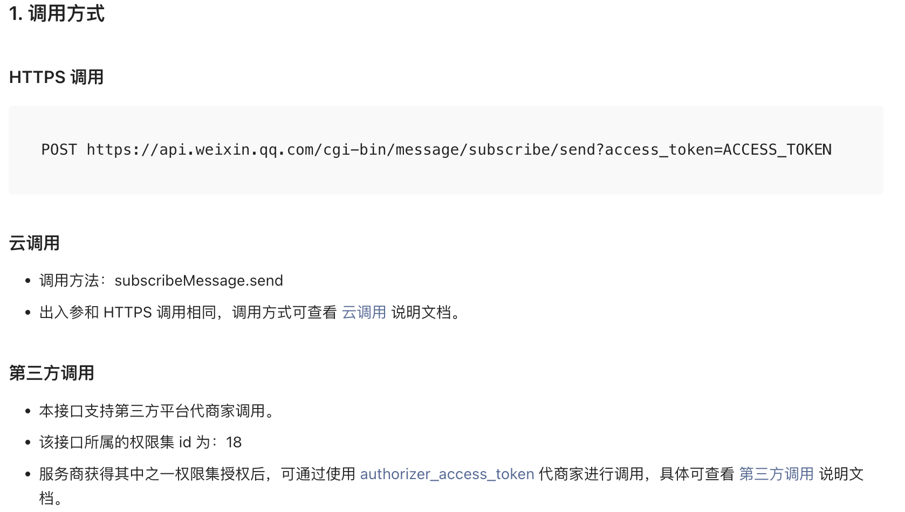

tags:: [[微信小程序云调用]]

- ## 小程序服务端 API
	- 见: [[微信服务端 API]]
	- ### 服务端 API 文档
		- [小程序服务端 API 列表](https://developers.weixin.qq.com/miniprogram/dev/server/API/)
	- ### 云调用说明
		- 如果一个 **服务端 API** 支持 **云调用** , 则在其 **文档** 中, 会有说明.
		- {:height 414, :width 635}
- ## 云调用免鉴权
	- 从 **小程序端** 触发的 **云函数** 中发起的 **云调用** 都经过微信 **自动鉴权** .
		- 所以, 调用 **服务端 API** 无需 `access_token` .
- ## 云调用步骤
	- ### 1.配置服务端 API 权限
		- 需要在各 **云函数** 目录的 `config.json` 文件中, 声明 **云函数** 需要调用的 **服务端 API** , 才能调用.
		- 声明在 `permissions.openapi` 数组中 ( **API 名称** 在接口文档中有说明):
			- ``` json
			  {
			    "permissions": {
			      "openapi": [
			        "subscribeMessage.send"
			      ]
			    }
			  }
			  ```
		- 该配置有 **10 分钟的缓存** .
			- 所以如果上传 **云函数** 后, 调用提示 `无权限` , 则 10 分钟 后再调用.
	- ### 2.发起服务端 API 调用
		- 要求: `wx-server-sdk` 至少 `0.4.0` , 最好使用 `latest` .
			- ``` json
			  // package.json
			  {
			    "dependencies": {
			      "wx-server-sdk": "latest"
			    }
			  }
			  ```
			- 如果需要 **在本地调试云函数** , 则执行 `npm install --save wx-server-sdk@latest` 在本地安装依赖.
		- 调用示例:
			- ``` js
			  const cloud = require('wx-server-sdk')
			  cloud.init({
			    env: cloud.DYNAMIC_CURRENT_ENV,
			  })
			  exports.main = async (event, context) => {
			    try {
			      const result = await cloud.openapi.subscribeMessage.send({
			          "touser": 'OPENID',
			          "page": 'index',
			          "lang": 'zh_CN',
			          "data": {
			            "number01": {
			              "value": '339208499'
			            }
			        })
			      return result
			    } catch (err) {
			      return err
			    }
			  } 
			  ```
		- 所有 API 均挂载在 `wx-server-sdk` 模块的 `openapi` 对象下.
			- 在 `openapi` 对象下挂载 **二级命名空间对象** (如 `openapi.subscribeMessage` ) , 表示 **接口类别** .
			- 在 **二级命名空间对象** 下挂载 **该类别的所有开放方法** (如 `openapi.subscribeMessage.send` ) .
- ## 云调用频率限制
	- **云函数** 调用 **服务端 API** 最多 `10 万次/分钟`
- ## 参考
	- [云开发 - 开发指引 - 微信生态 - 云调用](https://developers.weixin.qq.com/miniprogram/dev/wxcloudservice/wxcloud/guide/openapi/openapi.html)
	  logseq.order-list-type:: number