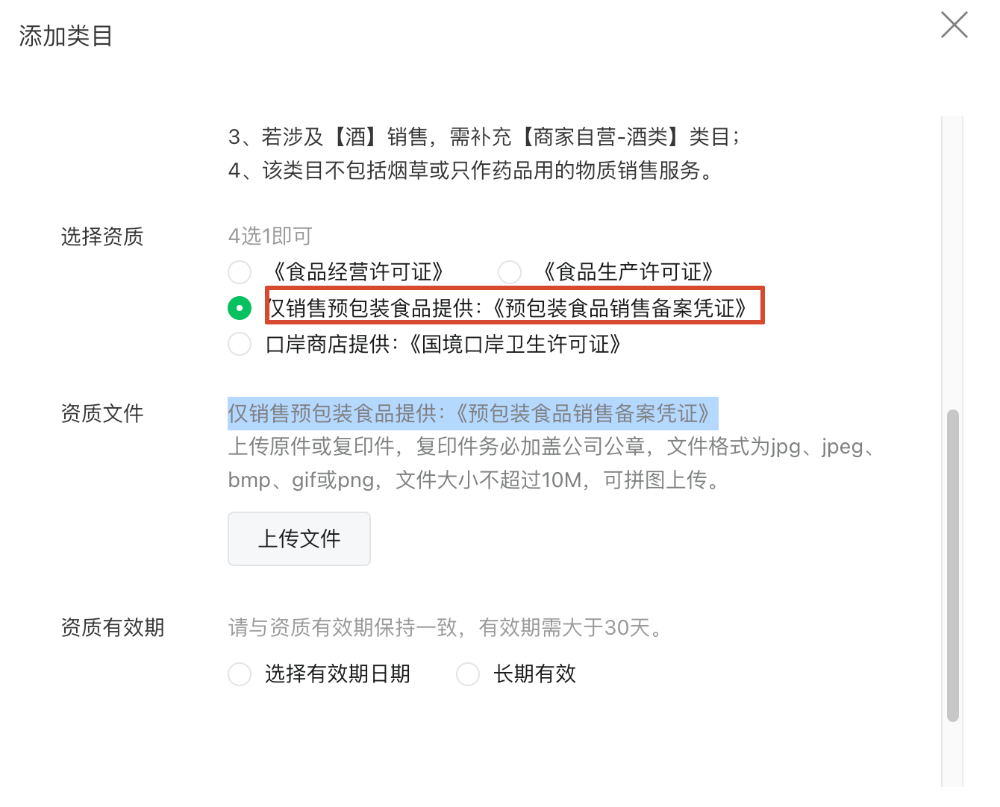

tags:: [[微信小程序]]
---

- ## 一个简单企业小程序需要的服务
	- 需要如下服务:
		- 用户小程序
		  logseq.order-list-type:: number
			- 小程序前端: 上传审核即可.
			  logseq.order-list-type:: number
			- 小程序后端
			  logseq.order-list-type:: number
			- 微信登录 API
			  logseq.order-list-type:: number
		- 管理后台
		  logseq.order-list-type:: number
			- 管理后台 Web 前端 (需公网地址)
			  logseq.order-list-type:: number
			- 管理后台后端
			  logseq.order-list-type:: number
			- 关系型数据库
			  logseq.order-list-type:: number
			- 对象存储 (存文件/图片等)
			  logseq.order-list-type:: number
			- 后端日志服务
			  logseq.order-list-type:: number
		- 可选服务 ( ==前期可忽略== )
		  logseq.order-list-type:: number
			- 安全
			  logseq.order-list-type:: number
				- 数据库数据备份与恢复 (以防数据误操作)
				  logseq.order-list-type:: number
				- DDos 防护
				  logseq.order-list-type:: number
	- 所以, 总结就是, 我们 **至少** 要部署或订阅:
		- 一个后端服务 (小程序后端 和 管理后台后端 合并).
		  logseq.order-list-type:: number
		- 一个关系型数据库服务.
		  logseq.order-list-type:: number
		- 一个对象存储服务.
		  logseq.order-list-type:: number
		- 一个静态 Web 前端.
		  logseq.order-list-type:: number
		- 一个后端日志服务.
		  logseq.order-list-type:: number
		- 一个域名.
		  logseq.order-list-type:: number
		- SSL 证书 (可用免费的).
		  logseq.order-list-type:: number
- ## 起步时资源用量估算
	- ==用户:==
		- 首年用户数: 500 人
		  logseq.order-list-type:: number
		- 日活用户数: 50 人
		  logseq.order-list-type:: number
		- 最高并发请求数: 10 次/秒
		  logseq.order-list-type:: number
	- 后端服务:
	  logseq.order-list-type:: number
	  id:: 6a67962b-8d5f-45d3-ba09-05968b1c3cc1
		- CPU + 内存: 0.5 核 1G
		  logseq.order-list-type:: number
		  id:: 6a67962e-741c-481a-ba11-75ae44e5b51b
		- 运行时长: 14 时/天 * 30 天 = 420 时/月
		  logseq.order-list-type:: number
		  id:: 6a67963b-61b1-4881-8078-2fdf3b965ca2
		- 流量: 1 GB/月
		  logseq.order-list-type:: number
		  id:: 6a67970d-c213-4496-9fd0-c9841424c6b7
		- 构建时间: 5 分钟/次 * 12次/月 = 60 分钟/月 ==若自己构建, 可以免资源==
		  logseq.order-list-type:: number
		  id:: 6a67a0f3-df42-459b-9b44-b41c36882b2a
	- 关系型数据库服务:
	  logseq.order-list-type:: number
	  id:: 6a67959f-376f-40ea-aaa4-5fabd1a12ddf
		- CPU + 内存: 0.5 核 1G
		  logseq.order-list-type:: number
		  id:: 6a6796fc-a2ba-4b6d-bb01-fc9c7609a8ec
		- 存储: 5 MB/人 * 500 人 ≈ 3G
		  logseq.order-list-type:: number
		  id:: 6a6795bc-3bdc-42d4-af2b-ccf37229a5b1
		- 运行时长: 14 时/天 * 30 天 = 420 时/月
		  logseq.order-list-type:: number
		  id:: 6a679666-cb17-4d8a-a18e-2b3967a93477
		- 调用次数: (200 次/人天 × 50 人 + 200 次/人天 * 2 人) * 30天  = 31.2 万次/月
		  logseq.order-list-type:: number
		  id:: 6a68854e-bf96-4956-b149-b456d62e3984
	- 对象存储服务:
	  logseq.order-list-type:: number
	  id:: 6a6795c2-85c4-4f2f-b445-4d6eb20fc380
		- 存储: 1 万张 * 400 KB ≈ 4G
		  logseq.order-list-type:: number
		  id:: 6a6795d2-9639-4fae-99e2-4717313cc357
		- 上行次数: 100 次/回 * 5 回/月 = 500 次/月
		  logseq.order-list-type:: number
		  id:: 6a6795d6-4388-4a0a-a2c9-04c4330f7299
		- 下行次数: 200 次/人天 * 50 人 * 30 天 * 90% = 30 万次/月 * 10% 回源率 = 3 万次/月
		  logseq.order-list-type:: number
		  id:: 6a679ad8-c419-4380-8d73-a077bea4c007
		- CDN 流量: 30 万次/月  * 400 KB ≈ 114.4 G GB/月
		  logseq.order-list-type:: number
		  id:: 6a67a043-b56f-42a7-8023-ca28b9a81990
		- CDN 回源流量: 30 万次/月 * 10% * 400 KB ≈ 11.5 GB/月
		  logseq.order-list-type:: number
		  id:: 6a67a2d6-8a34-4727-9773-17d835424ca8
	- 静态 Web 前端:
	  logseq.order-list-type:: number
	  id:: 6a6795cf-6c95-4897-b0c2-e99df4f5fecf
		- 存储: 100 MB
		  logseq.order-list-type:: number
		  id:: 6a6795f8-48b4-4f46-a9ce-4cc7ee211b6f
		- 流量: 0.5G/月
		  logseq.order-list-type:: number
		  id:: 6a679608-45a1-4438-b197-c65b312b7c82
	- 日志服务:
	  logseq.order-list-type:: number
	  id:: 6a6884d8-a11e-438f-8071-faa1c891a977
		- 存储: 10 MB/天 * 30 天 = 300 MB/月
		  logseq.order-list-type:: number
		  id:: 6a6884db-d6a1-4c50-921b-ca1df3fe36e9
- ## 非开发操作
	- 开发一个简单小程序, 除了开发, 还要做如下操作:
		- 注册小程序.
		  logseq.order-list-type:: number
		- 设置小程序服务类目.
		  logseq.order-list-type:: number
		- 小程序微信认证.
		  logseq.order-list-type:: number
		- 注册微信支付商户 (需保证已完成小程序微信认证).
		  logseq.order-list-type:: number
		- 小程序备案 (在小程序管理后台操作, 需保证已完成小程序微信认证).
		  logseq.order-list-type:: number
		- 管理后台域名 ICP 备案 和 公安备案 (参见:  [[域名备案]])
		  logseq.order-list-type:: number
		- 云服务选择.
		  logseq.order-list-type:: number
- ## 注册小程序
	- ### 主体类型
		- {:height 164, :width 394}
	- ### 企业类型
		- 注册 **企业** 类型小程序, 需要进行 **主体验证** .
			- {:height 165, :width 807}
		- 有如下方式:
			- **支付验证** : 用 **企业公账** 向腾讯官方打一个随机金额的款项 (之后会退还) .
			  logseq.order-list-type:: number
				- ==实测, 支付后 30 分钟左右收到 **验证结果通知** ==
			- **微信认证** : 支付 300 元审核费用.
			  logseq.order-list-type:: number
		- ==如果不是马上要用到 **需要微信认证的功能** , 或是马上要上线: 可以先采取 **支付验证** .==
			- 因为 **微信认证** 有一年有效期的, 如果不是立即要用, 没必要这么快进行认证.
			- 后续需要的时候, 可以再进行 **微信认证** .
- ## 设置小程序服务类目
	- 选择符合自己小程序功能的 **服务类目** , 某些类目需要上传一些 **资格证书** .
		- ==奇怪的是, 这个地方直接上传 **营业执照** 也审核通过了 (营业执照经营范围有包含 "食品销售 (仅销售预包装食品)" 和 "食品互联网销售 (仅销售预包装食品)")==
		- {:height 307, :width 471}
- ## 注册微信支付商户
	- ==需确保已完成微信认证==
	-
- ## 域名费用
	- 腾讯云价格:
		- `.com` 大概首年 83 元, 续费 90 元/年.
		- `.cn` 大概首年 33 元, 续费 38 元/年.
- ## SSL 证书费用
	- 腾讯云 CloudBase : **静态网站托管** 自带 免费证书 .
	  logseq.order-list-type:: number
	- 各个云厂商的免费证书, 每 90 天需要进行一次续期 (可配置自动续期).
	  logseq.order-list-type:: number
	- 免费证书: Let's Encrypt (可配置自动续期)
	  logseq.order-list-type:: number
- ## 云服务选择
	- 通读 [[微信云开发, 腾讯云 CloudBase, CloudBase 云托管 & 微信云托管]]
	- ### 微信云托管
		- 参见: [微信云托管说明](https://cloud.tencent.com/document/product/876/113602)
		- ==下面不考虑 赠送的额度==
		- 各服务:
			- 后端服务:
			  logseq.order-list-type:: number
				- | 计费项目 | 单价 | 用量 | 计算 | 费用 |
				  | ---- | ---- | ---- |
				  | CPU | 0.055元/核时 | 210核时 | `0.5 × 420 × 0.055` | 11.55元 |
				  | 内存 | 0.032元/GB时 | 420GB时 | `1 × 420 × 0.032` | 13.44元 |
				  | 公网流量 | 0.8元/GB | 1GB | `1 × 0.8` | 0.80元 |
				  | 构建时间 | 0.05元/分钟 | 60分钟 | `60 × 0.05` | 3.00元 |
				  | 合计 |  |  |  | **29.79元** |
			- 关系型数据库服务:
			  logseq.order-list-type:: number
				- | 计费项目 | 单价 | 用量 | 费用 |
				  | ---- | ---- | ---- |
				  | 数据库算力 | 0.342元/CCU时 | 420 CCU时 | 143.64元 |
				  | 数据库存储 | 0.00485元/GB时 | 2,160 GB时 | 10.476元 |
				  | 合计 |  |  | **154.116元** |
			- 对象存储服务:
			  logseq.order-list-type:: number
				- | 计费项目 | 单价 | 用量 | 费用 |
				  | ---- | ---- | ---- |
				  | 对象存储 | 0.0043元/GB天 | 120GB天 | 0.516元 |
				  | 上传操作 | 0.01元/万次 | 按1万次计费 | 0.01元 |
				  | 下载操作 | 0.01元/万次 | 30万次 | 0.30元 |
				  | CDN 流量 | 0.18元/GB | 114.4409GB | 20.5994元 |
				  | CDN 回源流量 | 0.15元/GB | 11.4441GB | 1.7166元 |
				  | 合计 |  |  | **23.142元** |
			- 静态 Web 前端:
			  logseq.order-list-type:: number
				- | 计费项目 | 单价 | 用量 | 计算 | 费用 |
				  | ---- | ---- | ---- |
				  | 静态存储 | 0.0043元/GB天 | 0.1GB、30天 | `0.1 × 30 × 0.0043` | 0.0129元 |
				  | 静态流量 | 0.21元/GB | 0.5GB | `0.5 × 0.21` | 0.105元 |
				  | 合计 |  |  |  | **0.1179元** |
			- 日志服务
			  logseq.order-list-type:: number
				- ==免费==
		- ==合计:==
			- | 服务 | 云端构建 | 自行构建 |
			  | ---- | ---- | ---- |
			  | 后端服务 | 29.79元 | 26.79元 |
			  | MySQL 数据库 | 154.116元 | 154.116元 |
			  | 对象存储及 CDN | 23.142元 | 23.142元 |
			  | 静态管理后台 | 0.1179元 | 0.1179元 |
			  | 总计 | **207.1659元** | **204.1659元** |
			  | 四舍五入 | **207.17元/月** | **204.17元/月** |
	- ### 腾讯云 CloudBase 个人版
		- 参见: [云开发 CloudBase - 购买指南 - 资源点价格文档](https://cloud.tencent.com/document/product/876/127357)
		- 19.9 元/月 套餐费用 + 超额费用
		- 资源点消耗:
			- | 服务 | 计费项 | 计算过程 | 单价 | 资源点 |
			  | ---- | ---- | ---- |
			  | 后端云托管 | CPU | 0.5核 × 420小时 | 55点/核小时 | 11,550 |
			  | 后端云托管 | 内存 | 1GB × 420小时 | 32点/GB小时 | 13,440 |
			  | 后端云托管 | 外网出流量 | 1GB | 800点/GB | 800 |
			  | 后端云托管 | 构建时间 | 5分钟 × 12次 | 当前价目表没有独立构建计费项 | 0 |
			  | **后端小计** |  |  |  | **25,790** |
			  | MySQL | CPU | 0.5核 × 420小时 | 342点/核小时 | 71,820 |
			  | MySQL | 存储 | 3GB × 24小时 × 30天 | 0.5点/GB小时 | 1,080 |
			  | MySQL | 数据库连接器调用 | 31.2万 ÷ 1万 × 10点 | 10点/万次 | 312 |
			  | **数据库小计** |  |  |  | **73,212** |
			  | 对象存储 | 存储容量 | 4GB × 30天 | 3.94点/GB天 | 472.80 |
			  | 对象存储 | 写请求 | 500 ÷ 1万 × 10点 | 10点/万次 | 0.50 |
			  | 对象存储 | 读请求 | 30万 × 10%回源率 ÷ 1万 × 10点 | 10点/万次 | 30 |
			  | 对象存储 | CDN流量 | 30万 × 400KB ÷ 1024² = 114.44GB | 210点/GB | 24,032.59 |
			  | 对象存储 | CDN回源流量 | 30万 × 10% × 400KB ÷ 1024² = 11.44GB | 150点/GB | 1,716.61 |
			  | **对象存储小计** |  |  |  | **26,252.51** |
			  | 静态网站 | 存储容量 | 0.1GB × 30天 | 3.94点/GB天 | 11.82 |
			  | 静态网站 | 流量 | 0.5GB | 210点/GB | 105 |
			  | **静态网站小计** |  |  |  | **116.82** |
			  | 日志 | 写入流量 | 10MB × 30天 ≈ 0.3GB | 350点/GB | 105 |
			  | 日志 | 存储量 | 10MB/天 × 2/24天 × 30天 = 0.025GB·天 | 11.5点/GB天 | 0.29 |
			  | **日志小计** |  |  |  | **105.29** |
			  | 身份认证 | 登录调用 | 1,500 ÷ 1万 × 500点 | 500点/万次 | 75 |
			  | 小程序API | `callContainer` | 30万 ÷ 1万 × 200点 | 200点/万次 | 6,000 |
			  | **总计** |  |  |  | **131,551.61** |
			- ==注意, 相比微信云托管, 可能有如下额外支出==
				- 调用 `wx.cloud.callContainer()` API 访问后端服务: 200 次/人天 * 50 人 * 30 天 = 30 万/月
				  logseq.order-list-type:: number
				- 登录认证: 1 次/人天 * 50 人 * 30 天 = 1500 次/月
				  logseq.order-list-type:: number
		- ==总计:==
			- | 项目 | 计算 | 金额 |
			  | ---- | ---- | ---- |
			  | 个人版套餐 | 固定月费 | 19.90元 |
			  | 套餐内资源点 | 40,000点 | 已包含 |
			  | 超额资源点 | 131,551.61 − 40,000 = 91,551.61点 | 91.55元 |
			  | **每月预计费用** | 19.90 + 91.55 | **111.45元** |
			  | **每年粗估** | 111.45 × 12 | **1,337.40元** |
	- ### 轻量应用服务器 (2 核 4G)
		- 参考:
			- [轻量应用服务器 - 购买指南 - 价格总览](https://cloud.tencent.com/document/product/1207/73452)
			  logseq.order-list-type:: number
			- [轻量应用服务器 - 选购](https://buy.cloud.tencent.com/lighthouse)
			  logseq.order-list-type:: number
		- 轻量应用服务器, 部署所有服务
		- 选择 `新客专享型` :
			- 2 核 4G
			  logseq.order-list-type:: number
			- 60 GB SSD
			  logseq.order-list-type:: number
			- 5 Mbps 带宽
			  logseq.order-list-type:: number
			- 500 GB/月 流量包
			  logseq.order-list-type:: number
		- 首年 312元, 续费 65 元/月, 即 780 元/年.
	- ### 轻量应用服务器 + 轻量数据库
		- ==各服务:==
			- 轻量应用服务器 (2 核 2G ): `35 元/月`
			  logseq.order-list-type:: number
				- 参见: [轻量应用服务器 - 购买指南 - 价格总览](https://cloud.tencent.com/document/product/1207/73452)
				- 资源:
					- 2 核 2G
					  logseq.order-list-type:: number
					- 50 GB SSD
					  logseq.order-list-type:: number
					- 3 Mbps 带宽
					  logseq.order-list-type:: number
					- 300 GB/月流量包
					  logseq.order-list-type:: number
			- 轻量数据库 (1 核 1G) : `35 元/月`
			  logseq.order-list-type:: number
				- 参见: [轻量数据库 - 购买指南 - 计费概述](https://cloud.tencent.com/document/product/1207/59875)
		- ==总计:==
			- (35 + 35) * 12 = 840 元/年
	- ### 轻量应用服务器 + 轻量数据库 + 轻量对象存储
		- ==各服务:==
			- 轻量应用服务器 (2 核 2G ): `35 元/月`
			  logseq.order-list-type:: number
			- 轻量数据库 (1 核 1G) : `35 元/月`
			  logseq.order-list-type:: number
			- 轻量对象存储: `57.79 元/月`
			  logseq.order-list-type:: number
				- 参见: [轻量对象存储 - 购买指南 - 产品定价](https://cloud.tencent.com/document/product/1207/88189)
				- ==对目前用量来讲, 套餐包会更贵==
				- | 计费项 | 计算 | 费用 |
				  | ---- | ---- | ---- |
				  | 存储容量 | 4GB×30天×0.00393333 | 0.47元 |
				  | 上传流量 | 外网上行 | 0 |
				  | 上传请求 | 当前价目表无单独请求计费 | 0 |
				  | 下载请求 | 当前价目表无单独请求计费 | 0 |
				  | 外网下行流量 | 114.44GB×0.5元 | 57.22元 |
				  | **对象存储合计** |  | **57.69元/月** |
		- ==总计:==
			- | 服务 | 月费 |
			  | ---- | ---- | ---- |
			  | 轻量应用服务器 | 35.00元 |
			  | 轻量数据库 | 35.00元 |
			  | 轻量对象存储 | 57.69元 |
			  | **总计** | **127.69元/月** |
			  | 按12个月粗估 | **1,532.28元/年** |
	- ### 轻量应用服务器 + 轻量数据库 + 标准对象存储 + CDN
		- ==各服务:==
			- 轻量应用服务器 (2 核 2G ): `35 元/月`
			  logseq.order-list-type:: number
			- 轻量数据库 (1 核 1G) : `35 元/月`
			  logseq.order-list-type:: number
			- 标准对象存储 + CDN:
			  logseq.order-list-type:: number
				- 参见:
					- [对象存储 - 购买指南 - 计费概述](https://cloud.tencent.com/document/product/436/16871)
					- [CDN - 购买指南 - 基础服务计费](https://cloud.tencent.com/document/product/228/75562)
				- | 计费项 | 计算 | 单价 | 费用 |
				  | ---- | ---- | ---- |
				  | COS存储 | 4GB | 0.118元/GB/月 | 0.47元 |
				  | 写请求 | 500次 | 0.01元/万次 | 约0元 |
				  | 读请求 | 30万×10%=3万次 | 0.01元/万次 | 0.03元 |
				  | CDN下行流量 | 30万×400KB÷1024²=114.44GB | 0.21元/GB | 24.03元 |
				  | COS回源流量 | 114.44GB×10%=11.44GB | 0.15元/GB | 1.72元 |
				  | CDN HTTPS请求 | 30万次 | 每月前300万次免费 | 0元 |
				  | **对象存储合计** |  |  | **约26.25元** |
		- ==总计:==
			- | 服务 | 月费 |
			  | ---- | ---- | ---- |
			  | 轻量应用服务器 | 35.00元 |
			  | 轻量数据库 | 35.00元 |
			  | COS＋CDN | 26.25元 |
			  | **合计** | **96.25元/月** |
			  | **年费粗估** | **1,155元/年** |
	- ### 轻量应用服务器 + 轻量数据库 + 标准对象存储 + CDN + CLS 日志服务
		- ==CLS 日志服务:==
			- 参见: [定价日志服务](https://buy.cloud.tencent.com/price/cls)
			- ==按保留最近 30 天的日志计算==
			- | CLS计费项 | 用量计算 | 费用算式 | 月费 |
			  | ---- | ---- | ---- |
			  | 日志写流量 | 10MB×30÷1000÷8＝0.0375GB | 0.0375×0.18 | 0.0068元 |
			  | 标准索引流量 | 10MB×30÷1000＝0.3GB | 0.3×0.35 | 0.1050元 |
			  | 标准日志存储 | 0.3GB÷8＝0.0375GB | 0.0375×30天×0.0115 | 0.0129元 |
			  | 标准索引存储 | 0.3GB | 0.3×30天×0.0115 | 0.1035元 |
			  | 主题分区 | 1个分区 | 1×30天×0.04 | 1.2000元 |
			  | 服务请求 | 1次/分钟×60×24×30＝43,200次 | 43,200÷1,000,000×0.15 | 0.0065元 |
			  | 外网/内网读流量 | 仅控制台查询 | 控制台查询不收费 | 0 |
			  | 数据加工 | 不启用 | 0×0.15 | 0 |
			  | **合计** |  |  | **约1.43元/月** |
		- ==总计:==
			- `(35 + 35 + 26.25 + 1.43) * 12` = `1172.16 元/年`
- ## 费用总计
	- ==固定费用:==
		- 域名: `90 元/年`
		  logseq.order-list-type:: number
		- 小程序微信认证: `300 元/年`
		  logseq.order-list-type:: number
	- ==云服务选择:==
		- 微信云托管 : `207 元/月 * 12 = 2484 元/年`
		  logseq.order-list-type:: number
		- 腾讯云 CloudBase 个人版 : `(19.9 元/月 + 91.55 元/月) * 12 = 1337.4 元/年`
		  logseq.order-list-type:: number
		- 轻量应用服务器 (2 核 4G) : `780 元/年 (首年 312)`
		  logseq.order-list-type:: number
			- 轻量应用服务器, 部署所有服务
		- 轻量应用服务器 + 轻量数据库 : `840 元/年`
		  logseq.order-list-type:: number
			- 轻量应用服务器, 部署数据库之外的所有服务
		- 轻量应用服务器 + 轻量数据库 + 轻量对象存储 : `1532.28元/年`
		  logseq.order-list-type:: number
			- 轻量应用服务器, 部署数据库和对象存储之外的所有服务
		- 轻量应用服务器 + 轻量数据库 + 标准对象存储 + CDN: `1155 元/年`
		  logseq.order-list-type:: number
			- 轻量应用服务器, 部署数据库和对象存储之外的所有服务
		- 轻量应用服务器 + 轻量数据库 + 标准对象存储 + CDN + CLS 日志服务: `1172.16 元/年`
		  logseq.order-list-type:: number
			- 轻量应用服务器, 部署数据库, 对象存储 和 日志服务 之外的所有服务
-