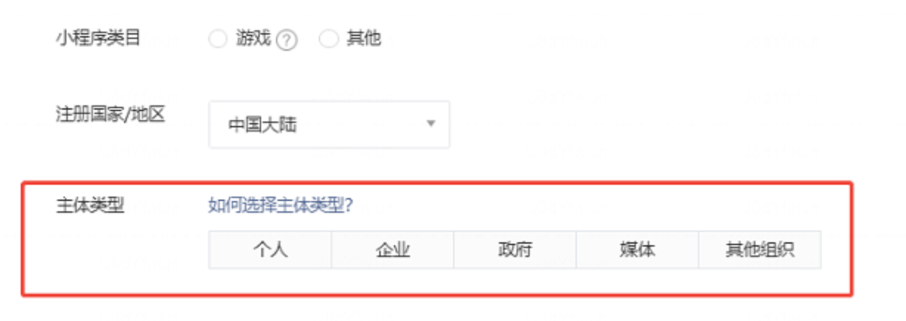
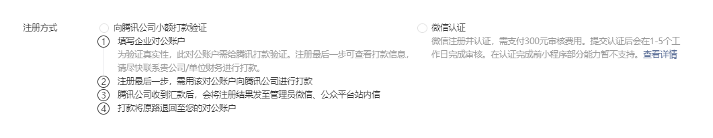

tags:: [[微信小程序]]
---

- ## 一个简单企业小程序需要的服务
	- 用户小程序
	  logseq.order-list-type:: number
		- 小程序前端: 上传审核即可.
		  logseq.order-list-type:: number
		- 小程序后端
		  logseq.order-list-type:: number
	- 管理后台
	  logseq.order-list-type:: number
		- 管理后台 Web 前端 (需公网地址)
		  logseq.order-list-type:: number
		- 管理后台后端
		  logseq.order-list-type:: number
		- 关系型数据库
		  logseq.order-list-type:: number
		- 对象存储 (存文件/图片等)
		  logseq.order-list-type:: number
	- 安全 (可选)
	  logseq.order-list-type:: number
		- 数据库数据备份与恢复 (以防数据误操作)
		  logseq.order-list-type:: number
		- DDos 防护
		  logseq.order-list-type:: number
	- ==小程序后端 和 管理后台后端, 在前期可以是同一个服务==
	- 所以, 总结就是, 我们需要部署或订阅:
		- 一个业务逻辑后端.
		  logseq.order-list-type:: number
		- 一个关系型数据库服务.
		  logseq.order-list-type:: number
		- 一个对象存储服务.
		  logseq.order-list-type:: number
		- 一个域名 + SSL 证书 (可用免费的).
		  logseq.order-list-type:: number
		- 一个静态 Web 前端.
		  logseq.order-list-type:: number
- ## 非开发操作
	- 开发一个简单小程序, 除了开发, 还要做如下操作:
		- 注册小程序.
		  logseq.order-list-type:: number
		- 小程序微信认证.
		  logseq.order-list-type:: number
		- 注册微信支付商户 (需保证已完成微信认证).
		  logseq.order-list-type:: number
		- 小程序备案 (在小程序管理后台操作, 需保证已完成微信认证).
		  logseq.order-list-type:: number
		- 管理后台域名 ICP 备案 和 公安备案 (参见:  [[域名备案]])
		  logseq.order-list-type:: number
		- 云服务选择.
		  logseq.order-list-type:: number
- ## 注册小程序
	- ### 主体类型
		- {:height 164, :width 394}
	- ### 企业类型
		- 注册 **企业** 类型小程序, 需要进行 **主体验证** .
			- {:height 165, :width 807}
		- 有如下方式:
			- **支付验证** : 用 **企业公账** 向腾讯官方打一个随机金额的款项 (之后会退还) .
			  logseq.order-list-type:: number
				- ==实测, 支付后 30 分钟左右收到 **验证结果通知** ==
			- **微信认证** : 支付 300 元审核费用.
			  logseq.order-list-type:: number
		- ==如果不是马上要用到 **需要微信认证的功能** , 或是马上要上线: 可以先采取 **支付验证** .==
			- 因为 **微信认证** 有一年有效期的, 如果不是立即要用, 没必要这么快进行认证.
			- 后续需要的时候, 可以再进行 **微信认证** .
- ## 注册微信支付商户
	- ==需确保已完成微信认证==
	-
- ## 域名费用
	- 腾讯云价格:
		- `.com` 大概首年 83 元, 续费 90 元/年.
		- `.cn` 大概首年 33 元, 续费 38 元/年.
- ## SSL 证书费用
	- 腾讯云 CloudBase : **静态网站托管** 自带 免费证书 .
	  logseq.order-list-type:: number
	- 各个云厂商的免费证书, 每 90 天需要进行一次续期 (可配置自动续期).
	  logseq.order-list-type:: number
	- 免费证书: Let's Encrypt (可配置自动续期)
	  logseq.order-list-type:: number
- ## 云服务选择
	- 通读 [[微信云开发, 腾讯云 CloudBase, 微信云托管 & 云服务器]]
	- ### 微信云托管费用
		- 参见: [微信云托管说明](https://cloud.tencent.com/document/product/876/113602)
	-
- ## 费用总计
	- 主要是如下几个条目:
		- 域名: `90 元/年`
		  logseq.order-list-type:: number
		- 小程序微信认证: `300 元/年`
		  logseq.order-list-type:: number
		- 云服务:
		  logseq.order-list-type:: number
			- 腾讯云 CloudBase :
			  logseq.order-list-type:: number
			- 微信云托管 :
			  logseq.order-list-type:: number
			- 轻量应用服务器 (2 核 4G) : `780 元/年 (首年 312)`
			  logseq.order-list-type:: number
				- 轻量应用服务器, 部署所有服务
			- 轻量应用服务器 + 数据库 :
			  logseq.order-list-type:: number
				- 轻量应用服务器, 部署数据库之外的所有服务
			- 轻量应用服务器 + 数据库 + 对象存储:
			  logseq.order-list-type:: number
				- 轻量应用服务器, 部署数据库和对象存储之外的所有服务
	-
	- 域名 + 小程序微信认证 +  : 5 元/月 + 25 元/月 + 平均 60 元/月 = 90 元/月.
	- 域名 + 小程序微信认证 +  : 5 元/月 + 25 元/月 + 平均 65 元/月 = 95 元/月.
	- 域名 + 小程序微信认证 + () : 5 元/月 + 25 元/月 + (平均 65 元/月 + 35 元/月 + 8 元/月) = 138 元/月.
	-