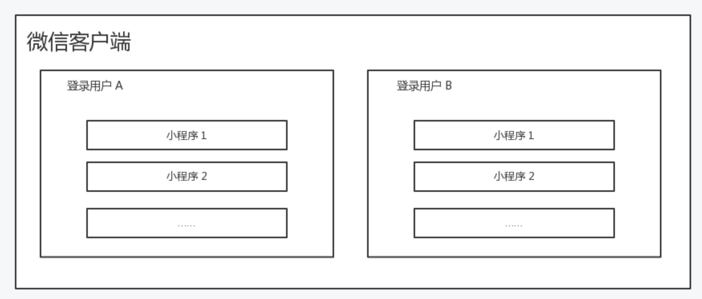

tags:: [[微信小程序文件系统]]
---

- ## 文件系统
	- 文件系统提供了:
		- 一套 **以小程序和用户维度隔离** 的存储 .
		  logseq.order-list-type:: number
		- 一套相应的 **管理接口** .
		  logseq.order-list-type:: number
- ## 文件分类
	- 代码包文件: **小程序项目目录** 中的文件.
	  logseq.order-list-type:: number
	- 本地文件: 设备上给小程序用户开辟的存储空间中的文件.
	  logseq.order-list-type:: number
		- 本地临时文件: 调用 **特定 API** 产生的 **临时文件** , 在小程序销毁后可能会被 **清理** .
		  logseq.order-list-type:: number
		- 本地缓存文件: 调用接口把 **本地临时文件** 缓存后产生的文件, 不能自定义目录和文件名 .
		  logseq.order-list-type:: number
		- 本地用户文件: 微信提供了一个 **本地用户文件** 目录, 开发者对这个目录有 **完全自由的读写权限** .
		  logseq.order-list-type:: number
- ## 文件存储隔离
	- ### 代码包文件
		- **同一设备** 的 **不同小程序** 的 **代码包文件** 隔离.
			- 即 小程序只能访问 **属于当前运行的小程序** 的 **代码包文件** , 而不能访问其他小程序的 **代码包文件** .
	- ### 本地文件
		- **同一设备** 的 **不同微信用户** 的 **本地文件** 隔离.
			- 即 小程序只能访问当前登录用户的 **本地文件** , 而不能访问其他用户的 **本地文件** .
		- **同一微信用户** 的 **不同小程序下** 的 **本地文件** 隔离.
			- 即 小程序只能访问当前登录用户 **属于当前运行的小程序** 的 **本地文件** , 而不能访问其他小程序的 **本地文件** .
		- {:height 284, :width 570}
- ## 文件路径
	- ### 代码包文件路径
		- 只支持以 **项目根目录** 为 **根目录** 的 **绝对路径** :
			- `/a/b/c`
			  logseq.order-list-type:: number
			- `a/b/c` (可以省略开头的 `/` , 但仍视为绝对路径)
			  logseq.order-list-type:: number
		- **相对路径** 不合法.
			- 如 `./a/b/c` 和 `../a/b/c` 都是非法的.
	- ### 本地文件路径
		- #### 本地文件路径格式
			- **本地文件** 的文件路径格式为: `{{协议名}}://文件路径` .
				- ==正是因为有这个协议名, 才能在调用 API 传入文件路径时, 区分是 **代码包文件路径** 还是 **本地文件路径**==
			- 各种 **本地文件** 所在目录:
				- **本地临时文件** : `{{协议名}}://tmp/`
				- **本地缓存文件** : `{{协议名}}://store/`
				- **本地用户文件** : `{{协议名}}://usr/`
		- #### 本地文件路径协议名
			- 在 **iOS / Android 客户端** , `协议名` 为 `wxfile` .
			- 在 **微信开发者工具** , `协议名` 为 `http` .
			- 不过, 开发者无需关注这个差异, 也不应在代码中硬编码 **协议名** (否则, 无法让两边同时都能运行) .
		- #### 微信开发者工具查看本地文件
			- `开发者工具右上角「详情」 → 「基本信息」 → 「文件系统」`
- ## 容量限制与清理策略
	- ### 代码包文件
		- 容量限制: 受小程序 **代码包大小** 限制.
		- 清理策略: 只有在代码包被清理的时, 才会被清理.
	- ### 本地临时文件
		- 容量限制:
			- 在小程序运行时, 产生的 **本地临时文件** 最多只能到 `4GB`.
		- 清理策略:
			- 小程序被销毁后, **本地临时文件** 的清理策略:
				- 若当前用户某个小程序的 **本地临时文件** 占用大于 `2GB` , 则会 **以文件维度** 清理 (按文件的 **最近使用时间** , 从远到近清理) .
				  logseq.order-list-type:: number
				- 若当前用户所有小程序的 **本地临时文件** 占用总和超过 `6GB` , 则会 **以小程序维度** 清理.
				  logseq.order-list-type:: number
	- ### 本地缓存文件与本地用户文件
		- 容量限制: 任何时候, 当前用户单个小程序的 **本地缓存文件** 与 **本地用户文件** 总计都不能超过 `200MB` .
		- 清理策略: 只有在代码包被清理的时, 才会被清理.
- ## 代码包文件
	- ### 无法修改代码包文件
		- 小程序运行过程中, 无法 修改或删除 **代码包文件** .
			- ==只能重新发布版本==
	- ### 编译后无法访问的文件
		- 小程序项目中, 有些文件会被编译, 编译后就无法直接作为文件访问了.
			- 参见: [[微信小程序 - 项目结构]] , 查看 **会被编译** 的文件.
	- ### 最佳实践
		- 只在 **代码包** 中存放 **内容较小** 且 **无需动态替换** 的文件.
		- 对于 **内容较大** 或 **需要动态替换** 的文件:
			- 不要添加到 **代码包** 中, 建议在 **小程序启动后** 发起网络请求 **下载** 到到本地.
- ## 本地临时文件
	- ### 产生本地临时文件
		- **本地临时文件** 只能通过 **调用特定接口** 产生, 用户无法凭空创建 **本地临时文件** .
			- 参见: [[微信小程序文件系统: 产生本地临时文件]]
	- ### 本地临时文件会被清理
		- **本地临时文件** 产生后, 仅在 **当前小程序生命周期内** 保证有效, **小程序销毁后** 可能会被清理.
			- 参见: [[微信小程序 - 小程序生命周期]]
	- ### 最佳实践
		- 若想将 **本地临时文件** 持久保存:
		  logseq.order-list-type:: number
			- 可将 **本地临时文件** 转为 **本地缓存文件** 或 **本地用户文件** .
		- 在将文件 **下载** 为 **本地临时文件** 的场景下:
		  logseq.order-list-type:: number
			- 可以在第一次下载时缓存下载后的 **本地临时文件路径** , 每次下载时, 都调用 `FileSystemManager` 的 `access / accessSync` 方法判断文件存不存在.
			- 若存在, 则无需重复下载, 避免占用空间.
- ## 本地缓存文件 (不推荐使用)
	- ### 产生本地缓存文件
		- 调用 `FileSystemManager` 的 `saveFile / saveFileSync` 将 **本地临时文件** 转为 **本地缓存文件** , 原 **本地临时文件**失效.
			- ==已不推荐使用, 应使用功能更完整的 **本地用户文件**==
		- 将 **本地临时文件** 转为 **本地缓存文件** 时, 不能指定路径.
			- 就是直接将 `{{协议名}}://tmp/文件名` 剪切到 `{{协议名}}://store/文件名` .
- ## 本地用户文件
	- ### 本地用户文件目录
		- 微信提供了一个 **本地用户文件** 目录, 开发者对这个目录有 **完全自由的读写权限** .
		- 用 `wx.env.USER_DATA_PATH` 可以获取到这个目录的路径, 值为 `{{协议名}}://usr`
	- ### 产生本地用户文件
		- 调用 `FileSystemManager` 的 `copyFile / copyFileSync` 将 **本地临时文件** 复制到 **本地用户文件** 目录下.
		  logseq.order-list-type:: number
		- 调用 `FileSystemManager` 的 `saveFile / saveFileSync` 将 **本地临时文件** 剪切到 **本地用户文件** 目录下.
		  logseq.order-list-type:: number
		- 调用 `FileSystemManager` 的 `写文件` 相关方法 , 直接创建 **本地用户文件** .
		  logseq.order-list-type:: number
- ## API 和 组件对各种文件的读写权限
	- | API 和 组件 | 读 | 写 |
	  | ---- | ---- | ---- |
	  | 代码包文件 | ✅ | ❌ |
	  | 本地临时文件 | ✅ | ❌ |
	  | 本地缓存文件 | ✅ | ❌ |
	  | 本地用户文件 | ✅ | ✅ |
- ## 参考
	- [小程序 - 指南 - 基础能力 - 文件系统](https://developers.weixin.qq.com/miniprogram/dev/framework/ability/file-system.html)
	  logseq.order-list-type:: number
-