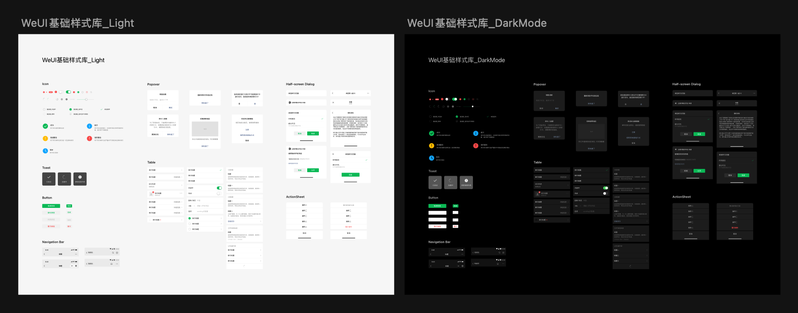

tags:: [[微信小程序]]
---

- ## 设计指南
	- 通读: [微信小程序设计指南](https://developers.weixin.qq.com/miniprogram/design/)
	- ### 关于设计稿标准尺寸
		- 官方推荐两种标准尺寸:
			- 375px
			  logseq.order-list-type:: number
				- 开始时, 使用 rpx 单位, 计算方便 (参见: [[WXSS 扩展特性: 尺寸单位 rpx]] )
			- 390px
			  logseq.order-list-type:: number
				- 开发时, 使用 (px 单位 + 响应式布局 + 必要时 rpx 单位), 更适配各种屏幕 ( ==这是现代主流方案== ).
				- (使用 px 单位, 通过 DPR 换算, 得到的物理像素必然是整数; 而使用 rpx 得到的物理像素则不一定是整数.)
	- ### 设计稿下载
		- [Sketch 设计控件库](https://wximg.gtimg.com/shake_tv/mina/WEUI_1_0_161226_Sketch.zip) (版本有点老, 新版本 Sketch 打不开)
		  logseq.order-list-type:: number
		- [Photoshop 设计控件库](https://wximg.gtimg.com/shake_tv/mina/WeUI1.0.psd.zip)
		  logseq.order-list-type:: number
		- [WeUI_Sketch 组件库](https://res.wx.qq.com/op_res/lWyoeDcquC-aEEqbiVnqVjbNwJuHNVYfe6v3bELpEOitmrLhU9_n9Ngow-tELWst)
		  logseq.order-list-type:: number
			- 长这样
			- {:height 227, :width 604}
	- ### WeUI
		- 参见: [[WeUI]]
- ## 大屏适配
	- 通读 [小程序大屏适配指南](https://developers.weixin.qq.com/miniprogram/design/adapt.html)
- ## 适老化设计
	- 通读 [小程序适老化设计指南](https://developers.weixin.qq.com/miniprogram/design/elderly.html)
	- ### 字体大小
		- 可以根据用户的 **微信客户端字体大小** , 设置 **小程序字体大小** .
		- 可以通过 [wx.getSystemInfo](https://developers.weixin.qq.com/miniprogram/dev/api/base/system/wx.getSystemInfo.html) , 获取 **微信客户端字体大小** 相关参数:
			- `fontSizeSetting` : 用户字体大小 (单位px)
			  logseq.order-list-type:: number
			- `fontSizeScaleFactor` : 字体缩放倍率
			  logseq.order-list-type:: number
	- ### 适配工具
		- 参见: [小程序适老化自动适配工具](https://github.com/wechat-miniprogram/miniprogram-elder-transform)
- ## 无障碍设计
	- 参见: [[微信小程序无障碍]]
- ## 物料设计
	- 通读 [小程序物料设计指引](https://developers.weixin.qq.com/miniprogram/design/MaterialDesign.html)
	- 其中包含物料下载.
-