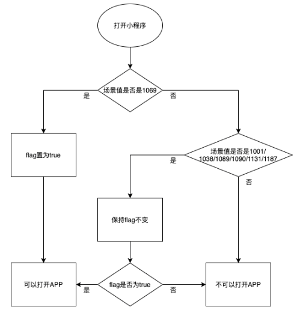

tags:: [[微信开发]]
---

- ## 规则
	- 场景值参见: [场景值列表](https://developers.weixin.qq.com/miniprogram/dev/reference/scene-list.html)
	- ### 1069 场景
		- 如果 **移动应用通过 Open SDK 进入微信，打开小程序** (场景值 `1069` ), 小程序会获得 **返回移动应用** 的能力.
			- 但是, 只能打开 **拉起该 小程序 的 移动应用** .
	- ### 非 1069 场景
		- 当小程序从以下场景打开时, 小程序将保持 **上一次打开小程序时**,  **打开移动应用能力** 的状态 (即上一次能打开移动应用, 这一次也可以; 否则, 这一次不可以)
		  logseq.order-list-type:: number
			- `1038` : 从另一个小程序返回 (基础库 2.2.4 及以上版本支持)
			  logseq.order-list-type:: number
			- `1089` : 小程序从聊天顶部场景中的「最近使用」内打开时
			  logseq.order-list-type:: number
			- `1090` : 长按小程序右上角菜单唤出最近使用历史
			  logseq.order-list-type:: number
			- `1001` : 发现栏小程序主入口，「最近使用」列表打开时 (基础库2.17.3及以上版本支持)
			  logseq.order-list-type:: number
			- `1131` : 浮窗 (8.0版本起仅包含被动浮窗) (基础库2.17.3及以上版本支持)
			  logseq.order-list-type:: number
			- `1187` : 浮窗 (8.0版本起) 或 星标 (基础库2.17.3及以上版本支持)
			  logseq.order-list-type:: number
		- "非如上场景, 则不具备 **打开移动应用** 的能力.
		  logseq.order-list-type:: number
	- ### 流程图
		- 
- ## 使用
	- 使用 `open-type` 的值设置为 `launchApp` 的 [button](https://developers.weixin.qq.com/miniprogram/dev/component/button.html) 组件.
		- 注意, 只能通过 button 组件使用, 无法后台调 API 打开移动应用.
- ## 参考
	- [小程序打开 App](https://developers.weixin.qq.com/miniprogram/dev/framework/open-ability/launchApp.html)
	  logseq.order-list-type:: number
	- [场景值列表](https://developers.weixin.qq.com/miniprogram/dev/reference/scene-list.html)
	  logseq.order-list-type:: number