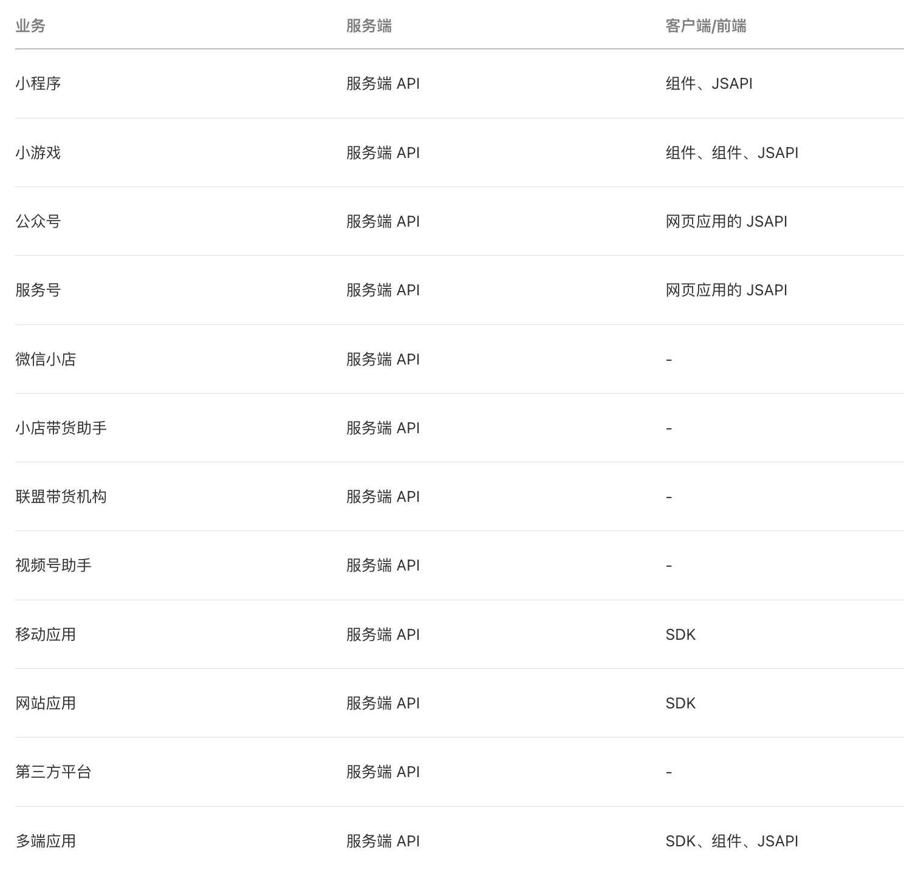

tags:: [[微信开发]]
---

- ## 微信能力
	- 做 **微信开发** , 本质上就是接入 **微信开放给开发者的能力** 。
	- 微信开放的能力:
		- [[微信支付]]
		  logseq.order-list-type:: number
		- [[微信分享]]
		  logseq.order-list-type:: number
		- ...
- ## 微信生态应用
	- 微信开放的能力, 需要在 **微信生态应用** 中调用.
	- **微信生态应用** , 有如下区分:
		- **微信原生应用** (都有 AppId, 支持做一些开发):
		  logseq.order-list-type:: number
			- 微信公众账号
			  logseq.order-list-type:: number
				- [[微信小程序]]
				  logseq.order-list-type:: number
				- [[微信公众号]]
				  logseq.order-list-type:: number
				- [[微信服务号]]
				  logseq.order-list-type:: number
				- [[企业微信]]
				  logseq.order-list-type:: number
			- [[微信视频号]]
			  logseq.order-list-type:: number
			- ...
		- **非微信原生应用**
		  logseq.order-list-type:: number
			- **第三方应用** (此名称参见: [微信Open SDK个人信息处理规则](https://support.weixin.qq.com/cgi-bin/mmsupportacctnodeweb-bin/pages/RYiYJkLOrQwu0nb8) , 有 AppId, 需要在微信后台注册审核):
			  logseq.order-list-type:: number
				- [[微信移动应用]] (需要集成 [[微信 Open SDK]] )
				  logseq.order-list-type:: number
				- [[微信网站应用]]
				  logseq.order-list-type:: number
				- ...
				  logseq.order-list-type:: number
			- **第三方网页 (在微信内打开)** (本身无 AppId, 但需与 公众号/服务号 绑定)
			  logseq.order-list-type:: number
				- [[微信网页开发]]
		- **第三方服务端**  (本身无 AppId , 但需要用到 **微信原生应用** 或  **非微信原生应用** 的 AppId 进行鉴权)
		  logseq.order-list-type:: number
			- 不管是 **微信原生应用** 还是 **非微信原生应用** , 都不可避免需要借助 **第三方服务端** 来配合开发.
			- 主要是如下两种情况:
				- [[微信服务端 API]]
				  logseq.order-list-type:: number
				- [[微信消息与事件推送]]
				  logseq.order-list-type:: number
			- ==服务端开发与部署:==
				- 自己开发之后, 自己部署 或 采用 [[微信云托管]] 部署.
				  logseq.order-list-type:: number
				- 采用 [[微信云开发]] 开发并部署.
				  logseq.order-list-type:: number
- ## 接入微信能力的方式
	- 各种应用支持的接入方式:
		- {:height 913, :width 555}
		- 图源: [开放平台: 开发指南](https://developers.weixin.qq.com/doc/oplatform/developers/dev/)
- ## 公众号与服务号
	- 公众号: 侧重内容推送.
		- 公众号原本是 **订阅号** 与 **服务号** 的统称.
		- 后面可能是用户叫习惯了? **订阅号** 干脆就改名 **公众号** 了, **服务号** 还叫 **服务号** .
	- 服务号: 侧重业务服务, 更像个应用.
- ## OpenID 与 UnionID
	- `OpenID`
		- `OpenID` 是 **微信用户** 在一个应用内的身份标记, 同一个 **微信用户** 在不同 **微信应用** 内有不同的 `OpenID` .
	- `UnionID`
		- 开发者可以在 **微信开放平台** 注册账号, 一个 **微信开放平台账号** 可以绑定多个 **应用** .
		- **微信用户** 在同一个 **微信开放平台账号** 的 **多个应用** 下, 共享同一个 `UnionID` .
- ## 开发者平台
	- 微信有如下几个开发者平台:
		- [微信公众平台](https://mp.weixin.qq.com/)  : 是 注册和管理 **企业微信 (原企业号)** , **服务号** , **公众号** 和 **小程序** 的平台, 主要是面向运营人员的.
		  logseq.order-list-type:: number
		- [微信开放平台](https://open.weixin.qq.com/) : 是 注册和管理 应用 (移动应用, 网页应用, 小程序等) , 为应用 申请开放能力 的平台.
		  logseq.order-list-type:: number
		- [微信开发者平台](https://developers.weixin.qq.com/platform) : 是 绑定和管理微信生态 所有能力的平台.
		  logseq.order-list-type:: number
			- 目前, **微信开发者平台** 应该是属于 **微信开放平台** 的补充吧, **微信开放平台** 虽然老旧, 但一时也无法被淘汰.
			- **微信开放平台** 会引导用户到 **微信开发者平台** .
		- [微信开放社区](https://developers.weixin.qq.com/community/homepage) : 开发者交流平台.
		  logseq.order-list-type:: number
		- [微信官方文档](https://developers.weixin.qq.com/doc/) : 开发文档导航.
		  logseq.order-list-type:: number
- ## 微信 UI 框架
	- [[WeUI]]
- ## 参考
	- [微信开放平台介绍](https://developers.weixin.qq.com/doc/oplatform/open/intro.html)
	  logseq.order-list-type:: number
	- [开放平台: 开发指南](https://developers.weixin.qq.com/doc/oplatform/developers/dev/)
	  logseq.order-list-type:: number
-