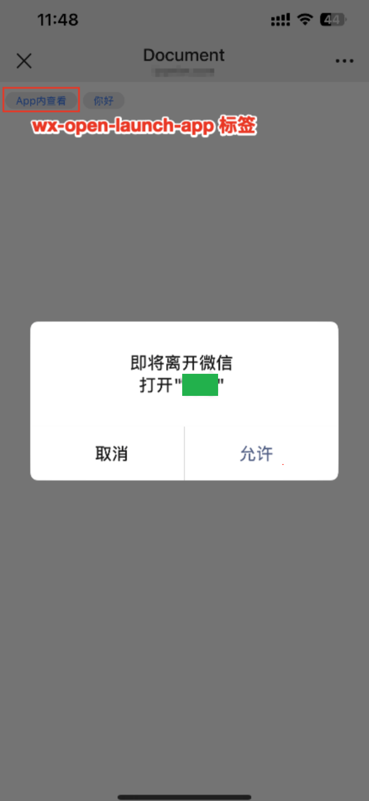
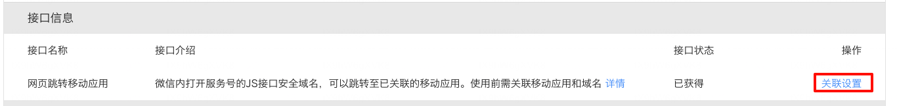
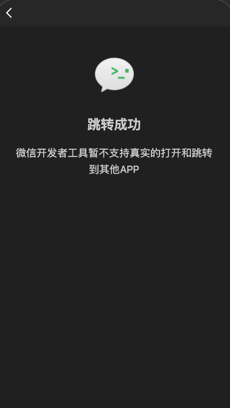

tags:: [[微信开放标签]]
---

- ## wx-open-launch-app 拉起移动应用原理
	- ### iOS
		- 微信客户端 对 `wx-open-launch-app` 的跳转参数进行校验.
		  logseq.order-list-type:: number
		- 解析到要跳转的 **移动应用的 AppID** , 作为 **URL Scheme** 进行跳转.
		  logseq.order-list-type:: number
			- 需要 Xcode 工程, 在 `TARGETS -> Info -> URL Types` , 配置 **URL Scheme** .
			- ==经测试: ==
				- 仅配置  **Universal Link**  是无法打开 App 的.
				  logseq.order-list-type:: number
				- 仅配置  **URL Scheme** 是可以打开 App 的.
				  logseq.order-list-type:: number
				- 同时配置   **Universal Link**  和  **URL Scheme** 是可以打开 App 的.
				  logseq.order-list-type:: number
			- ==是否可以说明,  `wx-open-launch-app` 跳转 App 仅使用到了 **URL Scheme** ?==
		- 出现用户确认弹框.
		  logseq.order-list-type:: number
			- 如图所示, 会有 `即将离开微信 打开 "xxx"` 的弹框.
			- {:height 433, :width 205}
	- ### Android
		- ==待详细测试==
		- 貌似是 Intent  + 包名, 因为安卓没有配置移动应用的 AppId , 也可以跳转.
- ## 事前准备
	- 要实现在 **微信内网页** 使用 `wx-open-launch-app` 跳转 **移动应用** , 需要事前有如下准备:
		- 在 [微信公众平台](https://mp.weixin.qq.com/) 注册一个 **服务号** (不能只是 **公众号** ) .
		  logseq.order-list-type:: number
		- 在 [微信开放平台](https://open.weixin.qq.com/) 注册一个 **开放平台账号** .
		  logseq.order-list-type:: number
		- 完成 **服务号** 和 **开放平台账号** 的 **认证** , 保证两者属于同一主体.
		  logseq.order-list-type:: number
		- 在同一 **开放平台账号** 下, 绑定已完成认证的 **服务号** .
		  logseq.order-list-type:: number
		- 在同一 **开放平台账号** 下, 注册一个 **移动应用** , 并审核通过 . 
		  logseq.order-list-type:: number
			- (参见: [[微信移动应用: 配置]] , 重点关注: **跳转/下载移动应用相关参数** )
- ## 域名配置说明
	- 微信内网页跳转移动应用的域名, 涉及以下几个方面:
		- 开发者部署的 **网页域名** .
		  logseq.order-list-type:: number
		- **服务号** 配置的 **JS 接口安全域名** .
		  logseq.order-list-type:: number
		- **服务号** 配置的可以跳转到 **指定移动应用** 的 **可跳转域名** .
		  logseq.order-list-type:: number
	- ==域名配置要求==
		- **可跳转域名** 必须是 **JS 接口安全域名** 或其 **子域名** ? ==子域名待验证==
		  logseq.order-list-type:: number
		- **网页域名** 必须与 **可跳转域名** 完全一致才行.
		  logseq.order-list-type:: number
			- 即如果 **可跳转域名**  是一级域名, 则 **网页域名** 也必须是一级域名, 否则无法打开 App .
			- **网页域名** 不能是 **可跳转域名** 子域名!!!!
			- ==经测试: ==
				- **JS 接口安全域名** 和 **可跳转域名**  都为 `myapp.com` , 而 **网页域名** 为 `sub.myapp.com` 时.
				- 虽然 JS-SDK 初始化正常, 但 `wx-open-launch-app` 触发 `error` 事件,  `e.detail` 值为:
					- `{errMsg: "launch:fail_check fail", appId: "wxyyyy", extInfo: "xxxxx"}`
					- 这是在 [[微信开发者工具]] 调试, 在 `error` 事件中打印出来的.
		- 一个 **可跳转域名** , 只能同时关联一个 **移动应用** .
		  logseq.order-list-type:: number
			- 因此需要保证配置的 **可跳转域名** 没有已经关联的 **移动应用** .
		- 注意: **JS 接口安全域名** 和 **可跳转域名** 的修改都有次数限制, 谨慎填写和修改!
		  logseq.order-list-type:: number
- ## 使用步骤
	- ### 1.配置服务号的 "JS 接口安全域名"
		- 参见: [[微信 JS 接口安全域名]]
	- ### 2.配置服务号的 "域名与移动应用关联"
		- 进入 [微信开放平台](https://open.weixin.qq.com) -> 顶栏 "管理中心" -> 顶栏 "公众号" -> 选择指定服务号 -> 网页跳转移动应用 -> 点击 "关联设置"
		  logseq.order-list-type:: number
			- {:height 163, :width 928}
		- 配置 "可跳转域名" 与 "移动应用" 的关联关系.
		  logseq.order-list-type:: number
			- 效果是: 配置的 "可跳转域名" 下的网页, 可以跳转到配置的 "移动应用" .
				- 由此可见: 并非可以跳转任何移动应用.
	- ### 3.Web 端接入 JS-SDK
		- 参见: [[微信 JS-SDK: 使用步骤]]
	- ### 4.Web 端使用 `wx-open-launch-app` 开放标签
		- 参见下文
	- ### 5.App 端接入 Open SDK
		- 参见: [[微信 Open SDK]]
	- ### 6.App 端获取 Web 端传递的参数
		-
- ## 使用 `wx-open-launch-app` 开放标签
	- ### 使用限制
		- **真机**  和 **微信开发者工具** 都可以渲染  `wx-open-launch-app` 标签, 但 **微信开发者工具** 无法测试 **跳转到 App** , 需要到 **真机** 上进行测试.
		  logseq.order-list-type:: number
			- {:height 311, :width 228}
		- `wx-open-launch-app` 标签中, 使用文字链无法拉起 App.
		  logseq.order-list-type:: number
		- 只有如下场景进入网页, `wx-open-launch-app` 标签才能正常打开 App, 否则点击按钮无反应.
		  logseq.order-list-type:: number
			- 点击 **公众号/服务号** 菜单栏, 进入网页.
			  logseq.order-list-type:: number
			- 收藏 **网页地址文本** , 并从收藏页面, 点击链接, 进入网页.
			  logseq.order-list-type:: number
			- 点击使用 **微信 Open SDK** 分享的网页卡片 (卡片再次分享也可以) , 进入网页.
			  logseq.order-list-type:: number
			- 使用微信扫描 **网页地址** 生成的二维码, 进入网页.
			  logseq.order-list-type:: number
			- (参考: 非官方贴 [wx-open-launch-app 标签跳转到app launch：fail ？](https://developers.weixin.qq.com/community/minihome/doc/000a666bcecda8a01eb31ff8b6bc00))
	- ### 标签
		- ``` html
		  	<wx-open-launch-app id="launch-btn" appid="你要跳转的 AppID" extinfo="你要传递给 App 的参数">
		          <script type="text/wxtag-template">
		              <style>.btn { padding: 12px }</style>
		              <button class="btn">App内查看</button>
		          </script>
		      </wx-open-launch-app>
		  ```
		- 属性:
			- `appid` : 你要跳转的 AppID
			- `extinfo` : 你要传递给 App 的参数 (由开发者自定义)
				- ==此参数还未细看==
	- ### 事件
		- | 名称 | 冒泡 | 返回值 | 备注 |
		  | ---- | ---- | ---- |
		  | ready | 否 |  | 标签初始化完毕，可以进行点击操作 |
		  | launch | 否 | { appId: string, extInfo: string } | 用户点击跳转按钮并对确认弹窗进行操作后触发 |
		  | error | 否 | { errMsg: string, appId: string, extInfo: string } | 用户点击跳转按钮后出现错误 |
		- `error` 事件返回的 `errMsg` 字段说明:
			- `launch:fail` 可能原因:
				- 当前场景不支持跳转
				  logseq.order-list-type:: number
				- Android 上该应用未安装.
				  logseq.order-list-type:: number
				- iOS 上用户在弹窗上点击确认, 但该应⽤未安装
				  logseq.order-list-type:: number
			- `launch:fail_check fail` 可能原因:
				- App 跳转权限, 校验失败.
				  logseq.order-list-type:: number
				- **网页域名** 与配置的 **可跳转域名** 不完全一致.
				  logseq.order-list-type:: number
				- 绑定 `AppID` 异常.
				  logseq.order-list-type:: number
- ## Web 端代码示例
	- ``` html
	  <!DOCTYPE html>
	  <html lang="en">
	  
	  <head>
	      <meta charset="UTF-8">
	      <meta name="viewport" content="width=device-width, initial-scale=1.0">
	      <title>Document</title>
	  
	      <script src="https://res.wx.qq.com/open/js/jweixin-1.6.0.js"></script>
	  </head>
	  
	  <body>
	      <wx-open-launch-app id="launch-btn" appid="你要跳转的 AppID" extinfo="你要传递给 App 的参数">
	          <script type="text/wxtag-template">
	              <style>.btn { padding: 12px }</style>
	              <button class="btn">App内查看</button>
	          </script>
	      </wx-open-launch-app>
	  
	      <button>你好</button>
	  
	      <script>
	          // 初始化
	          let ready = false;
	          init();
	  
	          var btn = document.getElementById('launch-btn');
	          btn.addEventListener('launch', function (e) {
	              console.log('success');
	          });
	  
	          btn.addEventListener('error', function (e) {
	              console.log('fail', e.detail);
	          });
	  
	          // 页面初始化
	          function init() {
	              // 配置微信 JS-SDK
	              let config = createConfig();
	              wx.config(config);
	  
	              wx.ready(() => {
	                  ready = true;
	                  console.log("WeChat JS-SDK is ready.");
	              });
	  
	              wx.error((err) => {
	                  console.error("WeChat JS-SDK error:", err);
	              });
	          }
	  
	          function createConfig() {
	              // 此处从服务端获取相关参数
	              let config = {
	                  debug: true,
	                  appId: "",
	                  timestamp: "",
	                  nonceStr: "",
	                  signature: "",
	                  jsApiList: [],
	                  openTagList: ['wx-open-launch-app']
	              };
	              return config;
	          }
	      </script>
	  </body>
	  
	  </html>
	  ```
- ## 参考
	- [微信内网页跳转APP功能](https://developers.weixin.qq.com/doc/oplatform/Mobile_App/WeChat_H5_Launch_APP.html)
	  logseq.order-list-type:: number
	- [开放标签使用说明](https://developers.weixin.qq.com/doc/service/guide/h5/opentag.html)
	  logseq.order-list-type:: number