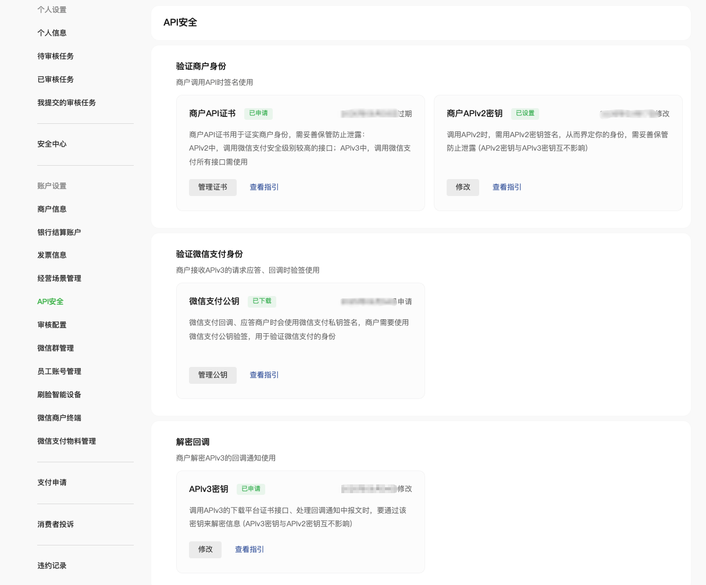

tags:: [[微信支付]]
---

- ## 问题
	- APIv3 和 APIv2 为何要求的 API 证书文件不同?
	  logseq.order-list-type:: number
		- 证书文件中内容是啥?
- ## API 安全参数设置
	- 如下所有参数, 都要在 [商户平台 - 账户中心 - API 安全](https://pay.weixin.qq.com/index.php/core/cert/api_cert#/) 进行设置, 方可在调用 API 时使用.
	- {:height 615, :width 695}
- ## 商户 API 证书 说明
	- ==APIv3 与 APIv2 共用同一个 API 证书==
	- ### 作用
		- 所有 APIv3 请求, 都要使用 **商户 API 私钥** 进行签名.
		- 所有 APIv2 请求, 都要使用 **APIv2 密钥** 进行签名.
			- 其中部分 APIv2 请求, 还要使用 **商户 API p12 证书** 验证身份 (一种被称为 [[mTLS]] 的过程.)
				- 所以, 必须是 p12 证书文件, 而不能只是 私钥 文件.
	- ### 生成步骤
		- 参考: [商户API证书获取方法及功能介绍](https://kf.qq.com/faq/161222NneAJf161222U7fARv.html)
		- 安装 **微信证书工具** .
		  logseq.order-list-type:: number
		- 填写必要信息, 生成 **证书请求串** .
		  logseq.order-list-type:: number
			- 具体细节参见: [[向 CA 申请证书]]
			- 注意: 此时密钥对已在本地生成.
		- 将 **证书请求串** 粘贴到 **微信商户平台** , 微信帮忙向 CA 申请证书.
		  logseq.order-list-type:: number
			- 这里 **微信证书工具** 不直接申请证书的原因是, 微信希望在申请证书阶段, 就对商户做一些校验;
			- 而不是等到商户自己生成证书, 上传证书时, 再做校验.
		- **微信商户平台** 展示生成的证书, 商户需要将其粘贴到 **微信证书工具** , 用于本地生成证书文件.
		  logseq.order-list-type:: number
	- ### 关于 CA
		- 参考: [微信支付商户API证书升级方法（技术人员）](https://kf.qq.com/faq/180824JvUZ3i180824YvMNJj.html)
		- 2018 年 6 月 之前, 商户的证书, 都是由微信支付自己的 CA `MmpaymchCA` 颁发的, 后来改为 `Tenpay.com Root CA` .
			- 因为, 微信支付无法保证商户程序运行的环境, 必然信任它的 CA .
		- ==其实, 本质上来说, 微信只是需要 **商户的公钥** 而已:==
			- 这里之所以涉及到 CA, 是为了保证 **商户公钥** 在传输给微信的过程中, 不会被黑客篡改.
	- ### 证书内容
		- `apiclient_cert.p12` : 包含 证书 + 私钥 内容
		  logseq.order-list-type:: number
			- 证书中是包含 公钥 内容的.
		- `apiclient_cert.pem` :  包含 证书 内容
		  logseq.order-list-type:: number
			- 证书中是包含 公钥 内容的.
		- `apiclient_key.pem` : 私钥文件.
		  logseq.order-list-type:: number
		- 证书密码: `商户号` .
		  logseq.order-list-type:: number
	- ### 证书序列号
		- 参考: [申请商户API证书](https://pay.weixin.qq.com/doc/v3/merchant/4012072428)
		- 执行如下命令获取:
			- ``` zsh
			  openssl x509 -in apiclient_cert.pem -noout -serial
			  serial=1DDE55AD98ED71D6EDD4A4A16996DE7B47773A8C
			  ```
		- 即 商户 API 证书的唯一标识 (证书存在更换的情况, 所以需要做区分).
			- 用于 **商户** 告知 **微信支付** , 应该使用哪个公钥进行验签.
	- ### 有效期
		- 参考: [申请商户API证书](https://pay.weixin.qq.com/doc/v3/merchant/4012072428)
		- 证书有效期 5 年, 到期前需更新
		  logseq.order-list-type:: number
		- 到期前可以申请新证书, 并将旧证书作废.
		  logseq.order-list-type:: number
		- 申请新证书不影响旧证书的使用, 最多允许同时有 3 个证书生效.
		  logseq.order-list-type:: number
- ## APIv2 密钥 说明
	- 参考:
		- [APIv2 安全规范](https://pay.weixin.qq.com/doc/v2/merchant/4011985891)
		  logseq.order-list-type:: number
		- [APIv2密钥设置及修改方法](https://kf.qq.com/faq/180830UVRZR7180830Ij6ZZz.html)
		  logseq.order-list-type:: number
	- ---
	- ### 作用
		- 防止 **数据被篡改** :
			- **商户** 调用 **微信支付** 时, 需要其用于 **签名** (**微信支付** 需要其进行验签 )
			  logseq.order-list-type:: number
			- **微信支付** 返回 **响应** 或 **通知** 时, 需要其用于 **签名** (**商户** 需要其进行验签 )
			  logseq.order-list-type:: number
		- ==注意, APIv2 密钥不用于数据加密, 加密完全交给 HTTPS==
	- ### 取值
		- 随机生成 32 个字符即可, 仅包含 "数字和大小写字母" .
	- ### 修改 APIv2 密钥
		- 一般是立刻生效, 少数情况有几分钟延迟.
		  logseq.order-list-type:: number
		- 修改后会同时存在两份密钥 ( ==或许微信的逻辑是新密钥校验不通过, 就使用旧密钥重试?== )
		  logseq.order-list-type:: number
		- 旧密钥会在 15 天后自动失效, 也可由用户提前作废 (但需要在新密钥生效的 24 小时之后)
		  logseq.order-list-type:: number
- ## APIv3 密钥 说明
	- 参考: [APIv3密钥设置方法](https://kf.qq.com/faq/180830E36vyQ180830AZFZvu.html)
	- ### 作用
		- **商户** 解密  **微信支付** 的 **回调通知** .
		  logseq.order-list-type:: number
		- **商户** 解密 [下载平台证书](https://pay.weixin.qq.com/doc/v3/partner/4012715700) 接口返回的 **平台证书** .
		  logseq.order-list-type:: number
	- ### 取值
		- 随机生成 32 个字符即可, 仅包含 "数字和大小写字母" .
- ## 微信支付公钥说明
	- ### 作用
		- 用于 **商户** 对 **微信支付** 的 **请求** 中的 **敏感内容** 进行加密.
		  logseq.order-list-type:: number
		- 用于 **商户** 对 **微信支付** 的 **响应** 进行验签.
		  logseq.order-list-type:: number
		- 用于 **商户** 对 **微信支付** 的 **回调** 进行验签.
		  logseq.order-list-type:: number
	- ### 公钥 ID
		- **微信支付密钥对** 可能会更换, **公钥 ID** 用来唯一区分某个密钥对中的 **公钥** .
		- 为了保证请求双方使用的密钥对能匹配:
			- **商户** 的所有 **请求** , 都需要带上 `Wechatpay-Serial` 请求头 (值为 **公钥 ID** 的值).
			  logseq.order-list-type:: number
				- 用于告诉 **微信支付** , **商户** 用的是哪个公钥:
					- **微信支付** 就能用与之匹配的 私钥 对 **加密参数** 进行解密.
					- **微信支付** 就能用与之匹配的 私钥 对 **响应参数** 进行签名.
			- **微信支付** 的 所有 **回调** , 都需要带上 `Wechatpay-Serial` 响应头 (值为 **公钥 ID** 的值).
			  logseq.order-list-type:: number
				- 用于告诉 **商户** , **商户** 需要用哪个公钥进行验签.
				- ==如果本地没有对应 ID 的公钥, 可能需要下载==
				- ==但 **微信支付公钥** 其实是长期不会变的, 所以无需担心, 也无需处理 公钥 ID 和 公钥的映射==
	- ### 微信支付公钥 与 平台证书
		- 两者作用一致, 区别是:
			- **微信支付公钥** : 只是微信支付的一个公钥.
			- **平台证书** : 微信支付的证书文件 (包含公钥)
				- 具体参见: [平台证书简介及使用说明](https://pay.weixin.qq.com/doc/v3/merchant/4012068814) ==可以不用看, 已弃用==
		- 由于 **平台证书** 过期需要轮换, 这个会比较麻烦.
			- **平台证书模式** 下, 需要使用 `Wechatpay-Serial` 请求头或响应头, 来标识使用的是哪一个证书.
			- 所以微信支付官方已经放弃了这个 **平台证书** 模式, 改用 **微信支付公钥** 模式.
- ## APIv3 需要的参数
	- 具体各参数如何使用参见: [[微信支付 APIv3 规范]]
	- 商户 APIv3 密钥.
	  logseq.order-list-type:: number
	- 商户 API 证书:
	  logseq.order-list-type:: number
		- 私钥文件 `apiclient_key.pem` .
		  logseq.order-list-type:: number
		- 证书序列号.
		  logseq.order-list-type:: number
	- 微信支付公钥:
	  logseq.order-list-type:: number
		- 公钥文件  `public_key.pem` .
		  logseq.order-list-type:: number
		- 公钥 ID .
		  logseq.order-list-type:: number
- ## APIv2 需要的参数
	- 商户 APIv2 密钥 .
	  logseq.order-list-type:: number
	- 商户 API 证书 
	  logseq.order-list-type:: number
		- 只需要: 证书文件 `apiclient_cert.p12` .
- ## 证书/密钥轮换问题
	- ### APIv3
		- ####  商户 API 证书
			- ==没有影响:==
				- 旧的请求 和 新的请求 , **微信支付** 都能根据 **证书序列号** , 决定用哪个 公钥 验签.
		- #### 微信支付公钥
			- ==长期不变, 则无影响;==
			- ==如果会变, 则有影响:==
				- 旧的响应, **商户** 无法用新的公钥验签.
				  logseq.order-list-type:: number
				- 旧的回调, **商户** 无法用新的公钥验签.
				  logseq.order-list-type:: number
				- 旧的加密请求 和 新的加密请求, **微信支付** 都可以通过 **公钥 ID** 决定用哪个 私钥 进行解密.
				  logseq.order-list-type:: number
				- 新的响应 或 新的回调, **商户** 都可以用新的 微信支付公钥 验签.
				  logseq.order-list-type:: number
			- ==所以, 前两点, 解决方案可能是: 通过微信支付提供的 API , 实时下载新的公钥 ID 对应的公钥, 来验签.==
		- #### APIv3 密钥
			- ==有影响:==
				- 旧的加密响应, **商户** 无法用新的密钥解密.
				  logseq.order-list-type:: number
				- 旧的加密回调, **商户** 无法用新的密钥解密.
				  logseq.order-list-type:: number
				- 新的加密响应 或 新的加密回调, **商户** 都可以用新的 APIv3 密钥解密.
				  logseq.order-list-type:: number
			- ==所以, 前两点, 解决方案可能是: 如果解密失败, 则用旧密钥重试.==
				- 注意:  在 APIv3 密钥的加解密算法下, 密钥不对, 解密必然失败, 所以不存在新旧密钥都能解密出东西的情况 (一个正常内容, 一个乱码) .
	- ### APIv2
		- ####  商户 API 证书
			- ==没有影响:==
				- 旧的请求, 已经读取了旧的证书进行处理.
				  logseq.order-list-type:: number
				- 新的请求, 读取新的证书进行处理, 此时 **微信支付** 方也已经知道换了证书了 (因为要在 商户平台 进行配置).
				  logseq.order-list-type:: number
		- #### APIv2 密钥
			- ==有影响:==
				- 旧的响应, **商户** 无法用新的密钥验签.
				  logseq.order-list-type:: number
				- 旧的回调, **商户** 无法用新的密钥验签.
				  logseq.order-list-type:: number
				- 新的响应 或 新的回调, **商户** 都可以用新的密钥验签.
				  logseq.order-list-type:: number
				- 旧的请求 或 新的请求, **微信支付** 都能够通过轮询所有生效的 APIv2 密钥进行验签.
				  logseq.order-list-type:: number
			- ==所以, 前两点, 解决方案可能是: 如果验签失败, 则用旧密钥重试.==
-