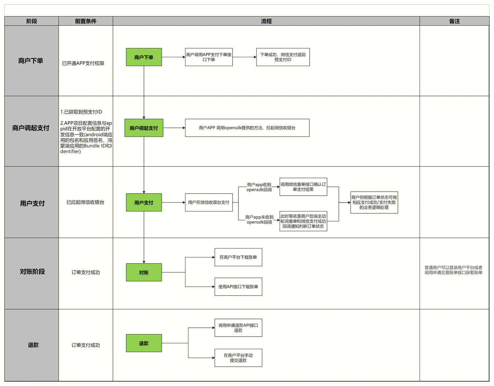
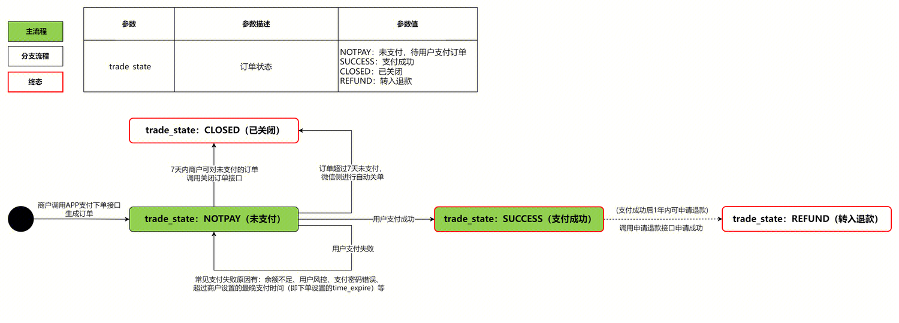

tags:: [[WeChat Pay]]
---

- ## 支付业务流程
	- 
	- ### 支付流程
		- **支付申请** : **用户** 在 **商户 APP 端** 点击支付, **商户 APP 端** 向 **商户后端** 发起请求.
		  logseq.order-list-type:: number
		- **获取预支付 ID** : **商户后端** 调用 [APP支付下单API](https://pay.weixin.qq.com/doc/v3/merchant/4013070347) 获取 **预支付 ID (prepay_id)** .
		  logseq.order-list-type:: number
		- **构造调起支付参数** :  **商户后端** 构造 **调起支付** 需要用到的参数 (可以用 **后端 SDK** 构造) , 返回给 **商户 APP 端** .
		  logseq.order-list-type:: number
		- **调起支付** : **商户 APP 端** 拿着 **商户后端** 构造的参数, 通过 **微信支付的 SDK (微信称之为 OpenSDK)** ,  调用 [sendReq API](https://pay.weixin.qq.com/doc/v3/merchant/4013070351) , 拉起微信支付收银台.
		  logseq.order-list-type:: number
		- **完成支付或取消支付** : 用户在微信支付收银台完成支付自动回到 **商户 APP** 或者 用户取消支付自动回到 **商户 APP** , 此时 **商户 APP 端** 会收到 OpenSDK 的 **onResp 回调** (通过这个回调的内容, 可以判断用户的操作, 但支付结果不能靠这个判断) .
		  logseq.order-list-type:: number
			- 为了能从 **微信** 回到 **商户 APP** , 可能需要做一些处理.
		- **获取支付结果** :  **商户 APP 端** 可以通过 [支付成功回调](https://pay.weixin.qq.com/doc/v3/merchant/4013070368) 和 [查询订单API](https://pay.weixin.qq.com/doc/v3/merchant/4013070356) 获取支付结果, 并针对支付结果执行相应的业务逻辑.
		  logseq.order-list-type:: number
		- **关闭订单** : **商户后端** 发现 订单支付超时 或 其他情况 时, 可主动调用 [关闭订单API](https://pay.weixin.qq.com/doc/v3/merchant/4013070360) , 以 **关闭订单** .
		  logseq.order-list-type:: number
	- ### 退款流程
		- 支付成功后, **商户后端** 可以调用 [申请退款接口](https://pay.weixin.qq.com/doc/v3/merchant/4013070371) 进行退款
		  logseq.order-list-type:: number
		- **商户后端** 可以通过 [退款结果通知](https://pay.weixin.qq.com/doc/v3/merchant/4013070388) 和 [查询单笔退款（通过商户退款单号）](https://pay.weixin.qq.com/doc/v3/merchant/4013070374) 获取退款结果.
		  logseq.order-list-type:: number
		- 若 **商户后端** 通过 [退款结果通知](https://pay.weixin.qq.com/doc/v3/merchant/4013070388) 和 [查询单笔退款（通过商户退款单号）](https://pay.weixin.qq.com/doc/v3/merchant/4013070374) 发现退款异常, 可调用 [发起异常退款](https://pay.weixin.qq.com/doc/v3/merchant/4013070379) 进行退款.
		  logseq.order-list-type:: number
- ## 支付状态流转
	- 
- ## 获取预支付 ID
	- 参考: [APP支付下单API](https://pay.weixin.qq.com/doc/v3/merchant/4013070347)
	- ### 重要请求参数
		- `out_trade_no` : 商户内部订单号.
		  logseq.order-list-type:: number
		- `time_expire` : 支付过期的绝对时间
		  logseq.order-list-type:: number
			- ==注意:==
				- 如果商户设置了 `time_expire` : 则时间范围需在 `[下单后 1 分钟, 下单后 90 天]` .
				  logseq.order-list-type:: number
				- 如果商户没设置 `time_expire` : 则默认值为 `7 天后` .
				  logseq.order-list-type:: number
				- 如果时间超过了 `time_expire` , 则用户只是无法完成支付, 订单 **并不会被自动关闭** .
				  logseq.order-list-type:: number
					- 如需关闭订单, 有如下方式:
						- 在下单后的 `7 天内` 主动调用 [关闭订单API](https://pay.weixin.qq.com/doc/v3/merchant/4013070360) .
						  logseq.order-list-type:: number
						- 下单后如果超过 `7 天` 还未支付, 则微信会 **自动关闭订单** .
						  logseq.order-list-type:: number
		- `attach` : 商户自定义数据.
		  logseq.order-list-type:: number
			- 支付成功后, **微信** 调用 **商户** 的 [支付成功回调通知](https://pay.weixin.qq.com/doc/v3/merchant/4013070368) 接口, 会传入这个字段.
			- 支付成功后, **商户** 主动调用 [查询订单API](https://pay.weixin.qq.com/doc/v3/merchant/4013070356) 也会返回这个字段.
		- `notify_url` : 商户接收 [支付成功回调通知](https://pay.weixin.qq.com/doc/v3/merchant/4013070368) 的地址
		  logseq.order-list-type:: number
	- ### 重要响应参数
		- `prepay_id` : 预支付交易会话标识 (调起支付需要用到)
		  logseq.order-list-type:: number
			- `prepay_id` 有效期为 2 小时:
				- 如果超过 2 小时, 商户可以使用 **原下单参数 (主要是 `out_trade_no` )** 重新请求 **下单接口** , 获取新的 `prepay_id` .
				- 如果超过 `time_expire` , 则商户需要使用 **新的参数** 重新请求 **下单接口** .
- ## 构造调起支付参数
	- 参考: [APP调起支付签名](https://pay.weixin.qq.com/doc/v3/merchant/4012365340)
	- 也可以使用 [服务端 SDK](https://pay.weixin.qq.com/doc/v3/merchant/4012076498) 进行构造
- ## 获取支付结果
	-
- ## 参考
	- [微信支付 - 开发指引](https://pay.weixin.qq.com/doc/v3/merchant/4013070176)
	  logseq.order-list-type:: number