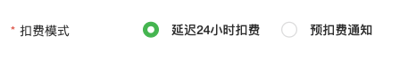
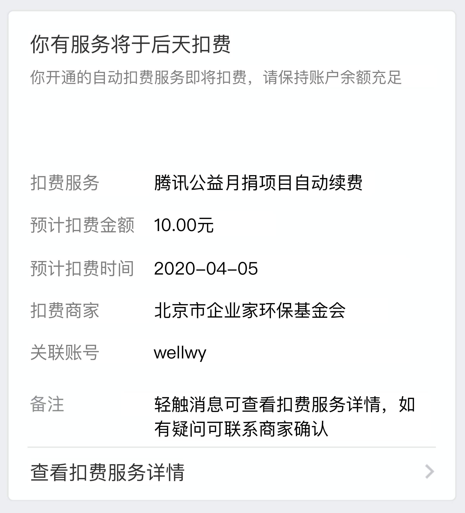

tags:: [[微信支付 - 周期扣款]]
---

- ## 扣款模式
	- 扣款有如下几种模式:
		- 预扣款通知 模式
		  logseq.order-list-type:: number
		- 通知后 24 小时扣款 模式
		  logseq.order-list-type:: number
	- **扣款模式** , 是在创建 **支付规则模板** 的时候指定的 (在这里创建: [创建模板](https://pay.weixin.qq.com/index.php/extend/pap/create))
		- 
	- 一个模板, 只能选择一种 **扣款模式** , 一般申请后为【24小时自动扣费】模式 (参考自: [接入流程](https://pay.weixin.qq.com/doc/v2/merchant/4011986709))
- ## 预扣款通知 模式
	- 参考: [预扣费通知 API](https://pay.weixin.qq.com/doc/v2/merchant/4011987402) , [申请扣款 API](https://pay.weixin.qq.com/doc/v2/merchant/4011987377)
	- ### 涉及的接口
		- [[微信支付 API (V3): 预扣费通知]] (只有 V3)
		  logseq.order-list-type:: number
		- [[微信支付 API (V2): 申请扣款]] (只有 V2)
		  logseq.order-list-type:: number
	- ### 名词解释
		- **扣费等待期** : 调用 [[微信支付 API (V3): 预扣费通知]] 成功的 **当日及第二个自然日** , 这段时间 **不能进行扣款** .
		  logseq.order-list-type:: number
		- **可扣费期** : 在 **扣费等待期** 之后的,  **可以进行扣款** 的 **N 个自然日内 (N 默认为 7)** .
		  logseq.order-list-type:: number
			- **N** 被称为 **扣费持续天数**  .
		- **扣费周期** : 从调用 [[微信支付 API (V3): 预扣费通知]] 成功, 到 **扣款成功** 或 **可扣费期** 结束 .
		  logseq.order-list-type:: number
		- **可通知时间段** : 北京时间的每天 `7:00～22:00`.
		  logseq.order-list-type:: number
			- 为了不打扰用户, 不要在 **可通知时间段** 之外调用 [[微信支付 API (V3): 预扣费通知]] .
	- ### 扣款步骤
		- #### 首次扣款 (包含解约后重新签约的第一次扣款)
			- 如果是用户的 **首次扣款 (包含解约后重新签约的第一次扣款)** , 则:
				- 在  **签约成功时间** 之后的 **12 小时内** , 有如下选择:
				  logseq.order-list-type:: number
					- 可以直接调用 [[微信支付 API (V2): 申请扣款]] 发起扣款, 扣款会被立即执行.
					  logseq.order-list-type:: number
					- 按 **非首次扣款** 规则进行 **通知** 和 **扣款** .
					  logseq.order-list-type:: number
				- 在  **签约成功时间** 之后的 **12 小时外** , 按 **非首次扣款** 规则进行 **通知** 和 **扣款** .
				  logseq.order-list-type:: number
		- #### 非首次扣款
			- 在 **预定扣款日** 的 **至少 2 天前** 的 `7:00～22:00` , 商户调用 [[微信支付 API (V3): 预扣费通知]]  , 给用户实时下发 **扣款通知** .
			  logseq.order-list-type:: number
				- 大概长这样:
				- {:height 389, :width 346}
			- 在用户接收到 **扣款通知** 之后的 **扣费等待期** , 用户可以选择 **关闭扣费服务** , 或者 **什么都不做等待扣费** .
			  logseq.order-list-type:: number
			- 在 **预定扣款日** 的 `7:00～22:00` (避免打扰用户) , 商户调用 [[微信支付 API (V2): 申请扣款]] 进行扣款.
			  logseq.order-list-type:: number
				- 如果 [[微信支付 API (V2): 申请扣款]] 调用成功, 扣款实时发生.
				- 如果扣款失败, 可以一直发起扣款, 直到 **可扣费期** 结束.
					- ==用户对 **扣款失败** 无感知.==
				- **可扣费期** 结束之后, 如果要继续发起扣款, 需要重新下发 **扣款通知** .
					- 参考: [常见问题: Q：委托代扣场景，当收到扣款失败的回调通知后应该如何进行重试扣款？是否还需要再次发送预扣费通知然后再调用申请扣款接口？还是可以在收到扣款失败的回调通知后可直接调用申请扣款接口？](https://pay.weixin.qq.com/doc/v2/merchant/4011987907)
			- 扣款成功后, 用户微信客户端会收到 **扣费凭证** .
			  logseq.order-list-type:: number
- ## 通知后 24 小时扣款 模式
	- 参考: [申请扣款 API](https://pay.weixin.qq.com/doc/v2/merchant/4011987377)
	- ### 涉及的接口
		- [[微信支付 API (V2): 申请扣款]] (只有 V2)
		  logseq.order-list-type:: number
	- ### 扣款步骤
		- 商户只需调用 [[微信支付 API (V2): 申请扣款]] 即可.
			- 首先, 会立刻为用户下发 **扣款前通知** .
			- 然后:
				- 如果用户为 **首次扣款 (包含解约后重新签约的第一次扣款)** , 则:
				  logseq.order-list-type:: number
					- 在  **签约成功时间** 之后的 **12 小时内** 发起的扣款, 会被 **立即执行** ;
					  logseq.order-list-type:: number
					- 在  **签约成功时间** 之后的 **12 小时以外** 发起的扣款, 会在调用 [[微信支付 API (V2): 申请扣款]] 的 **24 小时后** 自动完成扣款.
					  logseq.order-list-type:: number
				- 如果用户 **非首次扣款** , 则会在 [[微信支付 API (V2): 申请扣款]] 的 **24 小时后** 自动完成扣款.
				  logseq.order-list-type:: number
		- 如果扣款失败, 可以重新发起扣款. (参见: [委托代扣中使用 24小时自动扣费 这种扣款方式，如果扣款失败了，可以一直重试吗？](https://developers.weixin.qq.com/community/develop/doc/0002ea5742cbb0917bf315e4961c00?highLine=%25E8%2587%25AA%25E5%258A%25A8%25E7%25BB%25AD%25E8%25B4%25B9))
- ## 参考
	- [周期扣费](https://pay.weixin.qq.com/doc/v2/merchant/4011986682)
	  logseq.order-list-type:: number
	-