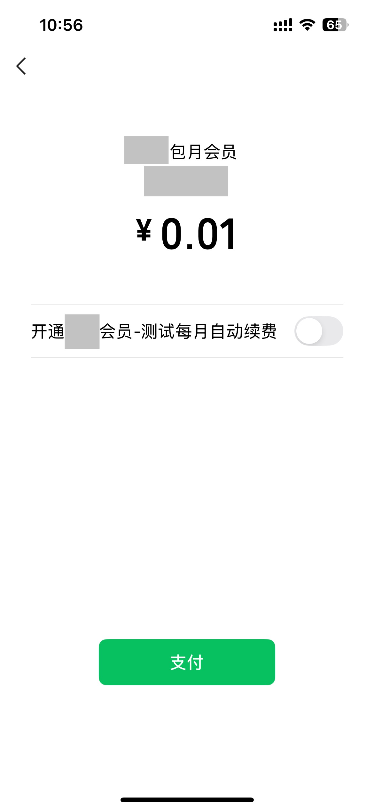
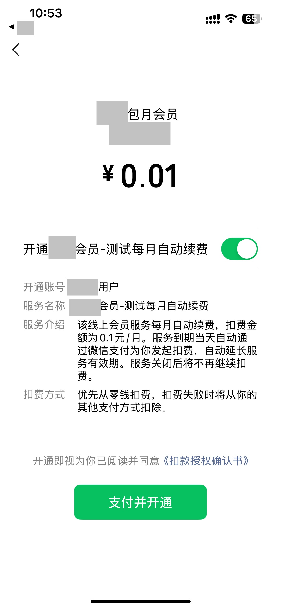
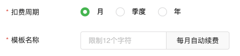

tags:: [[微信支付 - 委托代扣]]
---

- ## 签约模式
	- 参考: [官方 - 委托代扣的纯签约模式和支付中签约模式有什么不同?](https://developers.weixin.qq.com/community/develop/doc/000eaa082e0a4068baebc035151409?highLine=%25E6%2594%25AF%25E4%25BB%2598%25E5%25B9%25B6%25E7%25AD%25BE%25E7%25BA%25A6)
	- 纯签约模式.
	  logseq.order-list-type:: number
		- 用户先进行签约, 签约成功后, 商户再使用申请扣款接口进行扣款。
	- 支付中签约模式
	  logseq.order-list-type:: number
		- 支付后完成代扣协议的签约.
	- ==两种签约模式, 目前都只看到 V2 的, 没看到 V3 的.==
- ## 关于多次签约
	- **(商户号, 模板 ID, 微信号)** 三元组, 只能存在一次签约.
	- 如果同一 **商户号** , 需要对同一 **微信号** 进行多次签约, 需要使用不同的 **模板 ID** .
- ## 纯签约模式
	- ==暂未了解==
- ## 支付中签约模式
	- ### 涉及的 API
		- 微信提供:
		  logseq.order-list-type:: number
			- [支付中签约](https://pay.weixin.qq.com/doc/v2/merchant/4011987320)
			  logseq.order-list-type:: number
			- [查询订单](https://pay.weixin.qq.com/doc/v2/merchant/4011987538) 
			  logseq.order-list-type:: number
			- [查询签约关系](https://pay.weixin.qq.com/doc/v2/merchant/4011987640)
			  logseq.order-list-type:: number
			- [申请解约](https://pay.weixin.qq.com/doc/v2/merchant/4011987432)
			  logseq.order-list-type:: number
		- 商户提供:
		  logseq.order-list-type:: number
			- [扣款结果通知](https://pay.weixin.qq.com/doc/v2/merchant/4011987465)
			  logseq.order-list-type:: number
				- 注意: 这个微信支付的 **支付结果通知 V2** 和 **支付结果通知 V3** 返回的字段都有差别;
				- 但是验签方式, 与 **支付结果通知 V2** 一致.
			- [签约、解约结果通知](https://pay.weixin.qq.com/doc/v2/merchant/4011987586)
			  logseq.order-list-type:: number
		- 前端调用:
		  logseq.order-list-type:: number
			- APP 支付: [调起支付接口](https://pay.weixin.qq.com/doc/v2/merchant/4011937148)
			  logseq.order-list-type:: number
				- 注意, 这个是 V2 版本的接口,  调用 **支付中签约** 得到的 `prepayId` , 无法用于 V3 版本的支付.
	- ### 支付中签约流程
		- **用户** 选择 "自动续费" 产品, 点击 "支付" 按钮.
		  logseq.order-list-type:: number
		- **前端** 调用 **后端签约接口** (传入 `trade_type` 指定支付方式)
		  logseq.order-list-type:: number
		- **后端签约接口** 调用 **微信 [支付中签约] API** , 根据 `trade_type` 给 **前端** 返回其拉起 **微信 APP** 需要的参数 .
		  logseq.order-list-type:: number
		- **前端** 调用 **调起支付接口** 拉起 **微信 APP** , **用户** 可以进行 选择 **是否开通自动续费** .
		  logseq.order-list-type:: number
		- **后端** 获取 **支付结果** 和 **签约结果** .
		  logseq.order-list-type:: number
			- **支付结果** : 通过被动接收 **扣款结果通知** 和 主动调用 **微信 [查询订单] API** 来获取.
			- **签约结果** : 通过被动接收 **签约、解约结果通知** 和 主动调用 **微信 [查询签约关系] API** 来获取.
		- **后端** 根据 **支付结果** 和 **签约结果** , 来做后续的 **业务处理** .
		  logseq.order-list-type:: number
			- ==疑问: 这两个结果应该如何处理? ==
				- 是否存在 "支付成功, 但签约失败" 的情况?
				  logseq.order-list-type:: number
					- 存在这种情况, 可能原因是: 用户已签约 / 用户账号有异常 / 用户未选择签约 / 用户签的扣费项目超过了200条
						- 参见: [支付中签约常见错误 - Q：支付中签约接口，支付成功但是签约失败有哪些原因?](https://pay.weixin.qq.com/doc/v2/merchant/4011987907)
				- 如果支付失败, 是否签约也必然失败? 是否有 "未支付, 但完成签约" 的情况?
				  logseq.order-list-type:: number
		- **前端** 轮询调用 **后端签约状态查询接口** 获取 **支付结果** 和 **签约结果** .
		  logseq.order-list-type:: number
	- ### 支付中签约界面
		- 拉起微信 APP 之后的页面
			- 不支持移除自动续费按钮
				- (参见: [微信自动续费](https://developers.weixin.qq.com/community/develop/doc/00042085edcd3026b20405c8461800?highLine=%25E8%2587%25AA%25E5%258A%25A8%25E7%25BB%25AD%25E8%25B4%25B9) 或 [h5支付签约唤起的微信原生页面有开通自动续费勾选按钮,如何做到,支付和开通同时,即去除开通勾选?](https://developers.weixin.qq.com/community/develop/doc/00000af56d45708f5af3aecb361800?highLine=%25E8%2587%25AA%25E5%258A%25A8%25E7%25BB%25AD%25E8%25B4%25B9))
			- {:height 526, :width 200}
		- 勾选 "自动续费" 之后的页面
			- {:height 526, :width 200}
		- `XX 包月会员` 标题: 来自调用 **微信 [支付中签约] API** 时传入的 `body` 参数
		- `XX 用户` 开通账号: 来自调用 **微信 [支付中签约] API** 时传入的 `contract_display_account` 参数
			- 可以填写用户在商户系统中的 **用户名** .
		- `开通 XX 会员-测试` 文本: 来自 **创建模板** 时填入的模板名称.
			- 
		- `每月自动续费` 后缀: 来自 **创建模板** 时, 选择的 **扣费周期** .
- ## 解约流程
	- **用户** 点击 "解约" 按钮.
	  logseq.order-list-type:: number
	- **前端** 调用 **后端解约接口** .
	  logseq.order-list-type:: number
	- **后端解约接口** 调用 **微信 [申请解约] 接口** .
	  logseq.order-list-type:: number
	- **后端** 通过被动接收 **签约、解约结果通知** 和 主动调用 **微信 [查询签约关系] API** 来获取 **解约结果** .
	  logseq.order-list-type:: number
	- **后端** 根据 **解约结果** , 来做后续的 **业务处理** .
	  logseq.order-list-type:: number
- ## 退款流程
	- ==暂未了解==
- ## 参考
	- [支付中签约](https://pay.weixin.qq.com/doc/v2/merchant/4011987320)
	  logseq.order-list-type:: number
	- logseq.order-list-type:: number