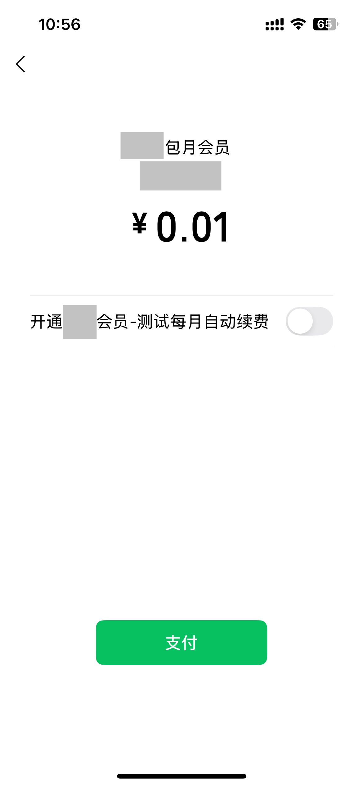
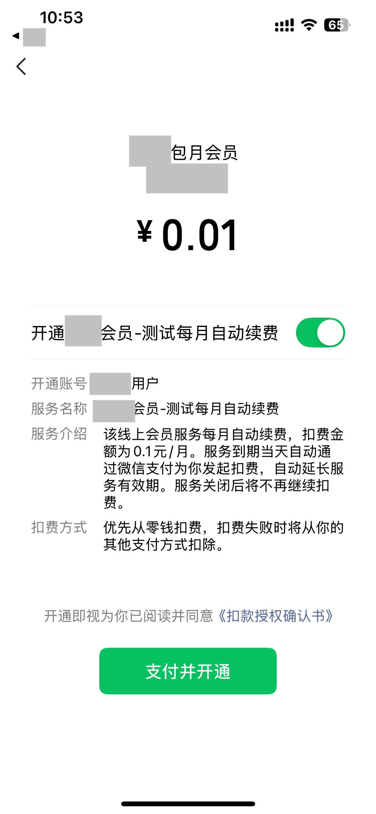
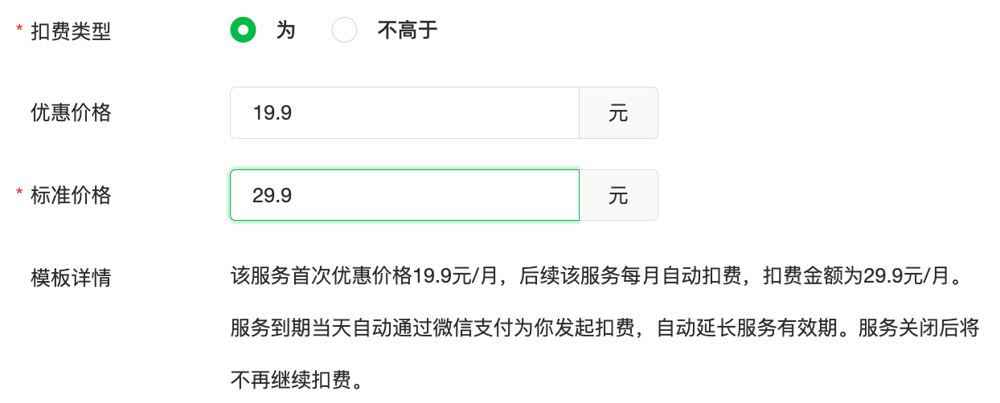
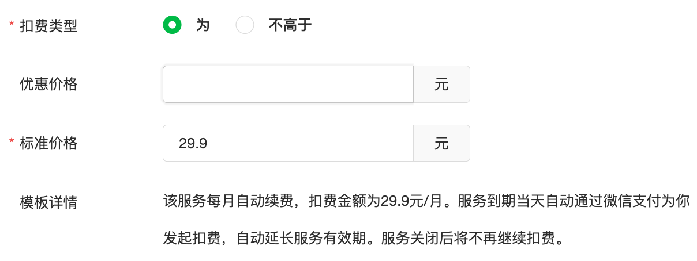
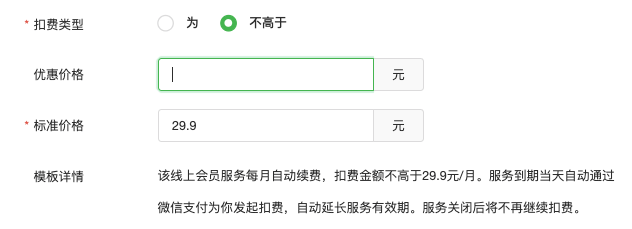

tags:: [[微信支付 - 周期扣款]]
---

- ## 签约模式
	- 参考:
		- [官方 - 委托代扣的纯签约模式和支付中签约模式有什么不同?](https://developers.weixin.qq.com/community/develop/doc/000eaa082e0a4068baebc035151409?highLine=%25E6%2594%25AF%25E4%25BB%2598%25E5%25B9%25B6%25E7%25AD%25BE%25E7%25BA%25A6)
		  logseq.order-list-type:: number
		- [官方 - 委托代扣分为哪几种模式？](https://developers.weixin.qq.com/community/develop/doc/00004e54ff0508f8b9eb745675b009?highLine=%25E7%25BA%25AF%25E7%25AD%25BE%25E7%25BA%25A6)
		  logseq.order-list-type:: number
	- ---
	- ==两种签约模式, 目前都只看到 V2 的, 没看到 V3 的.==
	- ### 纯签约模式
		- ( 参见: [[微信支付 - 周期扣款: 纯签约]] )
		- 用户先进行签约, 签约成功后, 商户再使用申请扣款接口进行扣款。
		- {:height 526, :width 200}
	- ### 支付中签约模式
		- ( 参见: [[微信支付 - 周期扣款: 支付中签约]] )
		- 不勾选 "自动续费" 则为单次支付, 勾选 "自动续费" 才会进行签约.
		- 不勾选:
			- {:height 526, :width 200}
		- 勾选:
			- {:height 526, :width 200}
- ## 签约相关概念
	- 参见: [[微信支付 - 委托代扣: 纯签约]]
- ## 关于首次优惠
	- ### 模板详情文字
		- 使用优惠价格:
		  logseq.order-list-type:: number
			- {:height 285, :width 495}
		- 不使用优惠价格:
		  logseq.order-list-type:: number
			- {:height 353, :width 485}
	- ### 实现方式
		- 有两种方式实现 "首次优惠" :
			- 模板使用 "优惠价格" , 拉起微信时, 传入 "优惠价格" . ==建议使用==
			  logseq.order-list-type:: number
				- 如果用户享受过 "首次优惠"  , 我们下次重新签约时, 应使用 **没有优惠价格** 的模板.
			- 模板不使用 "优惠价格" , 但在拉起微信时, 传入 "优惠价格" ,
			  logseq.order-list-type:: number
				- 但这就会导致实际扣减金额, 与界面显示的 "模板详情" 不一致.
				- **支付中签约** 或许还可以勉强使用这种方式, 因为第一次会直接支付 "优惠价格" (虽然与模板详情描述不一致, 但可以解释为首次支付的优惠) ;
				- **纯签约** 使用这种方式就不合理了, 因为用户是先进行签约的, 签约时已经展示 "模板详情" 了, 后面扣费的价格与 "模板详情" 的描述不一致, 就会让人疑惑.
- ## 关于扣款周期与限额限频
	- 参考:
		- [常见问题 - Q：扣款周期与限额限频说明](https://pay.weixin.qq.com/doc/v2/merchant/4011987907)
		  logseq.order-list-type:: number
		- [【委托代扣API】常见问题官方: Q2:申请扣款周期说明](https://developers.weixin.qq.com/community/pay/doc/0004aaa01e8908b165985d15e5bc08?blockType=8)
		  logseq.order-list-type:: number
		- ==以上两者对于 **限额限频** 的描述不一致, 我以官方文档为准.==
	- ---
	- **扣款日期**  : 
	  logseq.order-list-type:: number
		- 扣款周期内发起扣款的日期, 其实没有限制.
		  logseq.order-list-type:: number
		- ==签约协议期内, 有若干期不进行扣费, 貌似也不影响协议的存续?==
		  logseq.order-list-type:: number
			- 参考: `Q：用户签约12期代扣，已成功扣费1、2期，第3期用户通过其他方式缴纳费用后，第4期及后续期次是否可以正常扣费？`
	- **单笔扣款金额** :
	  logseq.order-list-type:: number
		- 正式模板: 不超过模板设置的金额 (不是必须相等) .
		  logseq.order-list-type:: number
			- 如果金额不固定, 可以设置 **扣费类型** 为 "不高于" (虽然设置为  "为" , 扣款时也可以传入不高于 "标准价格" 的 非固定金额).
			- {:height 181, :width 464}
		- 测试模板: 最高 0.1 .
		  logseq.order-list-type:: number
	- **单周期内扣款次数**  (扣款失败不计次数) :
	  logseq.order-list-type:: number
		- 正式模板: 每天最多只能扣款成功 1 次, 单扣款周期内最多只能成功 2 次.
		  logseq.order-list-type:: number
		- 测试模板: 每天最多可以扣款成功 100 次 ==单扣款周期内貌似没有限额?==
		  logseq.order-list-type:: number
		- ==重新签约的话, 额度会刷新==
-