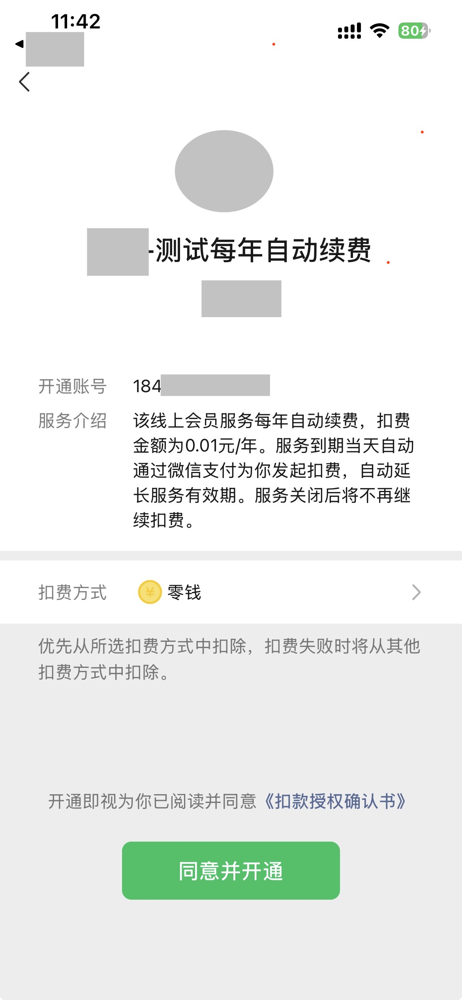

tags:: [[微信支付 - 周期扣款]]
---

- ## 签约流程
	- 进行 [[微信支付 - 委托代扣: 纯签约]] 之后.
	  logseq.order-list-type:: number
	- 定时任务 或 签约结果通知, 获取签约结果.
	  logseq.order-list-type:: number
		- 如果签约成功, 则发起首次支付.
		  logseq.order-list-type:: number
		- 如果签约失败, 则结束.
		  logseq.order-list-type:: number
	- 定时任务 或 支付结果通知, 获取支付结果.
	  logseq.order-list-type:: number
		- 如果支付成功, 则签约完成成功.
		  logseq.order-list-type:: number
		- 如果支付失败, 则需要进行解约.
		  logseq.order-list-type:: number
- ## 纯签约界面
	- {:height 526, :width 200}
	-