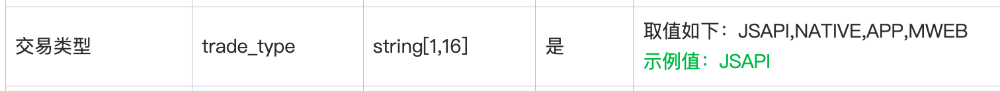
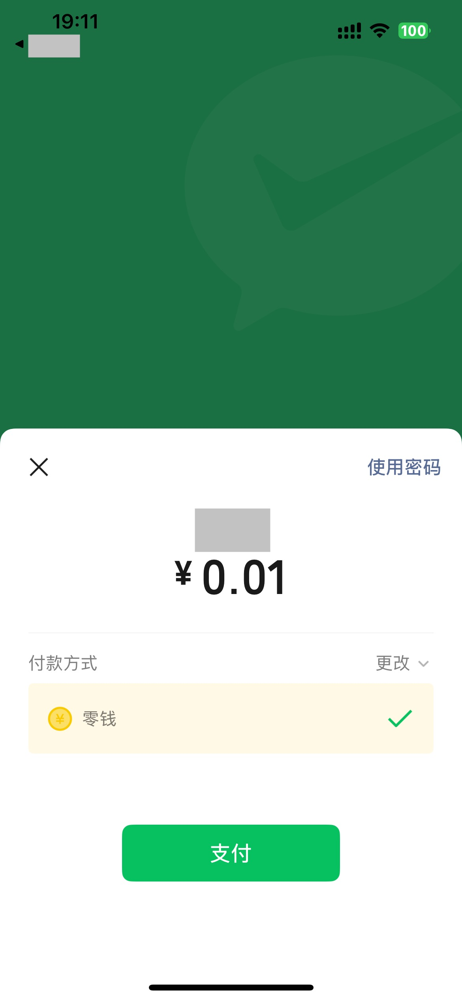

tags:: [[WeChat Pay API]] 
---

- ## 文档
	- [支付中签约](https://pay.weixin.qq.com/doc/v2/merchant/4011987320)
	- ==貌似只有 V2 (2025-12-12)==
- ## 关于 trade_type
	- ### 文档字段
		- {:height 99, :width 606}
		- 调用此 API 时, 需要传入 `trade_type` .
	- ### 采用的 [[微信支付方式]] 是 [[微信支付 - APP 支付]]
		- ==建议填入 `PAP` (虽然文档中根本没提到可以填 `PAP` )==
		- 因为如果传 `PAP` :
			- 调用 [[微信支付 API (V3): 商户订单号查询订单]] 和 [[微信支付 API (V2): 查询订单]] 都可以查询到订单.
		- 而如果传 `APP` :
			- 调用 [[微信支付 API (V3): 商户订单号查询订单]] 可以查询到订单.
			- 调用 [[微信支付 API (V2): 查询订单]] 将会报: `订单不是委托代扣场景`
				- ``` xml
				  <xml>
				    <return_code><![CDATA[SUCCESS]]></return_code>
				    <return_msg><![CDATA[OK]]></return_msg>
				    <result_code><![CDATA[FAIL]]></result_code>
				    <err_code><![CDATA[INVALID_REQUEST]]></err_code>
				    <err_code_des><![CDATA[订单不是委托代扣场景]]></err_code_des>
				    <mch_id><![CDATA[xxxxx]]></mch_id>
				    <appid><![CDATA[xxxxxxx]]></appid>
				    <nonce_str><![CDATA[xxxxx]]></nonce_str>
				    <sign><![CDATA[xxxxx]]></sign>
				  </xml>
				  ```
	- ### 采用的 [[微信支付方式]] 是其他方式
		- ==其他非 `APP` 支付方式暂未测试.==
- ## 重复签约
	- 微信用户处于已签约状态, 再次发起同一模板的签约.
	- {:height 526, :width 200}
	-
-