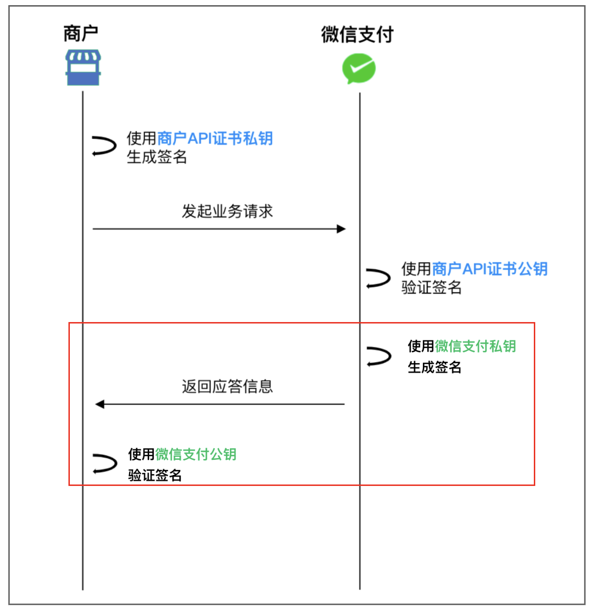
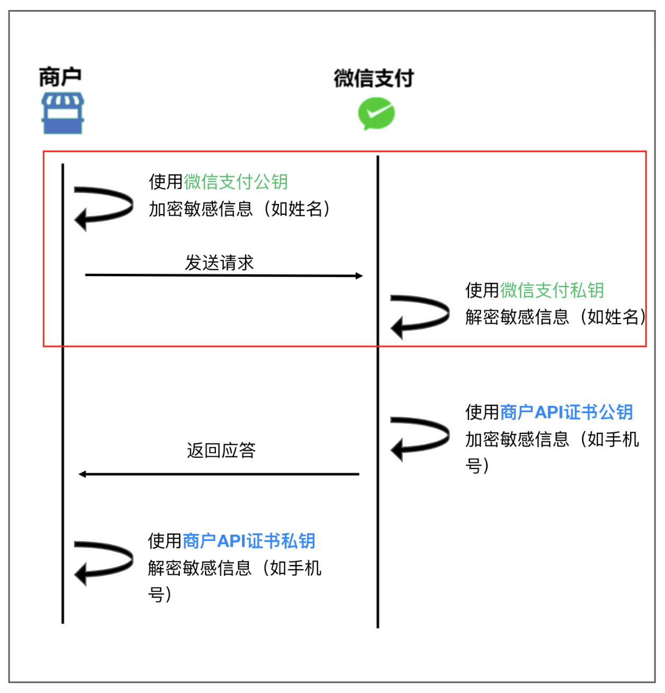
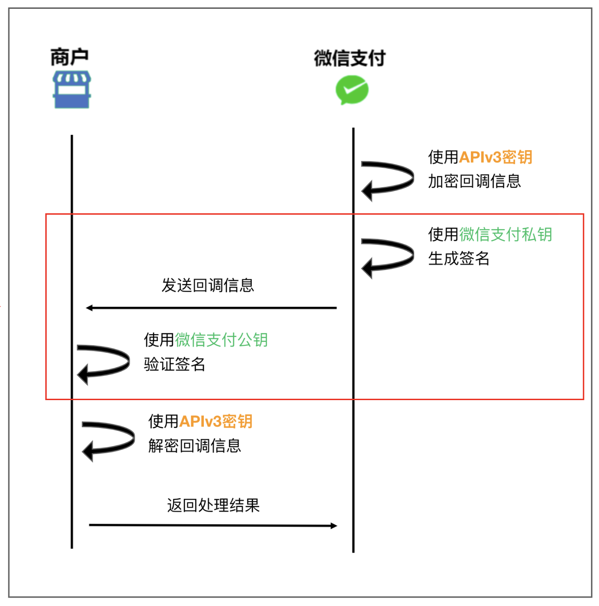

tags:: [[微信支付 API]]
---

- ## 接口规范
	- ### 请求方式
		- HTTPS + REST 风格
	- ### 出参入参
		- 都为 JSON 格式 .
		  logseq.order-list-type:: number
		- integer、boolean、string、object 和 array 类型的字段, 不允许值为 null .
		  logseq.order-list-type:: number
	- ### 字符编码
		- 只支持 UTF-8 使用 1 至 3 个字节编码的字符 (包括常用汉字).
	- ### 请求头
		- #### Content-Type 与 Accept
			- 除了 **图片上传 API** , 其他 API 都应有如下请求头
			- ``` zsh
			  Content-Type: application/json
			  Accept: application/json
			  ```
		- #### User-Agent
			- 取值二选一:
				- 使用 HTTP 客户端的默认值
				  logseq.order-list-type:: number
				- 根据自身系统信息, 组成自己独有的 User-Agent
				  logseq.order-list-type:: number
			- ==微信支付很可能会拒绝无 `User-Agent` 的请求.==
		- #### Accept-Language
			- 支持 `en` / `zh-CN` / `zh-HK` / `zh-TW` .
			- 不设置, 或设置不支持的值, 将默认使用 `zh-CN`.
	- ### 响应头
		- #### Request-ID
			- 微信支付 给 商户 的 响应 中, 会包含 `Request-ID` 响应头 , 用于标识唯一的请求.
			- 如有需要, 可以提供给微信支付, 用于排查问题.
	- ### HTTP 状态码
		- 200 : 成功, 且有应答的消息体.
		  logseq.order-list-type:: number
		- 204 : 成功, 但没应答的消息体.
		  logseq.order-list-type:: number
		- 202 : 已被成功接收, 但待处理.
		  logseq.order-list-type:: number
		- 4xx : 请求处理失败 
		  logseq.order-list-type:: number
			- 如: 缺少必要的入参, 支付时余额不足
		- 501/502/503 : 微信支付侧异常 (比较少见).
		  logseq.order-list-type:: number
		- 具体值参见: [HTTP状态码](https://pay.weixin.qq.com/doc/v3/merchant/4012081717)
	- ### 错误码和错误提示
		- #### code 字段
			- 错误码 (可能是 **公共错误码** , 也可能是 **业务错误码**)
			- ==公共错误码==
			- | 错误码 | 错误描述 |
			  | PARAM_ERROR | 参数错误 |
			  | INVALID_REQUEST | HTTP 请求不符合微信支付 APIv3 接口规则 |
			  | SIGN_ERROR | 验证不通过 |
			  | SYSTEM_ERROR | 系统异常，请稍后重试 |
		- #### message 字段
			- 错误描述 (同一 `code` 可能有多个不同的 `message` )
			- ``` json
			  //公共错误码返回示例
			  {
			    "code": "SYSTEM_ERROR", 
			    "message": "系统异常，请稍后重试" 
			  }
			  
			  //业务错误码返回示例
			  {
			    "code": "NO_AUTH",
			    "message": "商户号该产品权限未开通，请前往商户平台>产品中心检查后重试"
			  }
			  ```
		- #### detail 字段
			- 错误详情 (`code` 为 `PARAM_ERROR` 或 `INVALID_REQUEST` 时有值).
			- ==子字段:==
				- `field` : 指示错误参数的具体位置 .
				  logseq.order-list-type:: number
					- 当错误参数位于请求 Body 的 JSON 中, 返回 [[JSON Pointer]] 路径 (如: /amount/currency) .
					  logseq.order-list-type:: number
					- 当错误参数位于请求的 URL 或者 Query String 中, 返回参数变量名 (如: limit) .
					  logseq.order-list-type:: number
				- `value`：错误的值.
				  logseq.order-list-type:: number
				- `issue` : 具体错误原因.
				  logseq.order-list-type:: number
				- `location` : 错误参数的来源位置, 取值如下：
				  logseq.order-list-type:: number
					- `body` : 请求 Body 的 JSON 中.
					  logseq.order-list-type:: number
					- `url` : 请求 URL 中.
					  logseq.order-list-type:: number
					- `query` : 请求的 Query String 中.
					  logseq.order-list-type:: number
			- 例子:
				- ``` json
				  //detail返回示例
				  {
				    "code": "PARAM_ERROR", 
				    "message": "参数错误", 
				    "detail": {
				      "field": "/amount/currency",
				      "value": "XYZ",
				      "issue": "Currency code is invalid",
				      "location" :"body"
				     }
				  }
				  ```
- ## 接口交互大致流程
	- 参考: [微信支付公钥产品简介及使用说明](https://pay.weixin.qq.com/doc/v3/merchant/4012153196)
	- ### 商户 请求 微信支付 (无加密参数)
		- {:height 359, :width 328}
	- ### 商户 请求 微信支付 (有加密参数)
		- ==图中漏掉了生成签名和验证签名的过程==
		- {:height 552, :width 337}
	- ### 微信支付 通知 商户
		- {:height 392, :width 331}
- ## 签名验签
	- ### 签名相关的请求头
		- #### Wechatpay-Serial
			- 参见: [商户签名验签／加解密测试](https://pay.weixin.qq.com/doc/v3/merchant/4014551946)
			- 微信支付公钥模式: 值为 微信支付公钥ID
			- 平台证书模式: 值为 平台证书序列号. ==不建议的模式==
- ## 测试用的接口
	- [商户签名验签／加解密测试](https://pay.weixin.qq.com/doc/v3/merchant/4014551946)
	  logseq.order-list-type:: number
	- [回调接口](https://pay.weixin.qq.com/doc/v3/merchant/4015164042)
	  logseq.order-list-type:: number
-
- ## 参考
	- [APIv3概述](https://pay.weixin.qq.com/doc/v3/merchant/4012081606)
	  logseq.order-list-type:: number
	- [基本规则](https://pay.weixin.qq.com/doc/v3/merchant/4012081709)
	  logseq.order-list-type:: number