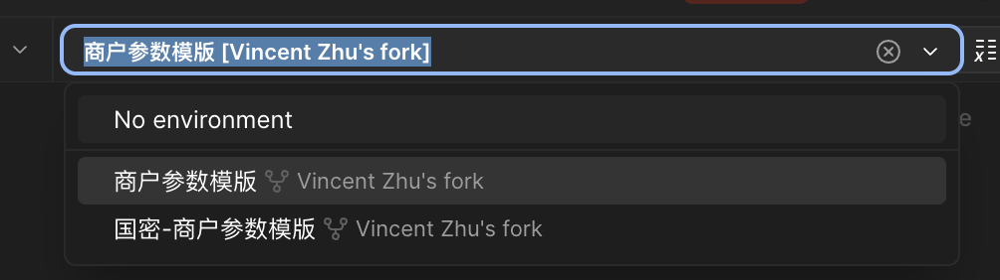
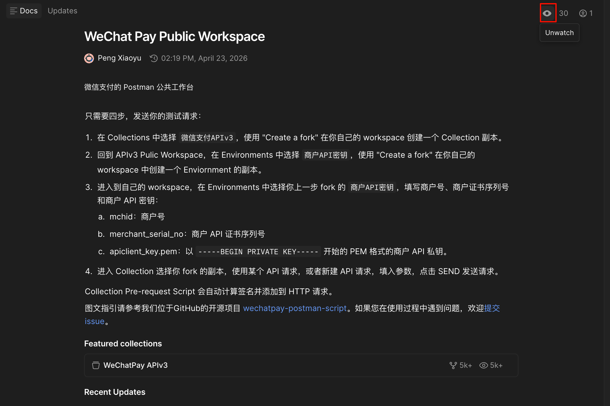

tags:: [[微信支付 API]]
---

- ## Fork 工作台
	- 在 [WeChat Pay Public Workspace](https://www.postman.com/wechatpay-dev/wechat-pay-public-workspace/overview) Fork Collections 和 Environments .
	  logseq.order-list-type:: number
	- 配置 Environments 中的 **商户参数模板** .
	  logseq.order-list-type:: number
		- 记得先将 Workspace 设置为私有, 避免数据泄露.
		- 值设置在 Current Value , 只会保存在本地.
	- 右上角选择 **商户参数模板** 环境.
	  logseq.order-list-type:: number
		- {:height 168, :width 577}
	- 发送请求.
	  logseq.order-list-type:: number
		- 网页版可能请求比较慢, 因为需要经过 Postman 后台中转.
		- 建议使用 桌面 APP 发送请求.
			- 建议使用 桌面 APP 发送请求.
- ## Watch 工作台
	- 可以 Watch 一下, 接收来自上游的变更通知.
	- {:height 500, :width 661}
- ## 参考
	- [WeChat Pay Public Workspace](https://www.postman.com/wechatpay-dev/wechat-pay-public-workspace/overview)
	  logseq.order-list-type:: number
	- [微信支付 APIv3 Postman 脚本](https://github.com/wechatpay-apiv3/wechatpay-postman-script)
	  logseq.order-list-type:: number
	- [Postman调试工具](https://pay.weixin.qq.com/doc/v3/merchant/4012076519)
	  logseq.order-list-type:: number