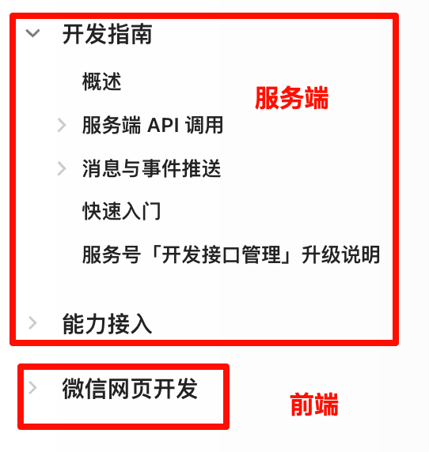

tags:: [[微信服务号]]
---

- ## 开发对接
	- 参考: [开发指南 - 概述](https://developers.weixin.qq.com/doc/service/guide/dev/)
	- 后端服务器对接:
	  logseq.order-list-type:: number
		- 调用 [[微信服务端 API]]
		  logseq.order-list-type:: number
		- 接收 [[微信消息与事件推送]]
		  logseq.order-list-type:: number
	- 前端页面对接:
	  logseq.order-list-type:: number
		- [[微信网页开发]]
	- {:height 383, :width 247}
- ## 公众账号测试号
	- 进入 [微信公众账号测试号申请系统](https://mp.weixin.qq.com/debug/cgi-bin/sandboxinfo?action=showinfo&t=sandbox/index) 申请测试号, 可以在不注册服务号的情况下, 测试相关功能.
	-