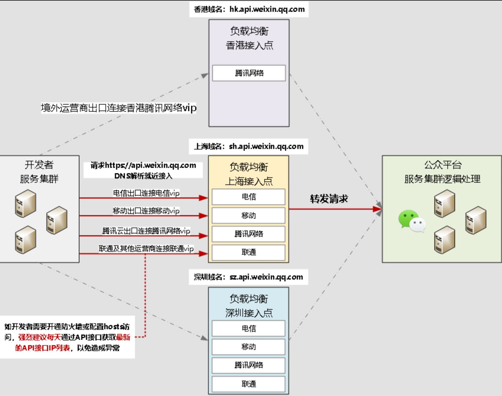

tags:: [[微信服务端 API]]
---

- ## 调用步骤
	- ### 1. 获取 AppID 和 AppSecret
		- 在调用 **微信服务端 API** 前, 需要先获取调用 API 的 **微信应用** 如下参数:
			- AppID
			  logseq.order-list-type:: number
			- AppSecret
			  logseq.order-list-type:: number
		- 两者可以在 [微信开发者平台](https://developers.weixin.qq.com/platform/) 获取.
		- 关于 AppSecret :
			- 平台不保存 `AppSecret` , 所以无法查看正在使用的 `AppSecret` .
			  logseq.order-list-type:: number
			- 如果忘记了 `AppSecret` , 可以重置, 但会导致旧 **AppSecret ** 失效.
			  logseq.order-list-type:: number
			- 除了 **重置** 外, AppSecret 还支持 **启用、冻结以及解冻** 等操作.
			  logseq.order-list-type:: number
				- (具体参见: [服务端 API 调用说明 - 2、AppSecret 管理](https://developers.weixin.qq.com/doc/oplatform/developers/dev/api/))
	- ### 2. 配置 API IP 白名单
		- 可以在 [微信开发者平台](https://developers.weixin.qq.com/platform/) 配置调用 API 的 IP 白名单
		- (具体参见: [服务端 API 调用说明 - 3、API IP 白名单](https://developers.weixin.qq.com/doc/oplatform/developers/dev/api/) )
	- ### 3. 指定 API 域名与 IP
		- #### 调用 API 时指定的域名
			- {:height 781, :width 792}
			- 通用域名
			  logseq.order-list-type:: number
				- `api.weixin.qq.com` : DNS 解析, 就近接入.
				- `api2.weixin.qq.com` : DNS 解析, 就近接入, `api.weixin.qq.com` 的 **异地容灾备份** .
			- 地域域名
			  logseq.order-list-type:: number
				- `sh.api.weixin.qq.com` : 访问上海的接入点.
				- `sz.api.weixin.qq.com` : 访问深圳的接入点.
				- `hk.api.weixin.qq.com` : 访问香港的接入点.
			- 一般使用 **通用域名** 即可.
		- #### 域名对应的 IP
			- 上述域名对应的 IP 是会动态变化的.
			- 如需配置 **网络安全策略** , 可以定时 (比如 每天) 调用 [获取微信API服务器IP getApiDomainIp](https://developers.weixin.qq.com/doc/subscription/api/base/api_getapidomainip.html) 获取最新 IP 进行配置.
			- 调用 API 时, 一定要使用域名, 而非 IP .
	- ### 4. 获取调用 API 用的 Token
		- Token 有如下几类:
			- 商家应用自己调用 API 的凭证: [[微信服务端 API: access_token]]
			  logseq.order-list-type:: number
			- 第三方平台代替商家应用调用 API 的凭证: [[微信服务端 API: authorizer_access_token]]
			  logseq.order-list-type:: number
			- 第三方平台调用第三方平台专用 API 的凭证: [[微信服务端 API: component_access_token]]
			  logseq.order-list-type:: number
		- 使用 [[微信云调用]] 也可以不使用 Token.
- ## 请求约定
	- 有如下约定:
		- 大部分请求方法为 `POST` 和 `GET` .
		  logseq.order-list-type:: number
		- 对于 `GET` 请求: 
		  logseq.order-list-type:: number
			- **请求参数** 应以 `QueryString` 的形式, 写在 URL 中.
		- 对于 `POST` 请求:
		  logseq.order-list-type:: number
			- 部分请求参数, 以 `QueryString` 的形式, 写在 URL 中 (比如 `access_token` ) .
			- 部分请求参数, 如无其他说明, 则以 `JSON` 字符串格式, 写在 `POST` 请求的 `body` 中.
- ## 返回参数约定
	- 部分 API:
		- 不管调用成功还是失败, 都会固定返回 `errcode` 和 `errmsg` .
	- 部分 API :
		- 只有调用失败时才会返回 `errcode` 和 `errmsg` .
	- 错误码: [微信服务端 API - 全局错误码](https://developers.weixin.qq.com/doc/oplatform/developers/errCode/)
- ## 异常处理
	- 接口调用额度:
	  logseq.order-list-type:: number
		- 每个接口都有调用额度限制.
		- 参见: [[微信服务端 API: OpenAPI 管理]]
	- 问题排查:
	  logseq.order-list-type:: number
		- [接口报警和排查指引](https://developers.weixin.qq.com/doc/oplatform/developers/dev/api/warn_guide.html)
		  logseq.order-list-type:: number
		- [智能 API 诊断工具](https://developers.weixin.qq.com/console/devtools/debug)
		  logseq.order-list-type:: number
- ## 参考
	- [服务端 API 调用说明](https://developers.weixin.qq.com/doc/oplatform/developers/dev/api/)
	  logseq.order-list-type:: number
	- [如何查看和重置 AppSecret](https://developers.weixin.qq.com/doc/oplatform/developers/dev/appid.html)
	  logseq.order-list-type:: number
	- [接口调用指南](https://developers.weixin.qq.com/doc/oplatform/developers/dev/guide.html)
	  logseq.order-list-type:: number