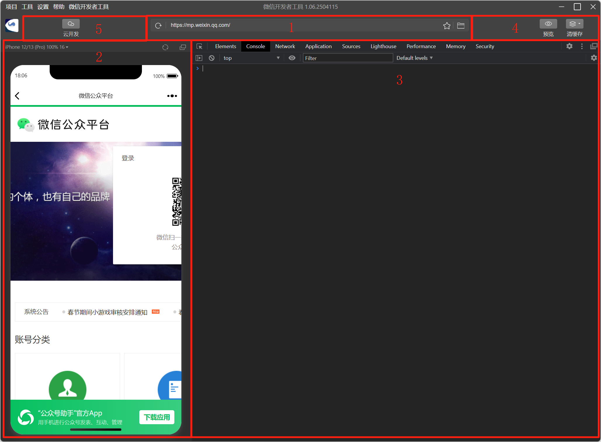

tags:: [[微信网页开发]]
---

- ## 什么是微信网页开发
	- 微信有内置浏览器, 可以打开 Web 网页.
	- 在 Web 网页中, 集成 **微信能力** , 就是 微信网页开发 .
		- 注意:  集成了 **微信能力** 的 Web 网页, 只能在微信内置浏览器中正常使用这些能力 (普通浏览器中无法正常使用).
- ## 公众号/服务号与微信网页开发
	- 如果需要调用 **微信能力** , 就需要将 **网页所属域名** , 绑定到某个 **公众号/服务号** 下.
		- 因为微信提供的能力需要通过 **公众号/服务号** 来进行申请.
	- 不管是不是在 **公众号/服务号** 内打开此网页, 只要是在微信内打开, 此网页都能调用 **公众号/服务号**  所能调用的 **微信能力** .
- ## 使用微信开发者工具
	- ### 为什么要使用微信开发者工具
		- 普通浏览器中, 显然无法调用和调试微信提供的能力.
		- 微信内置浏览器中, 虽然可以调用微信提供的能力, 但是无法打开调试控制台.
		- 所以要用 [[微信开发者工具]] 来开发.
	- ### 开发前准备
		- **服务号 管理员** 在 [微信开发者平台](https://developers.weixin.qq.com/platform) 中添加 **服务号 开发者** .
		  logseq.order-list-type:: number
		- 下载并打开 **微信开发者工具** , 登录 **服务号 开发者**  的账号.
		  logseq.order-list-type:: number
		- 进入 **微信开发者工具** 的 **公众号网页** .
		  logseq.order-list-type:: number
			- {:height 409, :width 389}
		- 本地启动 Web 服务器, 在 **微信开发者工具** 的地址栏填入要开发的网页.
		  logseq.order-list-type:: number
			- {:height 333, :width 508}
- ## 可使用的微信能力
	- [[微信网页授权]] : 微信提供的获取 **微信用户信息** 的能力.
	  logseq.order-list-type:: number
	- [[微信 JS-SDK]] : 微信内网页 **调用微信能力的工具包** .
	  logseq.order-list-type:: number
	- [[微信开放标签]] : 微信封装的 **网页标签** , 在微信内置浏览器中, 可被渲染成对应的 **功能组件** , 用于完成特定功能.
	  logseq.order-list-type:: number
- ## 参考
	- [微信网页开发 - 开始开发](https://developers.weixin.qq.com/doc/service/guide/h5/start.html)
	  logseq.order-list-type:: number
	- logseq.order-list-type:: number