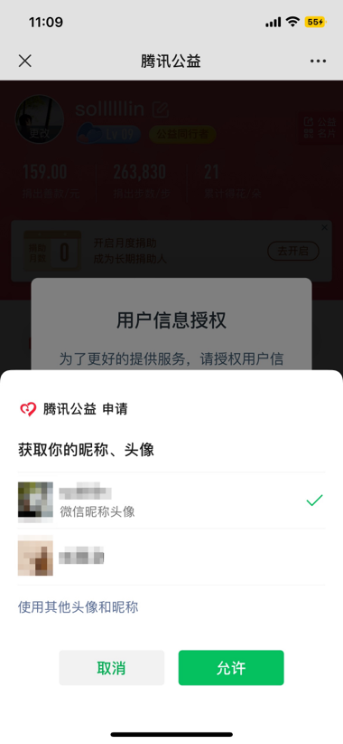

tags:: [[微信网页开发]]
---

- ## 什么是微信网页授权
	- 用于在微信内网页 **获取微信用户基本信息** , 进而实现业务逻辑.
	- 效果如下图:
		- {:height 753, :width 251}
		- 图源: [微信网页授权](https://developers.weixin.qq.com/doc/service/guide/h5/auth.html)
- ## 适用账号
	- 已认证的 **服务号**
	  logseq.order-list-type:: number
	- 已认证的如下类型的 **公众号** :
	  logseq.order-list-type:: number
		- 政府
		  logseq.order-list-type:: number
		- 事业单位
		  logseq.order-list-type:: number
		- 媒体
		  logseq.order-list-type:: number
- ## 开发前准备
	- 需要到 [微信公众平台](https://mp.weixin.qq.com/) 中 **公众号/服务号** 的「设置与开发 - 账号设置 - 功能设置」, 配置「网页授权域名」.
		- 如果没有「网页授权域名」, 则说明 **公众号/服务号** 不支持此能力.
	- 配置的值如 `www.qq.com` .
		- 表示这个域名下的所有路径, 都可调用 **微信网页授权** 能力.
		- 如 `http://www.qq.com/music.html` , `http://www.qq.com/login.html`
- ## 网页授权开发
	- 具体流程和开发细节, 请通读: [微信网页授权](https://developers.weixin.qq.com/doc/service/guide/h5/auth.html)
- ## 网页授权接口提额
	- **网页授权接口** 有调用频率限制, 参见 [网页授权接口调用额度提升指引](https://developers.weixin.qq.com/doc/service/guide/h5/get_quota.html) 花钱提升调用频率.
- ## 授权用户信息变更事件
	- 参见 [授权用户信息变更](https://developers.weixin.qq.com/doc/service/guide/h5/authorization_change.html) , 查看如何合规处理 **授权用户信息变更** .
	- 需参考 [[微信消息与事件推送]] 了解如何处理推送.
- ## 参考
	- [微信网页授权](https://developers.weixin.qq.com/doc/service/guide/h5/auth.html)
	  logseq.order-list-type:: number