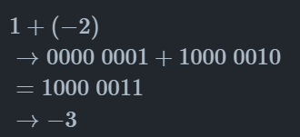
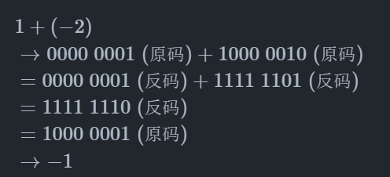

tags:: [[计算机组成原理]]
---

- ## 原码、反码与补码
	- 参考: [原码、反码和补码](https://www.hello-algo.com/chapter_data_structure/number_encoding/#331)
	- **原码**：最高位为符号位，0 表示正数，1 表示负数。
	- **反码**：正数的反码与其原码相同，负数的反码是对其原码除符号位外的所有位取反。
	- **补码**：正数的补码与其原码相同，负数的补码是在其反码的基础上加 1 。
	-
	- 使用原码直接进行位运算(比如加减)，可能会得到错误的答案 (比如正数与负数相加的时候)。
		- 
	- 但如果我们先将原码转换为反码，进行位运算，最后将结果从反码转换回原码，则会得到正确的答案
		- 
	-