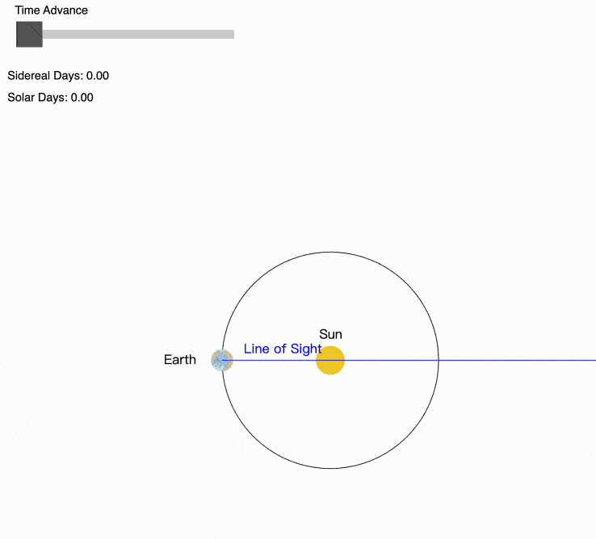
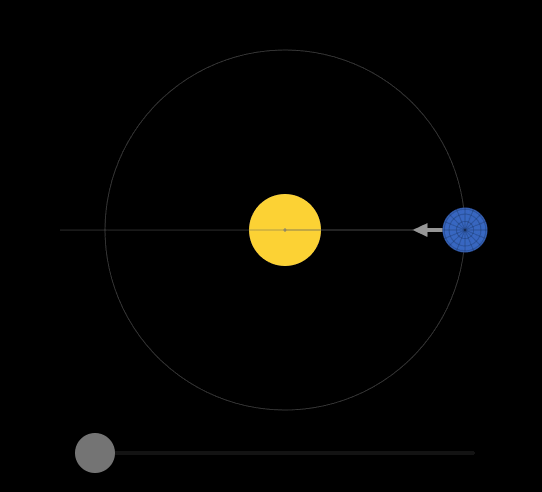
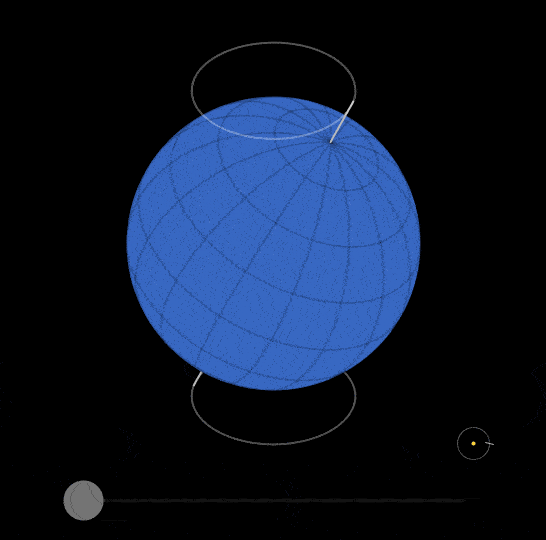
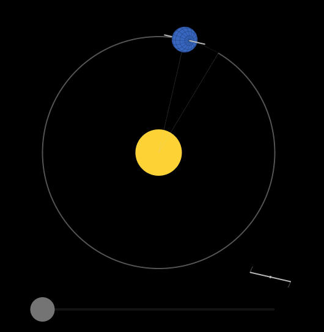

tags:: [[地月日系统]]
---

- ## 恒星日与太阳日
	- ### 什么是恒星日与太阳日
		- **恒星日 (Sidereal Day)** : 相对于遥远的恒星, 地球自转一周的时间.
			- `≈ 23 小时 56 分`
		- **太阳日 (Solar Day)** : 太阳在天空中重复出现的周期 .
			- `≈ 24 小时` .
			- 我们人类 [[历法]] 采用 **太阳日** .
		- 这里 **1 分钟 = 60 SI 秒** ,  **1 小时 = 3600 SI 秒** .
			- 参见: [[原子钟与 SI 秒]]
	- ### 为什么太阳日比恒星日长
		- 观察地球上某点, 一开始正对太阳.
			- 由于地球同时在公转, 在地球自转一周后, 这个点就不是正对太阳了.
			- 所以, 需要地球再自转和公转一段时间, 这个点才能再次正对太阳.
		- 查看演示: [Solar vs. Sidereal Day](https://sciencesims.com/sims/solar-vs-sidereal/)
			- {:height 377, :width 380}
		- 或者这个演示: [Earth and Sun#Axial Rotation](https://ciechanow.ski/earth-and-sun/#axial-rotation)
			- {:height 272, :width 303}
- ## 恒星年与回归年
	- ### 什么是恒星年与回归年
		- **恒星年 (Sidereal Year)** : 相对于遥远的恒星, 地球绕太阳公转一周的时间.
			- 约为 `365.2564 天`
		- **回归年 (Tropical Year)** : 地球绕太阳运动, 使 **太阳照射地球的角度变化** 完整重复一次所需的时间.
			- 约为 `365.2422 天`
			- 我们人类 [[历法]] 采用 **回归年** .
		- 这里的 1 天并非指 **太阳日** 或 **恒星日**, 而是一个标准的时间单位: **1 天 = 86400 SI 秒** .
			- 参见: [[原子钟与 SI 秒]]
	- ### 岁差 (Axial Precession)
		- 受 **太阳** 和 **月球** 的引力影响, **地球** 的 **自转轴** 并非保持不变, 而是会像 **陀螺** 一样晃动.
			- **自转轴** 的这个运动被称为 **地轴进动 (Axial Precession)** , 也被称为 **岁差** .
			- **自转轴** 的转动周期, 大概是 **25772 年** .
		- 参考如下演示: [Earth and Sun#Year](https://ciechanow.ski/earth-and-sun/#year)
			- {:height 253, :width 344}
	- ### 岁差导致恒星年比回归年长
		- **地球** 的 **岁差方向** , 让 **季节标记点** 沿着与 **地球公转** **相反** 的方向移动.
			- 相当与 **地球** 多转了一些, 去迎接 **太阳** .
		- 参考如下演示: [Earth and Sun#Year](https://ciechanow.ski/earth-and-sun/#year)
			- {:height 278, :width 284}
- ## 太阳直射
	- ### 太阳直射点
		-
	- ### 南北回归线
		-
	- ### 阳光角度与能量
		-
	- ### 正午
- ## 昼夜交替
	- 一个 **太阳日** 中, **地球面向太阳的角度变化** , 导致了 **昼夜更替** .
	- ### 晨昏线
		-
	- ### 子午线
		-
	- ### 极昼与极夜
		-
- ## 季节变化
	- 一个 **回归年** 中, **太阳照射地球的角度变化** , 导致了 **季节变化** .
	- ### 阳光角度
- ## 日行迹
	- ==未看懂, 待学习==
- ## 参考
	- [Earth and Sun](https://ciechanow.ski/earth-and-sun/) (这篇科普文章不错, 有空建议通读)
	  logseq.order-list-type:: number
	- GPT
	  logseq.order-list-type:: number