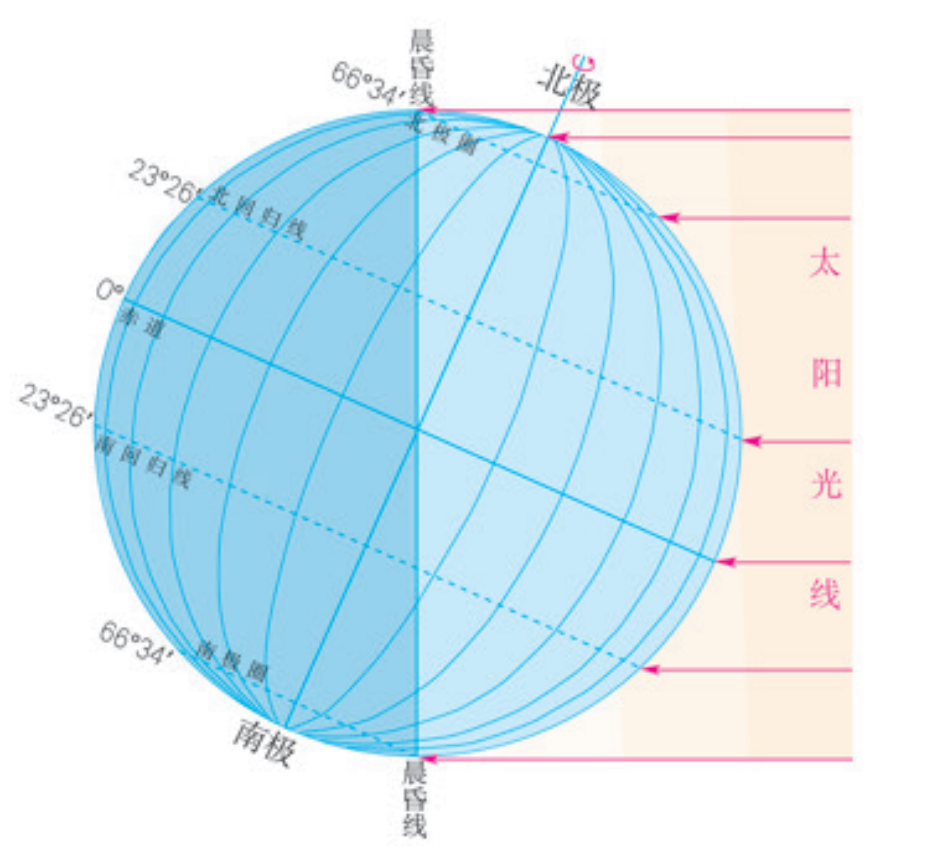
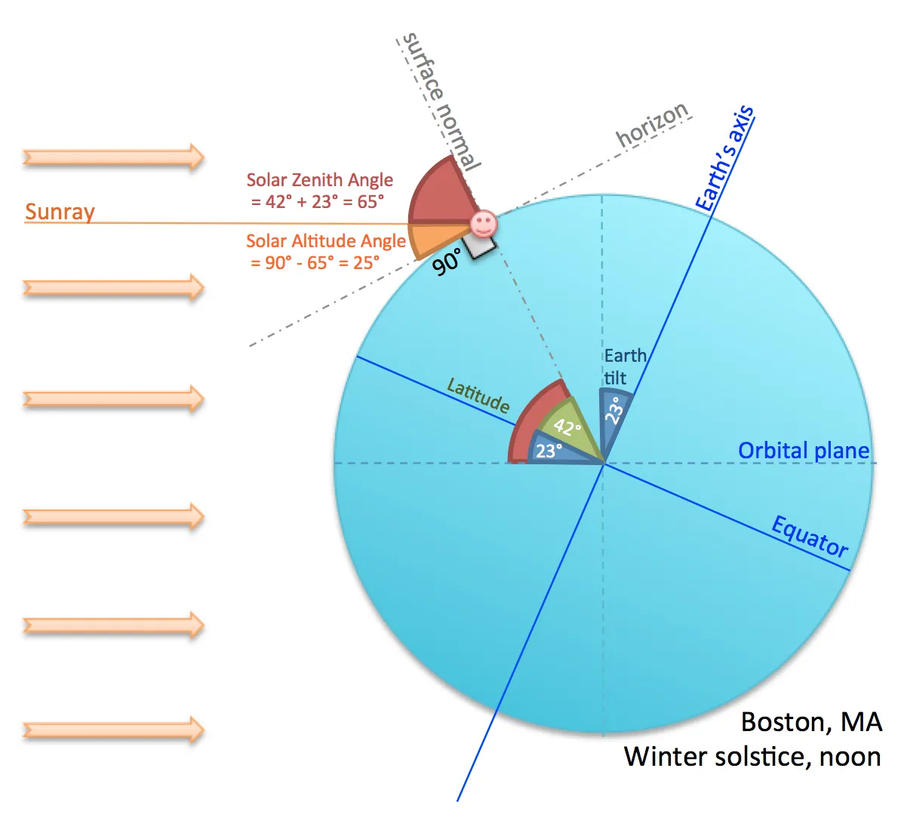
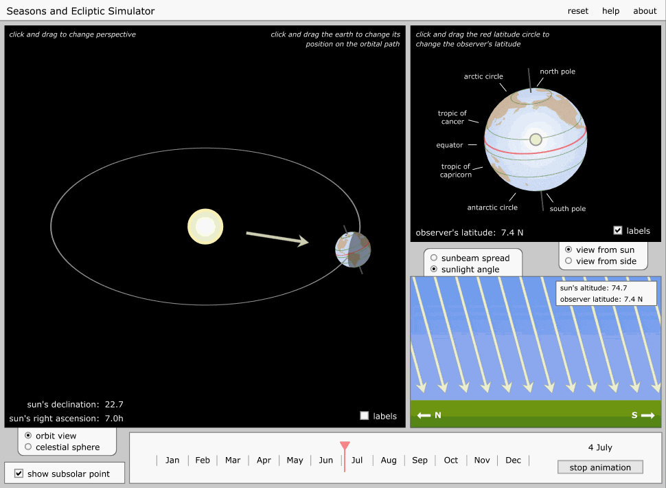
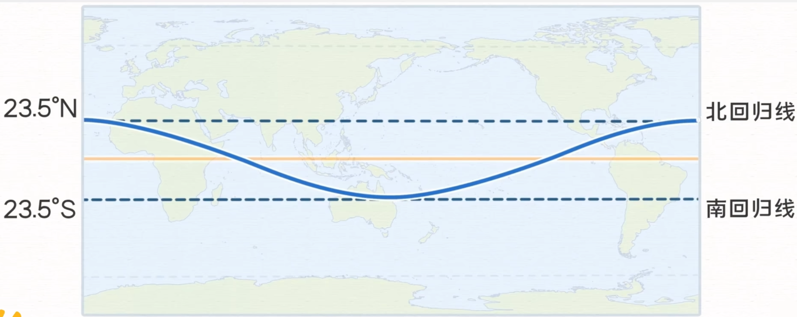
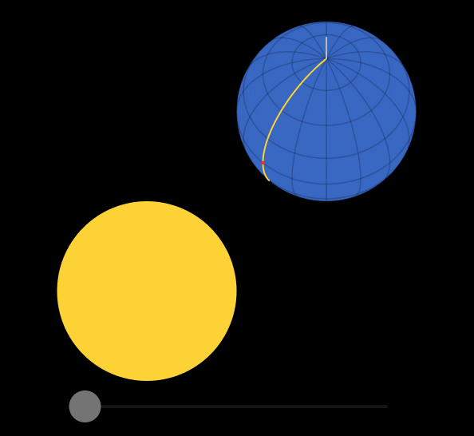
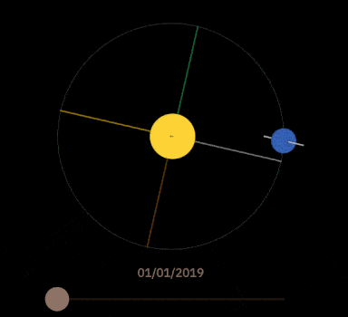
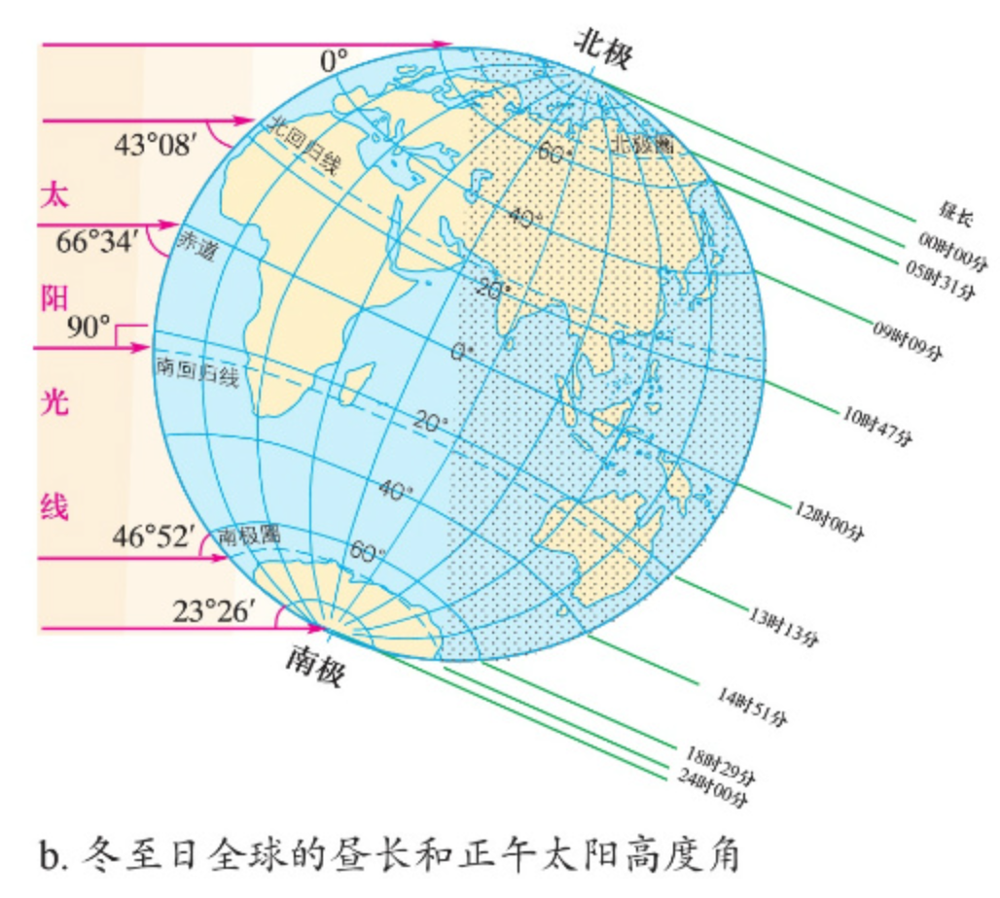
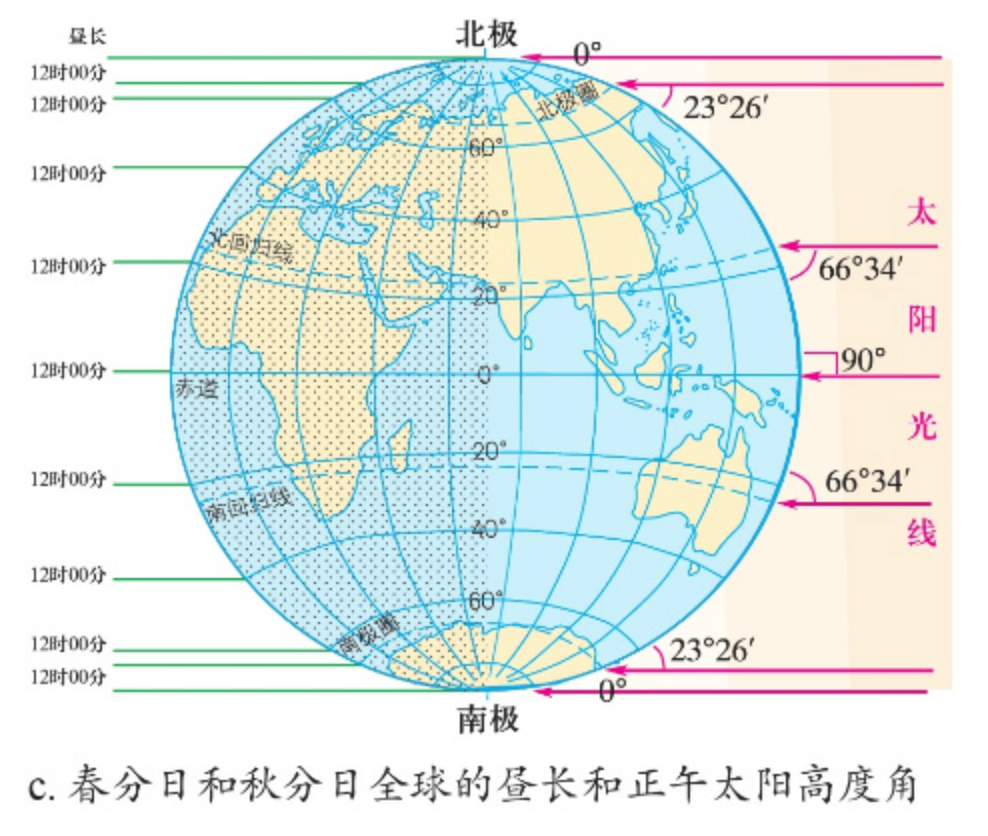
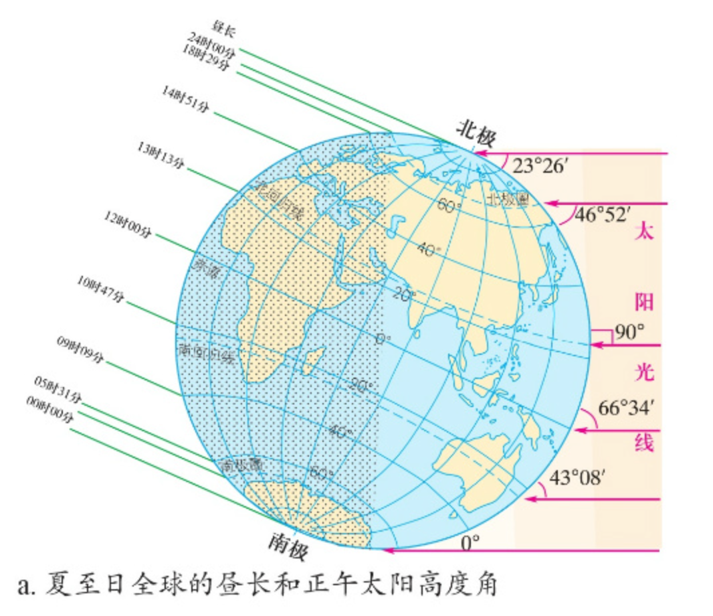

tags:: [[地月日系统]]
---

- ## 恒星日与太阳日
	- ### 什么是恒星日与太阳日
		- **恒星日 (Sidereal Day)** : 相对于遥远的恒星, 地球自转一周的时间.
			- `≈ 23 小时 56 分`
		- **太阳日 (Solar Day)** : 太阳在天空中重复出现的周期 .
			- `≈ 24 小时` .
			- 我们人类 [[历法]] 采用 **太阳日** .
		- 这里 **1 分钟 = 60 SI 秒** ,  **1 小时 = 3600 SI 秒** .
			- 参见: [[原子钟与 SI 秒]]
	- ### 为什么太阳日比恒星日长
		- 观察地球上某点, 一开始正对太阳.
			- 由于地球同时在公转, 在地球自转一周后, 这个点就不是正对太阳了.
			- 所以, 需要地球再自转和公转一段时间, 这个点才能再次正对太阳.
		- 查看演示: [Solar vs. Sidereal Day](https://sciencesims.com/sims/solar-vs-sidereal/)
			- {:height 377, :width 380}
		- 或者这个演示: [Earth and Sun#Axial Rotation](https://ciechanow.ski/earth-and-sun/#axial-rotation)
			- {:height 272, :width 303}
- ## 恒星年与回归年
	- ### 什么是恒星年与回归年
		- **恒星年 (Sidereal Year)** : 相对于遥远的恒星, 地球绕太阳公转一周的时间.
			- 约为 `365.2564 天`
		- **回归年 (Tropical Year)** : 地球绕太阳运动, 使 **太阳照射地球的角度变化** 完整重复一次所需的时间.
			- 约为 `365.2422 天`
			- 我们人类 [[历法]] 采用 **回归年** .
		- 这里的 1 天并非指 **太阳日** 或 **恒星日**, 而是一个标准的时间单位: **1 天 = 86400 SI 秒** .
			- 参见: [[原子钟与 SI 秒]]
	- ### 岁差 (Axial Precession)
		- 受 **太阳** 和 **月球** 的引力影响, **地球** 的 **自转轴** 并非保持不变, 而是会像 **陀螺** 一样晃动.
			- **自转轴** 的这个运动被称为 **地轴进动 (Axial Precession)** , 也被称为 **岁差** .
			- **自转轴** 的转动周期, 大概是 **25772 年** .
		- 参考如下演示: [Earth and Sun#Year](https://ciechanow.ski/earth-and-sun/#year)
			- {:height 253, :width 344}
	- ### 岁差导致恒星年比回归年长
		- **地球** 的 **岁差方向** , 让 **季节标记点** 沿着与 **地球公转** **相反** 的方向移动.
			- 相当与 **地球** 多转了一些, 去迎接 **太阳** .
		- 参考如下演示: [Earth and Sun#Year](https://ciechanow.ski/earth-and-sun/#year)
			- {:height 278, :width 284}
- ## 昼夜交替
	- ### 昼半球, 夜半球 与 晨昏线
		- 向着太阳的半球是白昼, 称为昼半球.
		- 背着太阳的半球是黑夜, 称为夜半球.
		- 二者的 **分界线 (圈)** , 被称为 **晨昏线 (圈)** .
		- {:height 293, :width 295}
		- 图源: [人民教育出版社 - 地理选择性必修1 自然地理基础#PDF 第12 页/页码第 7 页](https://basic.smartedu.cn/tchMaterial/detail?contentType=assets_document&contentId=373d48bd-c1b4-4edd-b148-628713692ba3&catalogType=tchMaterial&subCatalog=tchMaterial)
	- ### 昼夜交替原因
		- 地球自转, 导致待在某地的观察者, 循环经历白昼与黑夜.
	- ### 昼弧与夜弧
		- **晨昏线** 将经过的 **纬线** 分割成 **昼弧** 和 **夜弧** .
			- 二者的比例, 即昼夜时长的比例.
- ## 太阳高度角
	- ### 什么是太阳高度角
		- 太阳光线 与 地平面 (地球表面某点的切面) 的交角.
			- {:height 400, :width 400}
			- 图源: [How to Determine Solar Altitude Angle](https://medium.com/%40jchao_94580/how-to-determine-the-altitude-angle-of-the-sun-a4995d6b9c96)
	- ### 太阳直射点
		- 面向太阳, **太阳高度角** 为 90 度 的点.
		- 同一时刻, 地球上只存在一个 **太阳直射点** .
		- 也只有在 **太阳直射点** 才会发生真正的 **立杆无影** 的现象.
	- ### 南北回归运动
		- 太阳直射点的纬度, 一年中会在 `北回归线` 和 `南回归线` 之间来回移动.
			- 这被称为 **太阳直射点的南北回归运动** .
		- 查看演示: [Season and Ecliptic Simulator](https://astro.unl.edu/classaction/animations/coordsmotion/eclipticsimulator.html)
			- {:height 472, :width 640}
			- 注意, 图中右上角地球的转动, 是从 **太阳** 的方向观察的.
				- 这里 **地轴** 的转动并非是在强调 **地轴进动** , 即便没有 **地轴进动** , 从太阳的方向观察, **地球** 绕太阳 **公转** 也会导致 **地轴** 转动.
		- 平面展开图:
			- {:height 356, :width 559}
			- 图源: [这个视频终于解决了困扰我多年的难题。太阳直射点为什么会移动，我终于搞清楚了。](https://www.bilibili.com/video/BV1gXW8epEua)
			- ==注意, 这条曲线各年同纬度的点, 经度会发生变动.==
	- ### 地理上的子午线: 经线
		- 就是地球表面的 **经线** .
	- ### 天文上的子午线: 当地子午线
		- **当地子午线** 是某个观察地点的天空南北线 .
		- 它建立在 “天球” 这个假想球面上, 用来描述太阳、月亮、恒星等天体在天空中是否经过当地的正南/正北方向.
	- ### 太阳正午
		- 太阳正午: 就是某地一天中太阳经过当地子午线的时刻.
			- ==这也是当地当天太阳达到最高位置的时刻. (未深入理解)==
		- 除非, 该地刚好位于太阳直射点, 否则此刻的钟表时间不会是 `中午 12 点` .
			- {:height 408, :width 345}
			- 图源: [Earth and Sun#Axial Rotation](https://ciechanow.ski/earth-and-sun/#axial-rotation)
- ## 季节变化
	- ### 二分二至
		- | 节气 | 现代天文学定义 | 太阳直射点位置 | 太阳位置 | 昼夜长短 | 
		  | ---- | ---- | ---- | ---- | ---- |
		  | **冬至** | 太阳黄经 = **270°** | 南回归线附近 | 太阳到达天球最偏南的位置，北半球太阳正午影子最长的一天 | 北半球白昼最短的一天 | 
		  | **春分** | 太阳黄经 = **0°** | 赤道附近 | 太阳从天球南半球跨到北半球附近 | 昼夜大致等长 | 
		  | **夏至** | 太阳黄经 = **90°** | 北回归线附近 | 太阳到达天球最偏北的位置，北半球太阳正午影子最短的一天 | 北半球白昼最长的一天 |
		  | **秋分** | 太阳黄经 = **180°** | 赤道附近 | 太阳从天球北半球跨到南半球附近 | 昼夜大致等长 |
		- 示意图 (灰色为 **冬至**):
			- 冬至 和 夏至, 地轴 在黄道面上的投影, 与地日连线重合.
			- 春分 和 秋分, 地轴 在黄道面上的投影, 与地日连线垂直.
			- 
			- 图源: [Earth and Sun#Axial Tilt](https://ciechanow.ski/earth-and-sun/#axial-tilt)
	- ### 二分二至点的昼长与正午太阳高度角
		- 参考: [人民教育出版社 - 地理选择性必修1 自然地理基础#PDF 第 17 页/页码第 11 页](https://book.pep.com.cn/1438001131201/mobile/index.html?u_atoken=6a3f487b-5418-10cc-c4bf-21a8c9f16b7e&u_asession=01Vt0TFu2ZXiRjYEdBWIC9FYs3dfiazqnUu1ed5uDP0KPwAIlpp1pgHp9vInFtR_1HNFA5HegvR6Ji_LzP7SbW-dsq8AL43dpOnCClYrgFm6o&u_asig=05uXtM5SkFwRo66gie9QH0jbZdK-IWC5FsDZrnfWB49-bDCr3tyu6GdRpIvXp_fnC9VUc0npBLfqJHdgQx4E-Rs9mMJOLJCXzn41ZpElUBeX1EaD50XlVMKq-80Wi2ARkBIa1mr3Qml5TjP6L9b6K_dBsayJQhsdz98Qe71u_OEFVoJB74oyyDVOzTNiQ2TjGNksmHjM0JOodanL5-M1Qs1S0aRLT39VcGPXizeCdjpy3eCLmqxOaLWo_9_RLzFDDS6WB-vFiv4f-qZbtDyjkd7V1_lxBkq8F-LrxxBJ-gBXPUpLHxH1iRKZmnjAu0Zefw&u_aref=vUeYhRYiM4GaKrRtHlSc%2FbAY0GA%3D)
		- #### 示意图
			- **冬至日** 全球的昼长和正午太阳高度角:
				- {:height 459, :width 405}
			- **春分日** 与 **秋分日** 全球的昼长和正午太阳高度角:
				- {:height 459, :width 405}
			- **夏至日** 全球的昼长和正午太阳高度角:
				- {:height 459, :width 405}
		- #### 春分日 - 秋分日
			- 自春分日至秋分日, 是北半球的 **夏半年** :
				- 太阳直射北半球, 北半球各纬度 **昼弧** 大于 **夜弧** , 即 昼长大于夜长.
				  logseq.order-list-type:: number
				- 纬度越高, 昼越长, 夜越短, 至北极四周为 **极昼** .
				  logseq.order-list-type:: number
				- 其中, 夏至日:
				  logseq.order-list-type:: number
					- 太阳直射北回归线;
					  logseq.order-list-type:: number
					- 北半球昼最长, 夜最短, 北极圈及其以北地区皆为极昼.
					  logseq.order-list-type:: number
			- 南半球, 则相反.
		- #### 秋分日 - 次年春分日
			- 自秋分日至次年春分日, 是北半球的冬半年:
				- 太阳直射南半球, 北半球各纬度昼短夜长.
				  logseq.order-list-type:: number
				- 纬度越高, 昼越短, 夜越长, 至北极四周有 **极夜** 现象.
				  logseq.order-list-type:: number
				- 其中，冬至日:
				  logseq.order-list-type:: number
					- 太阳直射南回归线;
					  logseq.order-list-type:: number
					- 北半球昼最短，夜最长，北极圈及其以北地区到处出现极夜现象.
					  logseq.order-list-type:: number
			- 南半球, 则相反.
		- #### 春分日和秋分日
			- 太阳直射赤道;
			  logseq.order-list-type:: number
			- 全球各地昼夜等长, 均为12时.
			  logseq.order-list-type:: number
	- ### 季节变化原因
		- 造成季节变化的直接原因是: 地球表面接收到的 **太阳辐射强弱** 发生周期性变化.
			- 夏季接收得多, 气温较高;
			- 冬季接收得少, 气温较低.
	- ### 太阳辐射强弱变化的原因
		- 太阳高度角变化
		  logseq.order-list-type:: number
			- 夏季太阳更高, 阳光更接近直射, 单位面积获得的能量更多.
			- ==(太阳光不直射, 会导致同样多的太阳能量, 被分散到更大的面积里, 导致单位面积获取到的能量更少)== 未完全理解
		- 白昼时间变化
		  logseq.order-list-type:: number
			- 夏季白天更长, 地表被太阳加热的时间更久.
- ## 日行迹
	- ==未看懂, 待学习==
- ## 参考
	- [Earth and Sun](https://ciechanow.ski/earth-and-sun/) (这篇科普文章不错, 有空建议通读)
	  logseq.order-list-type:: number
	- GPT
	  logseq.order-list-type:: number