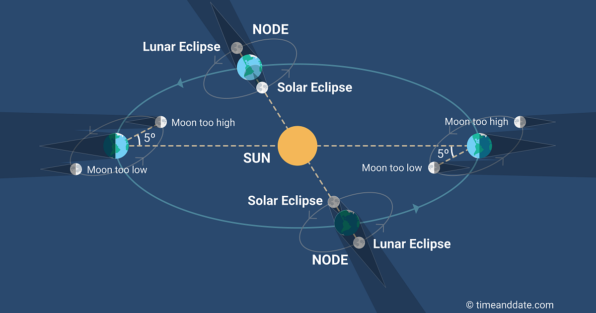
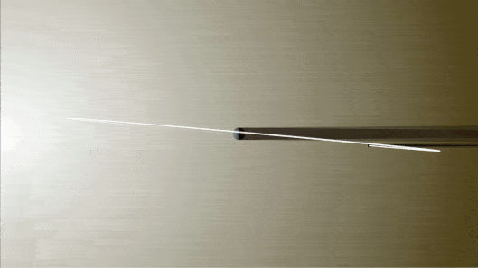
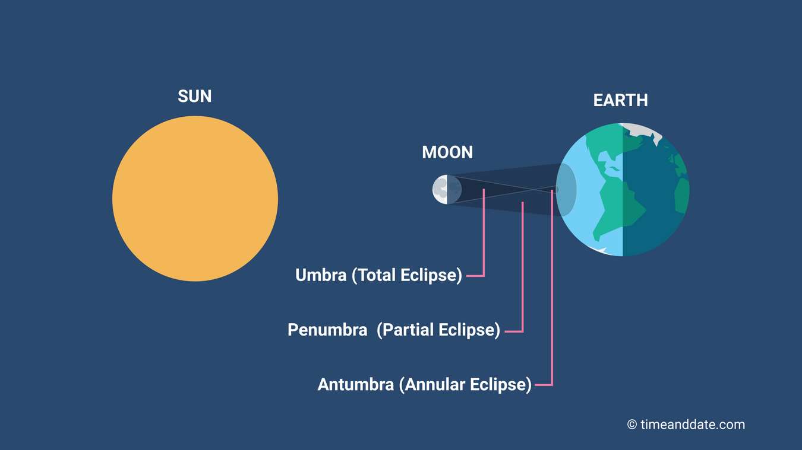
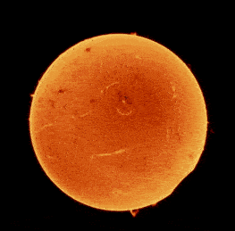
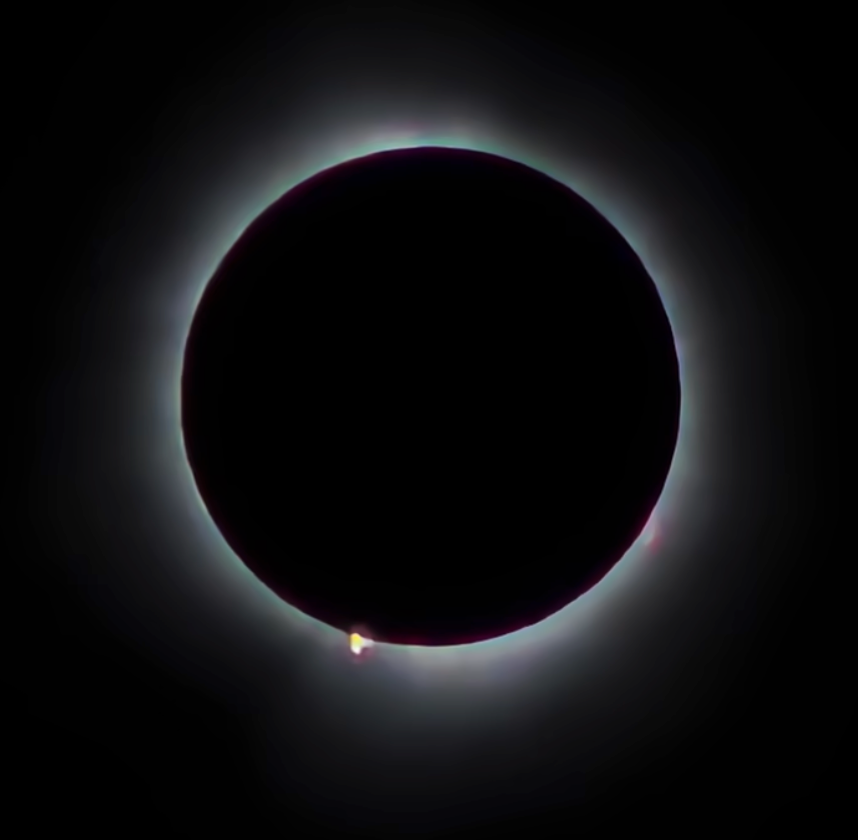
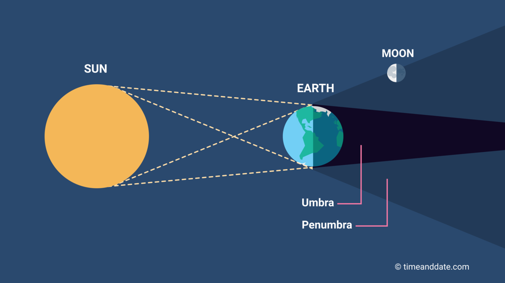

tags:: [[地月日系统]]
---

- ## 日食与月食示意图
	- 
	- 图源: [What Is a Penumbral Lunar Eclipse?](https://www.timeanddate.com/eclipse/penumbral-lunar-eclipse.html)
- ## 日食与月食的成因
	- 日食 : `日 - 月 - 地, 大致共线` (月球在中间)
		- 这必然发生在 **新月** 附近.
	- 月食 : `日 - 地 - 月, 大致共线` (地球在中间)
		- 这必然发生在 **满月** 附近.
	- 这意味着发生 **日食或月食** 时, **月球** 必须在 **黄道面** 上.
- ## 为什么不是每个月都有日食/月食
	- 注意, **新月/满月** 时:
		- 只是月球在黄道面上的投影, 在 **地日连线** 上.
		- 月球本身不一定在 **地日连线** 上, 也即月球本身不一定在 **黄道面** 上.
	- 所以, 可以这样描述 **日食/月食** 发生的条件:
		- **月球** 运行到 **月球轨道** 与 **黄道面** 的 **交点** 上, 且这个 **交点** 必须位于 **地日连线** 上 .
			- 若 **月球** 在中间, 则是 **日食** .
			  logseq.order-list-type:: number
			- 若 **地球** 在中间, 则是 **月食** .
			  logseq.order-list-type:: number
	- 试想一下:
		- 如果这个 **交点** 固定落在 **地日连线** 上, 每次 **月球** 穿过这个交点时, 都会发生 **日食/月食** .
		- 如果这个 **交点** 固定落在 **地日连线** 外, 每次 **月球** 穿过这个交点时, 都不会发生 **日食/月食** .
	- 所以, 正是由于  **月球轨道** 与 **黄道面** 的 **交点** , 相对 **地日连线** 的位置会一直发生变化:
		- 才导致, 不会永远不发生 **日食/月食** , 也不会每月都发生 **日食/月食** .
	- 这个 **交点** 相对 **地日连线** 的变化, 其实就是 **月球轨道 (白道面)** 相对 **太阳** 的变化.
- ## 白道面相对太阳为什么会发生变化
	- 变化原因:
		- 地球在绕太阳公转, 即使 **白道面** 不发生转动, 这个交点也会相对 **地日连线** 发生变化.
		  logseq.order-list-type:: number
			- ==这个是主要原因==
		- **白道面** 本身会因太阳引力而发生缓慢转动 (类似陀螺晃动), 这被称为 **月球轨道交点退行** .
		  logseq.order-list-type:: number
			- **月球轨道交点退行** 的周期是 **18.6 年** .
	- 查看白道面相对太阳的变化:
		- 
		- 图源: [Lunar Eclipses and the Moon's Orbit](https://svs.gsfc.nasa.gov/4158)
- ## 日全食, 日偏食, 日环食
	- ### 啥是日全食, 日偏食, 日环食
		- ==需要深入学习==
		- 可参考: [Umbra, Penumbra, and Antumbra: Why Are There 3 Shadows?](https://www.timeanddate.com/eclipse/shadows.html)
			- 
	- ### 日全食影像
		- 日全食过程:
			- 
			- 图源: [影视飓风 - 我们在日全食拍到了它？](https://www.bilibili.com/video/BV1fz421z7x9)
		- 日全食完成后:
			- {:height 509, :width 242}
			- 图源: [影视飓风 - 我们在日全食拍到了它？](https://www.bilibili.com/video/BV1fz421z7x9)
- ## 凌日
	-
- ## 月全食, 月偏食
	- ==需要深入学习==
	- 可参考: [What Is a Penumbral Lunar Eclipse?](https://www.timeanddate.com/eclipse/penumbral-lunar-eclipse.html)
		- 
- ## 血月
	-
- ## 参考
	- GPT
	  logseq.order-list-type:: number
	- [NASA - 2017 Eclipse and the Moon's Orbit](https://svs.gsfc.nasa.gov/4324/)
	  logseq.order-list-type:: number
- https://svs.gsfc.nasa.gov/4158
-