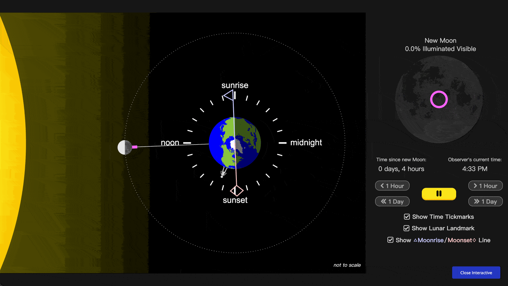
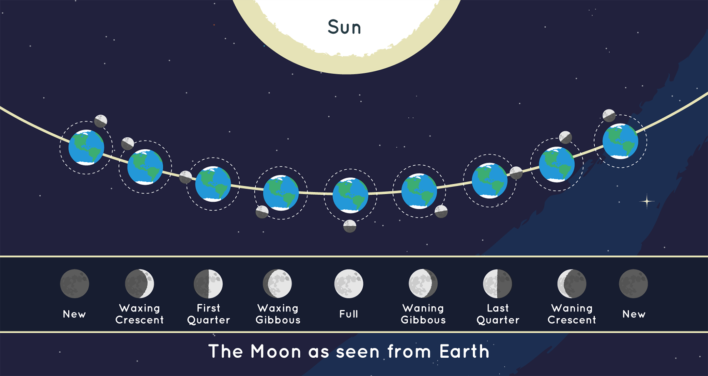
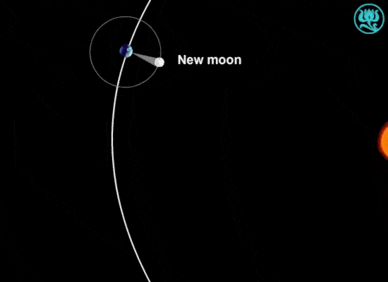

tags:: [[地月日系统]]
---

- ## 月相模型
	- ### 月相模型演示
		- 查看演示: [PBS - Lunar Phases Simulation](https://ca.pbslearningmedia.org/resource/buac19-68-sci-ess-moonphaseint/lunar-phases-simulation/)
			- 下图为地球北极上方俯视图
			- 
		- 或者看其他模拟:
			- [Moon Phases Visualized – Where Is the Moon?](https://www.timeanddate.com/astronomy/moon/location.html)
			  logseq.order-list-type:: number
			- [Lunar Phase Simulator](https://ccnmtl.github.io/astro-simulations/lunar-phase-simulator/)
			  logseq.order-list-type:: number
	- ### 学习月相模型需要提前知道的
		- #### 前提假设
			- 阳光近似成平行光 .
			  logseq.order-list-type:: number
				- 真实情况是: 太阳是一个有大小的球体, 光线从太阳表面向外发散.
				- 但是太阳距离很遥远, 所以可以忽略光线的夹角.
			- 月球和地球近似成球体.
			  logseq.order-list-type:: number
			- 月球公转轨道近似是圆形.
			  logseq.order-list-type:: number
		- #### 阳光照射
			- 太阳总是照亮月球的大约一半, 另一半处在黑暗中.
			  logseq.order-list-type:: number
				- 当然, 由于月球在自转, 被照亮的一半不是同一半.
			- 太阳总是照亮地球的大约一半, 另一半处在夜晚.
			  logseq.order-list-type:: number
				- 当然, 由于地球在自转, 被照亮的一半不是同一半.
		- #### 月相成因
			- 月球本身不发光, 只反射太阳光.
			  logseq.order-list-type:: number
			- 月相主要由 **月地日** 三者的相对位置决定.
			  logseq.order-list-type:: number
				- 月球公转轨道 和 地球公转轨道 有夹角
				- 所以, 在观察 **月-地-日** 角度时, 观察的并非是 **月球** 的真实位置, 而是 **月球** 在 **黄道面** 上投影的位置.
					- 所以, **新月** 时, **月-地-日** 角度才能为 0 .
			- 月球公转轨道 和 地球公转轨道 有夹角, 所以阳光大部分时候都能照射到 月球 .
			  logseq.order-list-type:: number
				- 除了发生 **月食** 的时候
			- 我们这里忽略地球公转导致的阳光方向变化, 假设阳光方向不变.
			  logseq.order-list-type:: number
				- ==真实情况是: 太阳光方向会随着地球自转而变化, 这肯定会影响月相.==
				- 但我们这里不考虑, 其实也就是不考虑地球公转.
				- 所以, 图中阳光光线不变, 地球也不公转.
		- #### 观察月相
			- ==我们说的 **月相** 是将 **观察者** 放在 地心 观察月亮的样子.==
			  logseq.order-list-type:: number
				- 地球的不同地点观察到的月相, 会有差别.
				  logseq.order-list-type:: number
				- 当月球和太阳在地球同一侧时 (比如新月附近), 我们可能晚上看不到月亮.
				  logseq.order-list-type:: number
					- 因为, 当地球上的观测者转到夜半球时, 月亮再日半球.
					- 另外, 白天也看不到月亮黑影:
						- 因为, 黑影需要更亮的背景衬托 (比如日食的时候, 背后有太阳)
						- 另外, 由于它靠近太阳的方向, 太阳眩光很强, 它会被白天的天空亮度淹没.
			- 南半球和北半球实际观察到的月相是左右翻转的.
			  logseq.order-list-type:: number
- ## 月相
	- ### 月相示意图
		- {:height 457, :width 853}
		- 图源: [Moon Phases](https://science.nasa.gov/moon/moon-phases)
	- ### 月相与 月-地-日 角度
		- | 中文 | 英文 | 大致日月角度 |
		  | ---- | ---- | ---- |
		  | 朔 / 新月 | New Moon | 0° |
		  | 上蛾眉月 / 娥眉月 | Waxing Crescent | 0°～90°之间 |
		  | 上弦月 | First Quarter | 90° |
		  | 盈凸月 | Waxing Gibbous | 90°～180°之间 |
		  | 望 / 满月 | Full Moon | 180° |
		  | 亏凸月 | Waning Gibbous | 180°～270°之间 |
		  | 下弦月 | Last Quarter / Third Quarter | 270° |
		  | 残月 / 下蛾眉月 | Waning Crescent | 270°～360°之间 |
		- 注意,
			- 这里的角度是 `月-地-日` 三者之间连线的角度, 并非月球绕地球公转走过的角度.
			  logseq.order-list-type:: number
			- 只有 `朔 / 新月` , `上弦月` , `望 / 满月` 和 `下弦月` 这四种月相有明确的 `月-地-日` 角度.
			  logseq.order-list-type:: number
			- `上弦月` / `下弦月` / `上蛾眉月` / `下蛾眉月` 中的 `上` 表示 **上半月** , `下` 表示 **下半月** .
			  logseq.order-list-type:: number
		- **角度变化** 可以查看这演示: [Lunar Phase Simulator](https://ccnmtl.github.io/astro-simulations/lunar-phase-simulator/)
- ## 恒星月与朔望月
	- ### 什么是恒星月与朔望月
		- **恒星月 (Sidereal Month)** : **月球** 相对于 **遥远恒星** , 绕 **地球** 运行一圈所需的时间.
			- 约为 `27.32 天`
		- **朔望月 (Synodic Month)** : **月球** 从一次月相到下一次相同月相所需的时间.
			- 约为 `29.53 天`
			- 我们人类 [[历法]] 采用 **朔望月** .
		- 这里的 1 天并非指 **太阳日** 或 **恒星日**, 而是一个标准的时间单位: **1 天 = 86400 SI 秒** .
			- 参见: [[原子钟与 SI 秒]]
	- ### 为什么朔望月比恒星月长
		- 查看如下演示: [The Sidereal and Synodic Months](https://www.sumanasinc.com/webcontent/animations/content/sidereal.html)
			- 
		- 月球绕地球公转时, 地球也在绕太阳公转.
			- 所以当月球完成一圈, 回到相对远方恒星的原方向时 (此时完成一个 **恒星月** ), 地球已经沿着轨道往前走了一段.
			- 这时, 太阳—地球—月球的角度, 还没有恢复到原来的状态。
			- 所以, 月球必须 **再多转一点** , 才能重新回到 “新月到新月” 这种同样的月相位置 (完成一个 **朔望月** ).
- ## 参考
	- GPT
	  logseq.order-list-type:: number