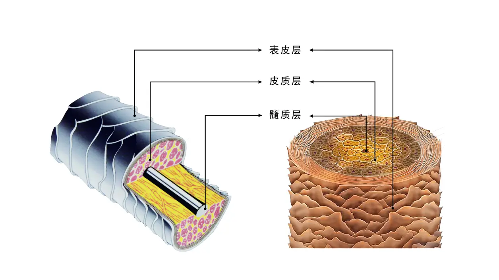

tags:: [[Health]]
---

- ## 三大层
	- 毛发由三大层组成:
		- `表皮层` : 鱼鳞片状的细透明体排列而成，大约有27-28层
		  logseq.order-list-type:: number
		- `皮质层` : 由螺旋状的纤维体组成的。含有麦拉宁粒子，水份10%，蛋白质，氨基酸。
		  logseq.order-list-type:: number
		- `髓质层` : 由真空状的海绵体排列形成的, **细软的头发** 里面不存在。
		  logseq.order-list-type:: number
	- {:height 301, :width 415}
	- [图源](https://www.bilibili.com/read/cv4066056/?opus_fallback=1)
- ## 四大键
	- 毛发中含有如下化学键:
		- `氢键` : 遇高温重组, 遇水断开
		  logseq.order-list-type:: number
		- `盐键` : 遇水而断, 利用热风重新组合, 保持到下次冲水.
		  logseq.order-list-type:: number
		- `二硫化物键` : 最坚硬的键, 它可切断后重组.
		  logseq.order-list-type:: number
		- `氨基键` : **细软头发** 里不存在, 只有 **粗硬头发** 里存在.
		  logseq.order-list-type:: number
	- [[化学烫发]] 针对的是 `二硫化物键` .
	- [[物理烫发]] 针对的是`氢键` 和 `盐键` .
- 参考 https://www.bilibili.com/video/BV1ab4y1o7AZ/?vd_source=f1fbb083ddef12dcff3388779faac201
- ## 参考
	- [毛发生理学](https://www.bilibili.com/video/BV1W4411e7Ht/?vd_source=f1fbb083ddef12dcff3388779faac201)
	  logseq.order-list-type:: number
	- [百度百科 - 毛发生理学](https://baike.baidu.com/item/%E6%AF%9B%E5%8F%91%E7%94%9F%E7%90%86%E5%AD%A6/10214553)
	  logseq.order-list-type:: number
	- [头发结构、保养及操作](https://www.bilibili.com/read/cv4066056/?opus_fallback=1)
	  logseq.order-list-type:: number
-