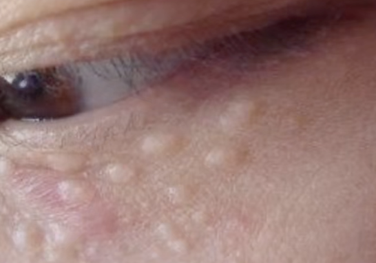
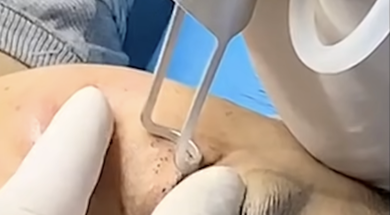

tags:: [[皮肤学]]
---

- ## 啥是汗管瘤
	- 属于良性肿瘤
	- 鹅卵石状, 光滑.
	- 除了眼周, 还可能长在 腋下, 会阴 等部位.
	- {:height 343, :width 331}
	- {:height 237, :width 299}
- ## 如何处理
	- 二氧化碳激光治疗, 把浅表烧掉.
		- 两三年后, 有复发的可能.
	- {:height 271, :width 357}
- ## 参考
	- [“医生，来个针挑脂肪粒？”——眼下的疙瘩到底是啥？皮肤科医生破解“脂肪粒”真身](https://www.bilibili.com/video/BV1o3411j7kY/?vd_source=f1fbb083ddef12dcff3388779faac201)
	  logseq.order-list-type:: number