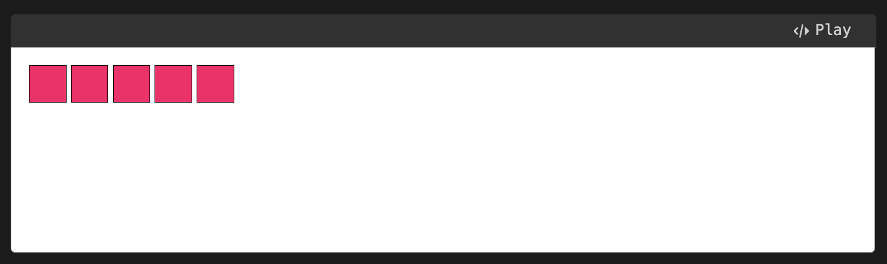

tags:: [[Whitespace Character]]
---

- ## 如何处理 HTML 中的 Whitespace
	- 文本内容之间的 Whitespace 会被解析为单个空格。
	  logseq.order-list-type:: number
	- 块级元素：
	  logseq.order-list-type:: number
		- 块级元素之间/块级元素与行内元素之间 (即尖括号外部) 的 Whitespace ，会被忽略。
		  logseq.order-list-type:: number
		- 元素内，开始标签到文本内容之间的 Whitespace ，和，文本内容到结束标签之间的 Whitespace，会被忽略。
		  logseq.order-list-type:: number
	- 行内元素：
	  logseq.order-list-type:: number
		- 行内元素之间的 Whitespace ，会被解析为单个空格。
		  logseq.order-list-type:: number
		- 元素内，开始标签到文本内容之间的 Whitespace ，和，文本内容到结束标签之间的 Whitespace，会被忽略。
		  logseq.order-list-type:: number
	- ``` html
	  <!doctype html>
	  
	    <h1>      Hello      World!     </h1> 
	    <a>link</a>  <span> span-text1</span><span> span-tex2</span> 
	  ```
- ## IFC 中 Whitespace 的处理规则
	- ``` html
	  <h1>   Hello
	          <span> World!</span>   </h1>
	  
	  <!--
	  <h1>◦◦◦Hello◦⏎
	  ⇥⇥⇥⇥<span>◦World!</span>⇥◦◦</h1>
	  -->
	  <!-- `◦`  表示空格
	  	`⏎` 表示换行
	  	`⇥` 表示制表符
	  -->
	  ```
	- 如上 `<h1>` 元素中形成了一个 [[IFC]] ，其包含:
		- 一个 text node ( `◦◦◦Hello◦⏎⇥⇥⇥⇥` )
		  logseq.order-list-type:: number
		- 一个 inline element ( `<span> 及其内部文本` )
		  logseq.order-list-type:: number
		- 另一个 text node ( `⇥◦◦` )
		  logseq.order-list-type:: number
	- 在这个 context 中，whitespace 会被这样处理：
		- 所有 **行首和行尾** 的 `空格` 与 `制表符` 都会被忽略。
		  logseq.order-list-type:: number
			- ``` html
			  <h1>◦◦◦Hello⏎
			  <span>◦World!</span>⇥◦◦</h1>
			  ```
		- 所有的 `制表符` 和 `换行符` 都会被处理为 `空格` 。
		  logseq.order-list-type:: number
			- ``` html
			  <h1>◦◦◦Hello◦<span>◦World!</span>◦◦◦</h1>
			  ```
		- 所有 `连续的空格` 都会被处理为 `一个空格` (跨越两个独立的行内元素的两个空格，也会被视为连续) 。
		  logseq.order-list-type:: number
			- ``` html
			  <h1>◦Hello◦<span>World!</span>◦</h1>
			  ```
		- 移除元素 **开头和结尾** 的 `空格` 。
		  logseq.order-list-type:: number
			- ``` html
			  <h1>Hello◦<span>World!</span></h1>
			  ```
- ## BFC 中 Whitespace 的处理规则
	- ``` html
	  <body>
	    <div>  Hello  </div>
	  
	     <div>  World!   </div>
	  </body>
	  
	  <!--
	  <body>⏎
	  ⇥<div>◦◦Hello◦◦</div>⏎
	  ⏎
	  ◦◦◦<div>◦◦World!◦◦</div>◦◦⏎
	  </body>
	  -->
	  <!-- `◦`  表示空格
	  	`⏎` 表示换行
	  	`⇥` 表示制表符
	  -->
	  ```
	- 如上 `<body>` 元素中形成了一个 [[BFC]] ，其包含:
		- 一个只包含 whitespace 的 text node 。
		  logseq.order-list-type:: number
		- 一个 `<div>` 元素。
		  logseq.order-list-type:: number
		- 一个只包含 whitespace 的 text node 。
		  logseq.order-list-type:: number
		- 一个 `<div>` 元素。
		  logseq.order-list-type:: number
		- 一个只包含 whitespace 的 text node 。
		  logseq.order-list-type:: number
	- 在这个 context 中，whitespace 会被这样处理 ( ==可能不同浏览器行为不完全一样，但大差不差== )：
		- 在 BFC 中，一切都是 block。
		  logseq.order-list-type:: number
			- ``` html
			  <block>⏎⇥</block>
			  <block>◦◦Hello◦◦</block>
			  <block>⏎⏎◦◦◦</block>
			  <block>◦◦World!◦◦</block>
			  <block>◦◦⏎</block>
			  ```
		- 每个 block 内部，根据上文 IFC 对 whitespace 的处理规则进行简化。
		  logseq.order-list-type:: number
			- ``` html
			  <block></block>
			  <block>Hello</block>
			  <block></block>
			  <block>World!</block>
			  <block></block>
			  ```
		- 最终，我们得到 三个 empty block 和 两个有内容的 block，三个 empty block 由于不包含任何内容，所以不占用占用任何空间。
		  logseq.order-list-type:: number
- ## Inline 元素和 Inline-block 元素之间的 Whitespace
	- ### 不希望出现的空格
		- ``` html
		  <!DOCTYPE html>
		  <html lang="en">
		  
		  <head>
		    <meta charset="UTF-8">
		    <meta name="viewport" content="width=device-width, initial-scale=1.0">
		    <title>Document</title>
		    <style>
		      .people-list {
		        list-style-type: none;
		        margin: 0;
		        padding: 0;
		      }
		  
		      .people-list li {
		        display: inline-block;
		        width: 2em;
		        height: 2em;
		        background: #f06;
		        border: 1px solid;
		      }
		    </style>
		  </head>
		  
		  <body>
		    <ul class="people-list">
		      <li></li>
		  
		      <li></li>
		  
		      <li></li>
		  
		      <li></li>
		  
		      <li></li>
		    </ul>
		  
		    <!--
		      <ul class="people-list">⏎
		      ◦◦<li></li>⏎
		      ⏎
		      ◦◦<li></li>⏎
		      ⏎
		      ◦◦<li></li>⏎
		      ⏎
		      ◦◦<li></li>⏎
		      ⏎
		      ◦◦<li></li>⏎
		      </ul>
		      -->
		  
		  </body>
		  
		  </html>
		  ```
		- 为了让 `<li>` 可以在一行中显示 (比如 导航栏) ，我们给 `<li>` 设置了 `display: inline-block;` 属性。
		- 效果大概是这样：
			- {:height 198, :width 477}
		- 可以看到 `<li>` 元素之间是有空格的 (FireFox 开发者工具可以显示 Whitespace)，但是很多时候我们都不希望有这个空格，这要怎么处理呢？
		- 虽然去掉 `<li>` 元素之间的 whitespace 是可以去掉空格的，但是这样我们的代码可读性就不太好了。
			- ``` html
			  <ul class="people-list">
			    <li></li><li></li><li></li><li></li><li></li>
			  </ul>
			  ```
	- ### 方案一：使用 `flex` 布局代替 `inline-block` 方案。
		- ``` css
		      .people-list {
		        list-style-type: none;
		        margin: 0;
		        padding: 0;
		        display: flex;
		      }
		  
		      .people-list li {
		        width: 2em;
		        height: 2em;
		        background: #f06;
		        border: 1px solid;
		      }
		  ```
	- ### 方案二：设置 `<ul>` 的 `font-size` 属性。
		- ``` css
		      .people-list {
		        list-style-type: none;
		        margin: 0;
		        padding: 0;
		        font-size: 0;
		      }
		  
		      .people-list li {
		        display: inline-block;
		        width: 2rem;
		        height: 2rem;
		        background: #f06;
		        border: 1px solid;
		      }
		  ```
		- 将 `<ul>` 的 `font-size` property 设置为 0 ，这样字体的大小就被设置为 0 了，空格就的大小也就被设置为 0 了。
		- 另外，将 `<li>` 的 `width` 和 `height` 单位改为 `rem` (相对于根元素的大小) ，这样 `<li>` 元素的大小就不会被设置为 0 了。
	- ### 方案三：设置 `<li>` 的边距为负数
		- ``` css
		      .people-list {
		        list-style-type: none;
		        margin: 0;
		        padding: 0;
		      }
		  
		      .people-list li {
		        display: inline-block;
		        width: 2rem;
		        height: 2rem;
		        margin-right: -0.25rem;
		        background: #f06;
		        border: 1px solid;
		      }
		  ```
		- 将 `<li>` 的右边框设置为负值 `-0.25rem` (这个空格的宽度通常是 font-size 的 1/4 左右)
	-
- ## 参考
	- [MDN -How whitespace is handled by HTML, CSS, and in the DOM](https://developer.mozilla.org/en-US/docs/Web/API/Document_Object_Model/Whitespace#dom_traversal_and_whitespace)
	  logseq.order-list-type:: number