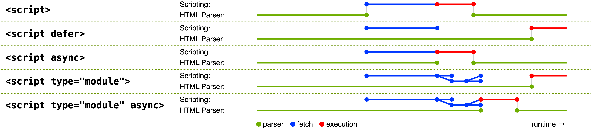

tags:: [[Browser]]
---

- ## 简化版本
	- 参考: [How the web works](https://developer.mozilla.org/en-US/docs/Learn/Getting_started_with_the_web/How_the_Web_works#order_in_which_component_files_are_parsed)
	- 获取 `html` 文件，并解析其中的 `<link>` 和 `<script>` 标签。
	  logseq.order-list-type:: number
	- 发出请求获取 `css` 和 `javascript` 文件，解析  `css` 和 `javascript` 文件。
	  logseq.order-list-type:: number
	- 在内存中生成 `DOM` 和 `CSSOM` ，然后编译并执行 `JavaScript` 。
	  logseq.order-list-type:: number
	- 根据上一步的三个元素，渲染画面。
	  logseq.order-list-type:: number
- ## 详细版本
	- 参考:
		- [Document: DOMContentLoaded event](https://developer.mozilla.org/en-US/docs/Web/API/Document/DOMContentLoaded_event)
		  logseq.order-list-type:: number
		- [Script Loading Strategies](https://developer.mozilla.org/en-US/docs/Learn/JavaScript/First_steps/What_is_JavaScript#script_loading_strategies)
		  logseq.order-list-type:: number
	- 加载顺序:
		- 浏览器边 Download HTML , 边 Parse HTML .
		  logseq.order-list-type:: number
		- 当 Parse 到 `<script>` 时, 开始 Download JS 代码 , 下载完成后立即执行 (会等待 `stylesheet` 被完全 Parse); 下载和执行期间, Parse 被 **阻塞** .
		  logseq.order-list-type:: number
		- 当 Parse 到 `<script defer>` 和 `<script type="module">` 时, 开始 Download JS 代码 , 此时 Parse 继续往下执行 .
		  logseq.order-list-type:: number
		- 当 Parse 到 `image` , `subframe` , `<script async>` 或 `<script type="module" async>` 时, 这些资源也会被异步加载 , Parse 继续往下执行 .
		  logseq.order-list-type:: number
		- 当 `<script async>` 和 `<script type="module" async>` 被加载完成时, 会被立即执行 (会等待 `stylesheet` 被完全 Parse), 且多个脚本之间 **无执行顺序** ; 执行期间, Parse 被 **阻塞**  .
		  logseq.order-list-type:: number
		- 当 HTML 被完全 Parse , 且 `stylesheet` 被完全 Parse,  `<script defer>` 和 `<script type="module">` 开始 **按声明的顺序** 执行 (如果未下载完成，则等待其下载完成再执行) .
		  logseq.order-list-type:: number
		- 当 HTML 被完全 Parse , 且 `<script defer>` 和 `<script type="module">` 执行完成, `DOMContentLoaded` event 被触发 .
		  logseq.order-list-type:: number
	- 注意:
		- 上面说的 JavaScript 包含在 `<head>` 和在 `<body>` 中的 .
		  logseq.order-list-type:: number
		- 所有的 JS 代码在执行前, 都会等待 `stylesheet` 被完全 Parse .
		  logseq.order-list-type:: number
		- `DOMContentLoaded` event 会等 `<script defer>` 和 `<script type="module">` 执行完成再触发; 但如果它们不存在，则只会等 HTML 被完全 Parse , 此时 `stylesheet` 可能还未被完全 Parse .
		  logseq.order-list-type:: number
	- {:height 284, :width 1219}
	- 图片来源: [HTML Spec](https://html.spec.whatwg.org/images/asyncdefer.svg)
	-
-