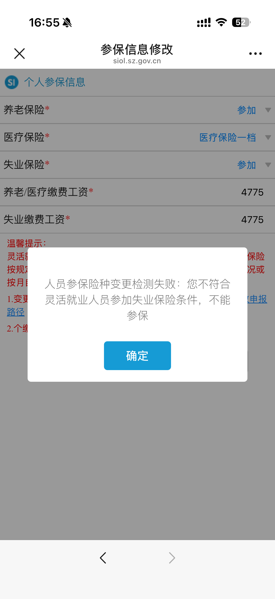
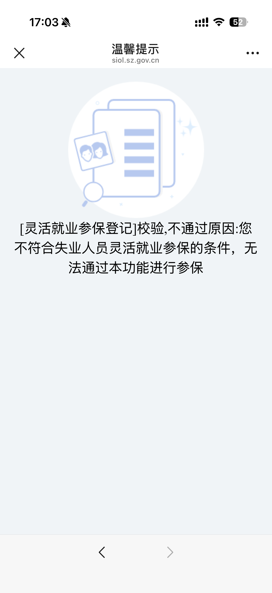

tags:: [[灵活就业参保]]
---

- ## 参保登记
	- **深圳社保** 服务号 -> **掌上办** -> **业务办理** -> **参保登记管理** -> **参保管理** -> **失业人员灵活就业参保登记** 。
		- 之前貌似是因为多点了一次，导致最终显示：
			- `该人员新增失败。失败原因职工XXX[111111111111111111]已经在本单位以【主职】参保登记，不允许重复登记，如需办理登记请先停保！`
			- {:height 374, :width 248}
		- 问过 **社保局** ，工作人员帮我在 **民意速办** 小程序上发了个工单询问，最终是短信通知我说 **参保成功** 了。
- ## 缴费时间
	- 每月 1-25 日，缴纳当月的社保。
		- 无法提前缴纳。
		- 逾期无法补缴。
- ## 如何缴费
	- **深圳税务** 公众号 -> **社保缴费** -> **灵活就业人员申报缴费**
		- 每月选择 **支付宝/微信扣款模式** 进行手动缴费就好，避免后续无需个人缴费时自动扣费了。
- ## 修改险种
	- **深圳社保** 服务号 -> 掌上办 -> 业务办理 -> 参保登记管理 -> 参保信息变更 -> 参保险种变更（个缴人员）
	- ==如果 **失业保险金** 发放已结束，可能在变更险种时会报错：==
		- {:height 453, :width 194}
		- > 人员参保险种变更检测失败：您不符合灵活就业人员参加失业保险条件，不能参保。
		- ==也可能是我选了 **失业保险** 的缘故。==
	- ==网上建议进行如下操作：==
		- 参考: [失业金申请结束后如何灵活就业参保 - 莫呀莫生气](https://www.xiaohongshu.com/discovery/item/6a963477000000002803434a?source=webshare&xhsshare=pc_web&xsec_token=AB2RYrHisv0WN5uSBea3ByQXnzfNEJQc_44DDw4U1XyoQ=&xsec_source=pc_share)
		- **个缴人员停保**
		  logseq.order-list-type:: number
			- **深圳社保** 服务号 -> 掌上办 -> 业务办理 -> 参保登记管理 -> 参保管理 -> 个缴人员停保
				- "是否当月个人缴费" 选 **否** 。
		- 重新 **灵活就业人员参保**
		  logseq.order-list-type:: number
			- **深圳社保** 服务号 -> 掌上办 -> 业务办理 -> 参保登记管理 -> 参保管理 -> 灵活就业登记和参保登记。
			- ==貌似，无法重新进行 **失业人员灵活就业参保登记** ，有如下提示：==
				- {:height 954, :width 186}
				- > [灵活就业参保登记]校验,不通过原因:您不符合失业人员灵活就业参保的条件，无法通过本功能进行参保
		- ==需要等几个小时，才能在缴费的地方生效==