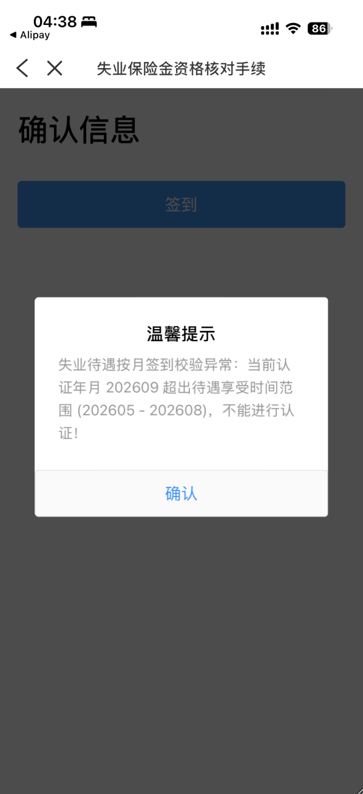
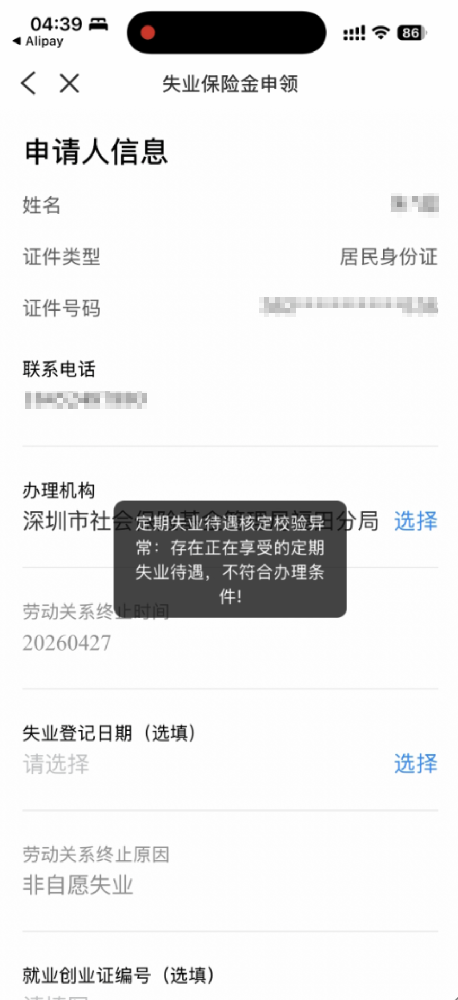

tags:: [[失业保险]]
---

- ## 2026.08.26 收到如下短信
	- > 【深圳社保局】温馨提示：市民朋友，您本次的失业保险待遇即将发放完毕，自2026年8月起，失业保险基金代缴医疗保险（含生育保险）将同步结束。为确保您的医保待遇不受影响，请您 2026年9月起及时通过“深圳社保微信公众号-个人参保信息查询”确认医保参保状态并办理续保。
	  已办理灵活就业参保但未参加医保人员，可通过“深圳社保微信公众号-参保信息变更-参保险种变更（个缴人员）”补充参加医疗保险；
	  未办理灵活就业参保人员可通过“深圳社保微信公众号-灵活就业登记和参保登记（港澳台、非深户、深户）”办理参保。如有疑问，可拨打12333咨询。
- ## 2026.09.07 有如下现象
	- ### 1. 失业保险金资格核对手续 (每月签到)
		- {:height 647, :width 264}
	- ### 2. 重新 "失业保险金申领"
		- 发现一个一闪而过的弹框:
			- {:height 704, :width 291}
		- > 定期失业待遇核定校验异常：存在正在享受的定期失业待遇，不符合办理条件！
	- ### 3. 失业金与社保
		- 代缴的 **医疗保险** 和 **生育保险** 已到账.
		- 但是 **失业保险金** 还未到账.
- ## 还能继续申领吗？
	- 不能， 这是根据 **失业保险** 缴纳年限计算的。
	- 在 **申领失业保险金** 成功后，有短信说明。
- ## 失业保险金发放完毕要怎么办？
	- 可以按如下步骤，加上 **医疗保险** 和 **失业保险** 两个险种，用于 **失业人员灵活就业参保** 。
		- 参见: [[深圳: 失业人员灵活就业参保]] 修改险种相关内容。
		-