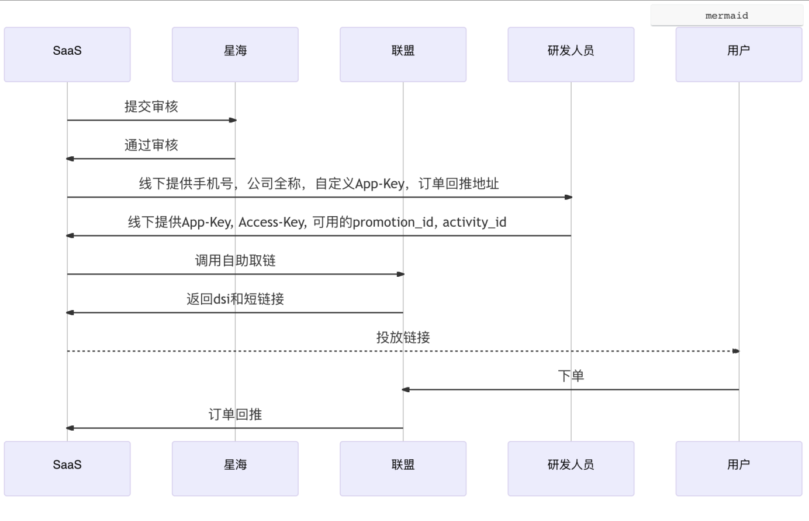
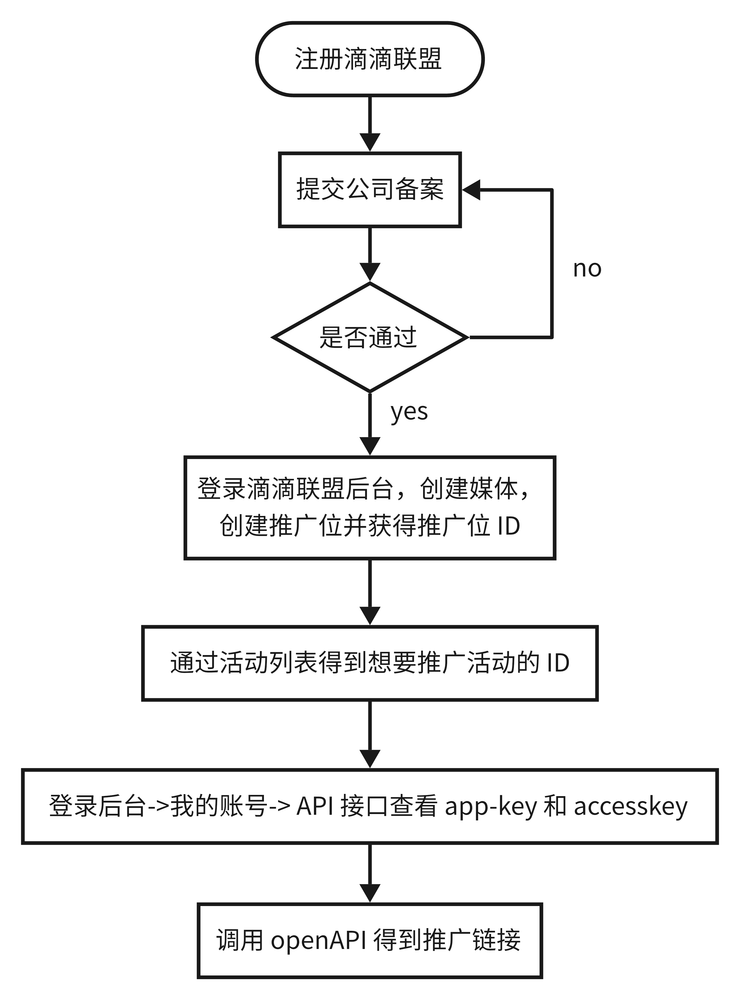

tags:: [[滴滴联盟]]
---

- ## API 文档
	- [滴滴联盟 openapi v1.0.0](https://opendocs.xiaojukeji.com/api_doc/16435)
- ## 接入流程
	- 参考: [滴滴联盟操作手册 - 4.2、API 接口取链 ](https://s3-gz01.didistatic.com/dunion/0923%E6%BB%B4%E6%BB%B4%E8%81%94%E7%9B%9F%E6%93%8D%E4%BD%9C%E6%89%8B%E5%86%8C.pdf)
	- {:height 644, :width 900}
	- 图中`SaaS 方` 指的就是: 要接入 滴滴联盟 的推广者.
- ## API 转链流程
	- {:height 1013, :width 331}
- ## 推广位, 活动 与 source_id
	- 参考: [滴滴联盟 openapi v1.0.0 - 概述](https://opendocs.xiaojukeji.com/api_doc/16437)
	- ### 推广位与活动
		- **推广位** 当前不与 **活动** 绑定.
		- 但为了方便业务方后期数据统计, 建议将 **推广位** 绑定到特定 **活动** 下.
	- ### source_id
		- 即 **订单来源标识** , 在 **取链** 或者 **生成二维码** 时指定.
		- `source_id` 可自定义, 在 **订单回调** 时会原路返回, 可供调用者 **归因** 使用.
	- ## 三元素
		- `活动 ID + 推广位 ID` 决定一个 `实例 ID: DSI`
			- `DSI` 可以由转链 API 传入 `活动 ID + 推广位 ID`  得到.
		- `DSI + source_id` 决定一条 **推广信息**
			- 即 `活动 ID + 推广位 ID + source_id` 决定一条 **推广信息**
- ## 事先准备
	- 需要事先准备如下参数:
		- `App-Key`
		  logseq.order-list-type:: number
		- `Access-key`
		  logseq.order-list-type:: number
		- `推广位 ID: promotion_id`
		  logseq.order-list-type:: number
		- `活动 ID: activity_id`
		  logseq.order-list-type:: number
		- `来源 ID: source_id`
		  logseq.order-list-type:: number
		- `callback` 回调地址
		  logseq.order-list-type:: number
- ## 回调
	- 参见: [回调地址设置](https://union.didi.cn/#/account/apiInterface)
	- ### 领券回调
		- 用户发生领券时, 滴滴联盟会调用我们配置的 `reward_callback_url` 进行回调.
		- 注意: 领券回调不会返回 `source_id` 字段
	- ### 订单回调
		- 在订单发生 **付款** 或 **退款** 时, 滴滴联盟会调用我们配置的  `callback_url` 进行回调.
			- `order_status = 2` : 付款
			- `order_status = 8` : 退款
			- `status = 6` 或 `is_risk = 1` : 不予返佣
	- ### 领券追加信息
		- 参考: [回传参数构建](https://opendocs.xiaojukeji.com/api_doc/18793)
		- 可以在推广链接上后拼接 `dunion_callback` 字段, 用于添加额外的信息.
		- 内容如: `dunion_callback={\"partner_mark\":\"123\"}`
			- 只能包含 `partner_mark` 字段.
			  logseq.order-list-type:: number
			- 如果不包含 `partner_mark` , 则不会进行 **领券回调** .
			  logseq.order-list-type:: number
			- `partner_mark` 的值:
			  logseq.order-list-type:: number
				- 数字、字母、特殊字符等组成的字符串
				  logseq.order-list-type:: number
				- 长度不可超过 60.
				  logseq.order-list-type:: number
				- 不可再嵌套 json .
				  logseq.order-list-type:: number
		- 获取追加信息途径:
			- 领券回调时的 `callback_info` 字段.
			  logseq.order-list-type:: number
			- 订单回调时的 `callback` 字段.
			  logseq.order-list-type:: number
	- ### source_id 与 partner_mark
		-
- ## 参考
	- [滴滴联盟 openapi v1.0.0 - 概述](https://opendocs.xiaojukeji.com/api_doc/16437)
	  logseq.order-list-type:: number