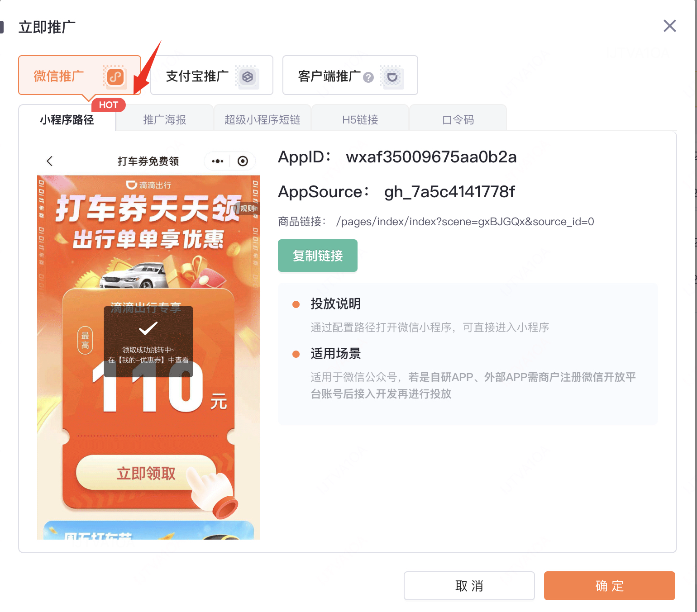
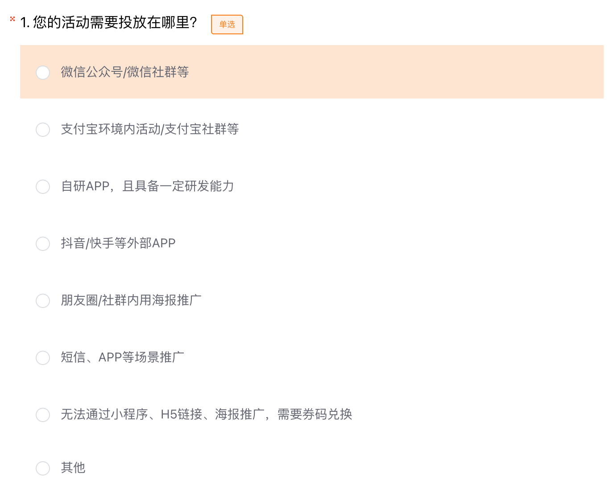

tags:: [[滴滴联盟]]
---

- 通读: [[中国 CPS 相关概念]]
- ## 推广流程
	- 创建媒体和推广位.
	  logseq.order-list-type:: number
		- [媒体管理](https://union.didi.cn/#/promoteManagement/mediaPromote)
		- [推广位管理](https://union.didi.cn/#/promoteManagement/mediaPromote)
	- 获取推广活动.
	  logseq.order-list-type:: number
		- [我要推广](https://union.didi.cn/#/promoteOverview)
	- 生成推广 **链接** 或 **二维码**
	  logseq.order-list-type:: number
		- 联盟后台直接生成 **短链** 或 **二维码** .
		  logseq.order-list-type:: number
		- 使用 API 生成 **短链** 或者 **二维码** .
		  logseq.order-list-type:: number
- ## 推广方式
	- {:height 631, :width 709}
- ## 推广方式选择
	- 参考: [投放取链指南](https://page.xiaojukeji.com/active/ddpage_0iBNADqI.html)
	- {:height 517, :width 523}
	- 自研 APP
	  logseq.order-list-type:: number
		- 建议使用【小程序路径】，用户领券链路更短.
-