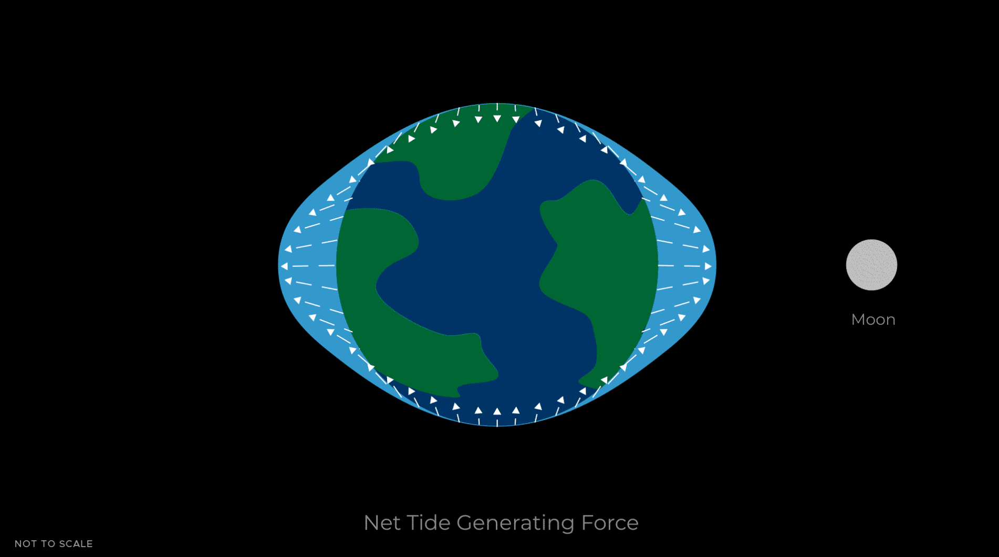
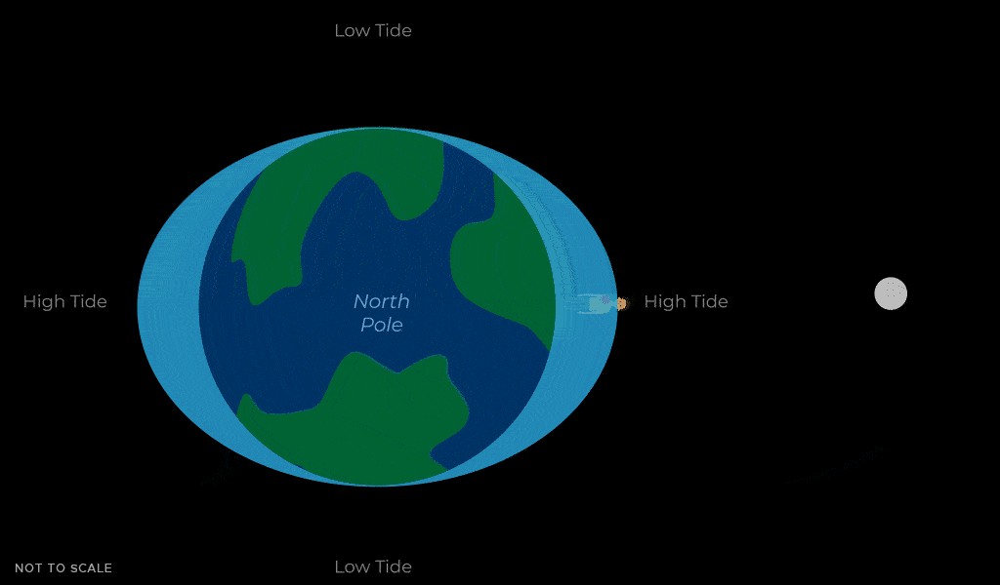
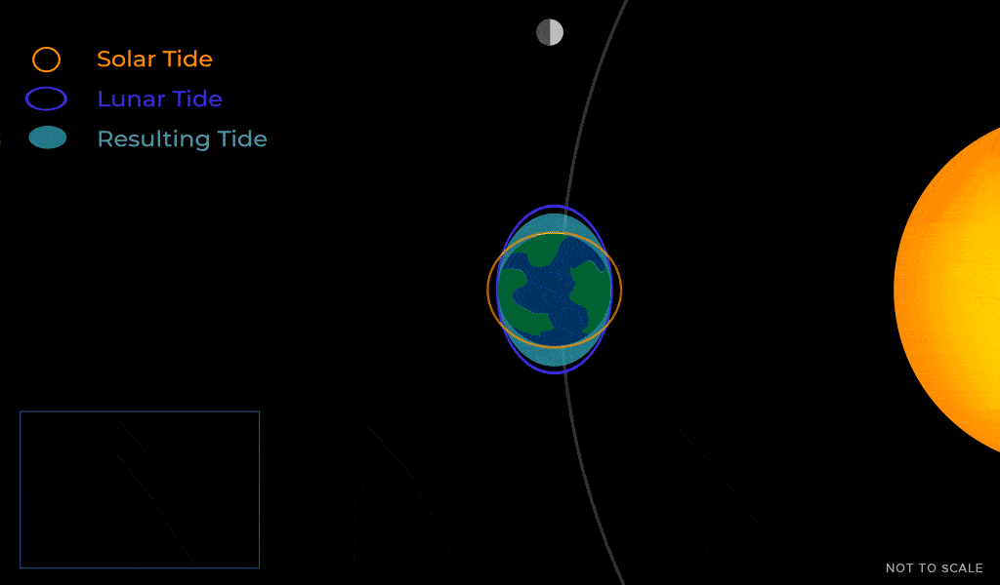
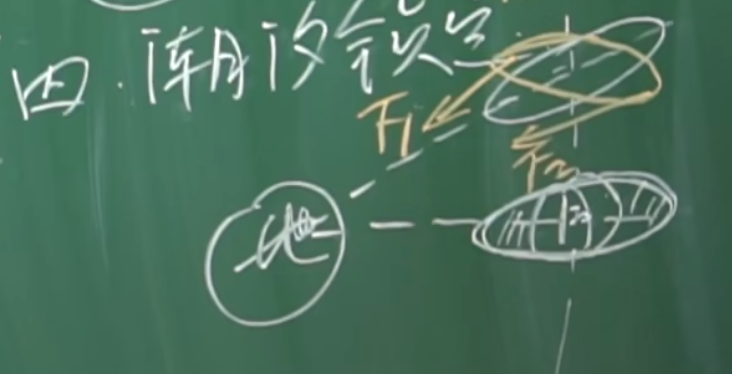

tags:: [[地月日系统]]
---

- ## 引潮力
	- 地球靠近月球的一侧, 引力 大于 向外的离心力 , 所以海水向月球鼓起.
	- 地球远离月球的一侧, 引力 小于 向外的离心力 , 所以海水向外鼓起.
	- 引力 与 离心力 的合力, 被称为 **引潮力** .
		- 月球与太阳对会对地球产生引潮力.
		- 月球的引潮力影响更大一些.
	- {:height 362, :width 479}
	- 图源: [NASA - Tides](https://science.nasa.gov/moon/tides/)
- ## 潮与汐
	- 由于 **月球** 绕着 **地球** 公转, 而 **潮水** 也主要受 **月球** 影响.
		- 我们考虑以月球和潮水为参考系, 认为他们静止.
		- 只考虑地球自转, 可以知道, 同一海岸线 (全球大多数海岸线), 一般一天经历 两次涨潮 和 两次退潮.
			- 白天涨落称为 **潮** .
			- 夜晚涨落称为 **汐** .
		- {:height 336, :width 549}
		- 图源: [NASA - Tides](https://science.nasa.gov/moon/tides/)
	- 严格来讲, 潮水的隆起并非位于 **地球质心** 与 **月球质心** 的连线上.
		- 因为, 地球自转远快于月球公转, 地球会带着潮水旋转.
		- 所以, 通常潮水的隆起先于月球到达, 这个时间间隔大约是 50 分钟.
		- _1782294314737_0.gif)
		- 图源: [NASA - Tides](https://science.nasa.gov/moon/tides/)
- ## 大潮与小潮
	- 地月日成一条直线时, 太阳潮 与 月亮潮 共同作用, 地球出现 **大潮 (Spring Tide)** .
		- 这出现在 **朔日** 与 **望日** .
	- 地月连线与地日连线成 90 度角时, 太阳潮 与 月亮潮 相互制约, 地球出现 **小潮 (Neap Tide)** .
	- {:height 471, :width 563}
	- 图源: [NASA - Tides](https://science.nasa.gov/moon/tides/)
- ## 月球的潮汐锁定
	- 地球对月球同样会有类似 **潮汐** 的作用, 导致 **月球** 面对地球的一面和背对地球的一面凸起, 形成一个椭球体.
	- 由于引力的作用, 经过长时间的磨合, **月球** 只能以椭球体凸起的一面一直面向 **地球** .
		- {:height 193, :width 264}
	- 这被称为 **潮汐锁定**, 也是 **月球同步自转** 的原因.
- ## 为什么地球不会被潮汐锁定
	- 为什么地球不会被 月球 或 太阳 潮汐锁定?
	- 因为时间还不够, 直到太阳寿终正寝, 地球都不会被 月球 或 太阳 潮汐锁定.
- ## 参考
	- [月亮为什么总是一面朝着地球？潮汐的大潮和小潮是怎么回事？李永乐老师讲解潮汐锁定（2018最新）](https://www.bilibili.com/video/BV1rs411L7DJ)
	  logseq.order-list-type:: number
	- [NASA - Tides](https://science.nasa.gov/moon/tides/)
	  logseq.order-list-type:: number